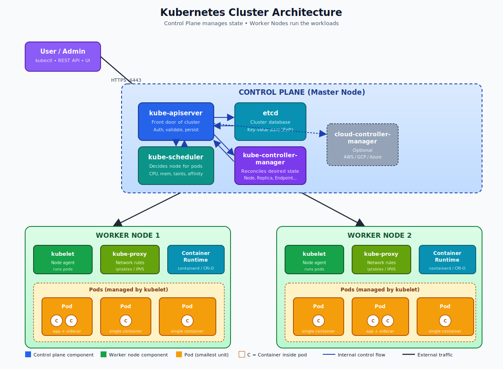
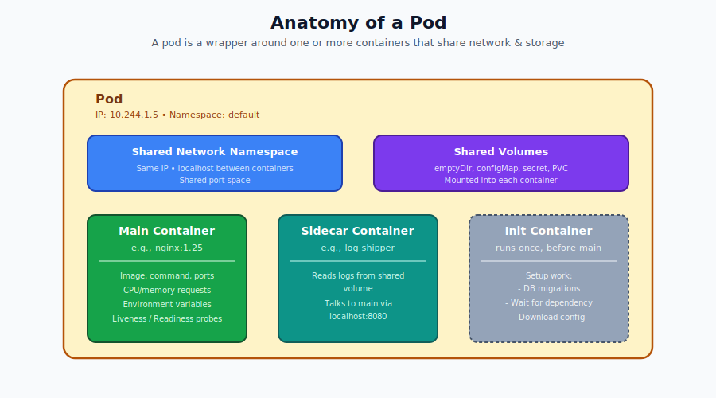
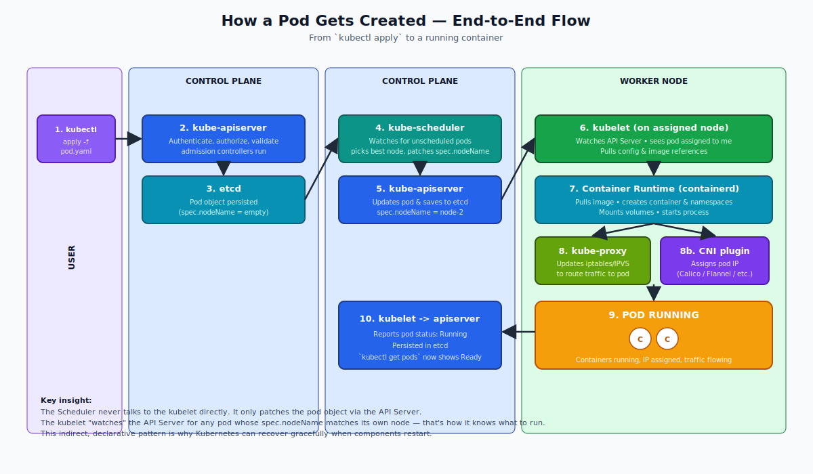

# Kubernetes Architecture — Theory (For Beginners)

## What is Kubernetes?

Imagine you run a restaurant. You have many cooks (containers), each making a different dish. Now imagine 100 customers walk in at once. You need someone to:

- Tell each cook what to make
- Replace a cook if one falls sick
- Hire more cooks when it gets busy
- Send food to the right table

**Kubernetes (K8s)** is that "manager" for your containers. It automatically runs, scales, heals, and connects your applications running inside containers (like Docker containers).

In simple words: **Kubernetes is a system that manages containers across many computers as if they were one big computer.**

---

## Why Do We Need Kubernetes?

Before Kubernetes, if your app crashed at 2 AM, someone had to wake up and restart it. If traffic doubled, someone had to manually start more servers. If you wanted to deploy a new version, you had to do it server by server.

Kubernetes handles all this automatically. It gives you:

- **Self-healing** — if a container crashes, K8s restarts it
- **Auto-scaling** — adds more containers when traffic increases
- **Load balancing** — spreads traffic evenly
- **Rolling updates** — updates apps with zero downtime
- **Service discovery** — apps find each other automatically

---

## The Big Picture: Cluster Architecture

A **Kubernetes Cluster** is a group of computers (called **nodes**) working together. Think of it like a team:

- **Control Plane (Master Node)** = The brain / the manager
- **Worker Nodes** = The hands / the workers who actually run your apps

---

## Control Plane Components (The Brain)

The Control Plane has 4 main components. Think of these as different departments in a company headquarters.

### 1. API Server (`kube-apiserver`)

**What it does:** It is the **front desk** of Kubernetes. Every request — whether from you, from a worker node, or from any tool — goes through the API Server first.

**Simple analogy:** It is like the receptionist at a hotel. You cannot directly enter any room; you must first talk to reception. Similarly, you cannot directly tell a worker node what to do — you tell the API Server, and it tells the worker.

**You talk to it using:** `kubectl` command, REST API calls, or the dashboard.

### 2. etcd

**What it does:** It is the **memory / database** of the cluster. It stores everything — what apps are running, how many copies, configuration, secrets, etc. It is a key-value store.

**Simple analogy:** It is like the company's filing cabinet. Every record about who works where, what they do, and what their settings are is stored here.

**Important:** If etcd is lost, the entire cluster forgets its state. So it is always backed up.

### 3. Scheduler (`kube-scheduler`)

**What it does:** When a new container needs to run, the Scheduler decides **which worker node** should run it.

**Simple analogy:** It is like a manager assigning tasks to employees. If Worker A is already busy and Worker B is free, the Scheduler sends the new task to Worker B. It looks at CPU, memory, rules, and constraints before deciding.

### 4. Controller Manager (`kube-controller-manager`)

**What it does:** It runs many small programs called **controllers** that constantly check, "Is the cluster in the desired state?" If not, they fix it.

**Examples of controllers:**
- **Node Controller** — notices when a node dies
- **Replication Controller** — makes sure the right number of pod copies are running
- **Endpoints Controller** — connects services to pods

**Simple analogy:** It is like a supervisor who keeps walking around the office checking, "Is everyone doing their job? Is anything broken?" and fixes things automatically.

### 5. Cloud Controller Manager (Optional)

**What it does:** If your cluster runs on AWS, Azure, or Google Cloud, this component talks to that cloud provider — for example, to create a load balancer or attach a disk.

---

## Worker Node Components (The Hands)

Each worker node has 3 components.

### 1. Kubelet

**What it does:** It is the **agent** running on every worker node. It listens to the API Server and runs the containers that the Control Plane tells it to.

**Simple analogy:** It is like an employee on the factory floor who receives orders from the manager and actually does the work.

The Kubelet does NOT manage containers it did not create through Kubernetes. It only manages **pods**.

### 2. Kube-proxy

**What it does:** It handles **networking** on the node. When traffic comes in, kube-proxy makes sure it reaches the right pod.

**Simple analogy:** It is like the postman of the node. It knows which envelope (network packet) goes to which house (pod).

### 3. Container Runtime

**What it does:** It is the actual software that runs containers. Kubernetes does not run containers itself — it asks the container runtime to do it.

**Examples:** containerd, CRI-O, Docker (older).

**Simple analogy:** Kubernetes is the head chef giving instructions, but the container runtime is the stove that actually cooks the food.

---

## What is a Pod?

A **Pod** is the smallest unit in Kubernetes. A pod is a wrapper around one or more containers that share storage and network.

**Simple analogy:** Think of a container as a person, and a pod as a small apartment that holds 1 or 2 closely related people. They share the same address (IP) and the same kitchen (storage).

You almost always have **one container per pod**, but sometimes you have a "helper" container alongside (called a sidecar).

---

## How Everything Works Together — Pod Creation Flow

Let us say you tell Kubernetes: "Run a pod called `myapp`." Here is exactly what happens, step by step:

**The key insight:** the Scheduler never talks directly to the kubelet. It just updates the pod object via the API Server. The kubelet "watches" the API Server for any pod assigned to its node and reacts. This loose coupling is what makes Kubernetes so resilient.

---

## Key Terms to Remember

| Term | One-line meaning |
|------|------------------|
| Cluster | A group of machines running Kubernetes |
| Node | A single machine (VM or physical) in the cluster |
| Control Plane | The "brain" — makes decisions |
| Worker Node | The "muscle" — runs your apps |
| Pod | The smallest unit; wraps one or more containers |
| API Server | Front door of Kubernetes |
| etcd | Memory/database of the cluster |
| Scheduler | Decides where pods run |
| Controller Manager | Watches & fixes cluster state |
| Kubelet | Agent on each node that runs pods |
| Kube-proxy | Handles networking on each node |
| Container Runtime | The thing that actually runs containers |

---

## Summary in One Paragraph

Kubernetes is a manager for containers. A cluster has a Control Plane (brain) and Worker Nodes (muscle). The Control Plane has the API Server (front door), etcd (memory), Scheduler (decides where to run), and Controller Manager (keeps things healthy). Each Worker Node has Kubelet (agent), Kube-proxy (networking), and a Container Runtime (runs containers). The smallest deployable unit is a Pod, which wraps containers. You give Kubernetes a desired state, and it constantly works to make reality match that state.

---

Next: open `02-Exercise.md` and run real `kubectl` commands against your own cluster to see every piece of this architecture in action. The exercises will have you actually inspect the API Server, etcd, scheduler, kubelet, and pods on a live cluster.
