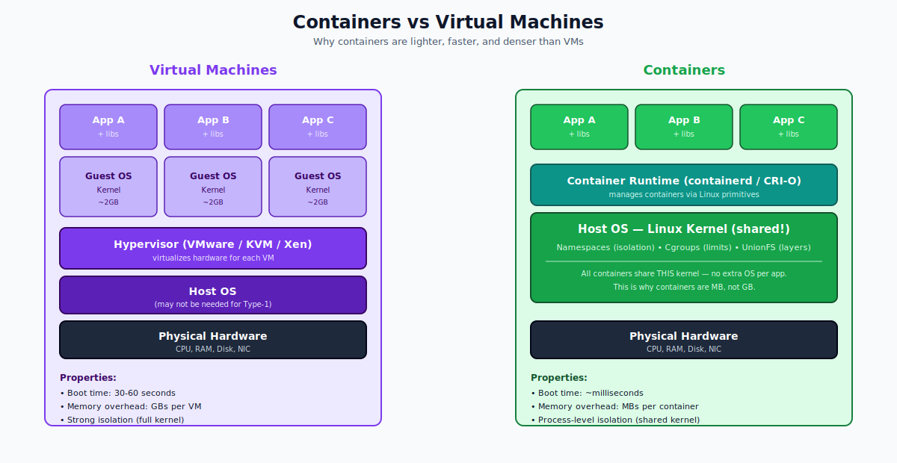
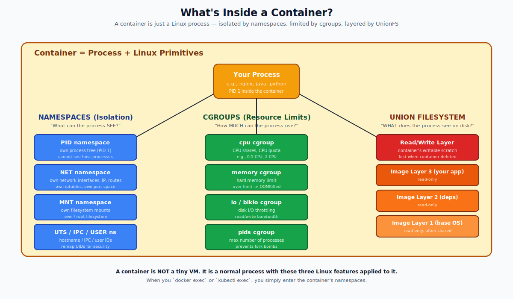
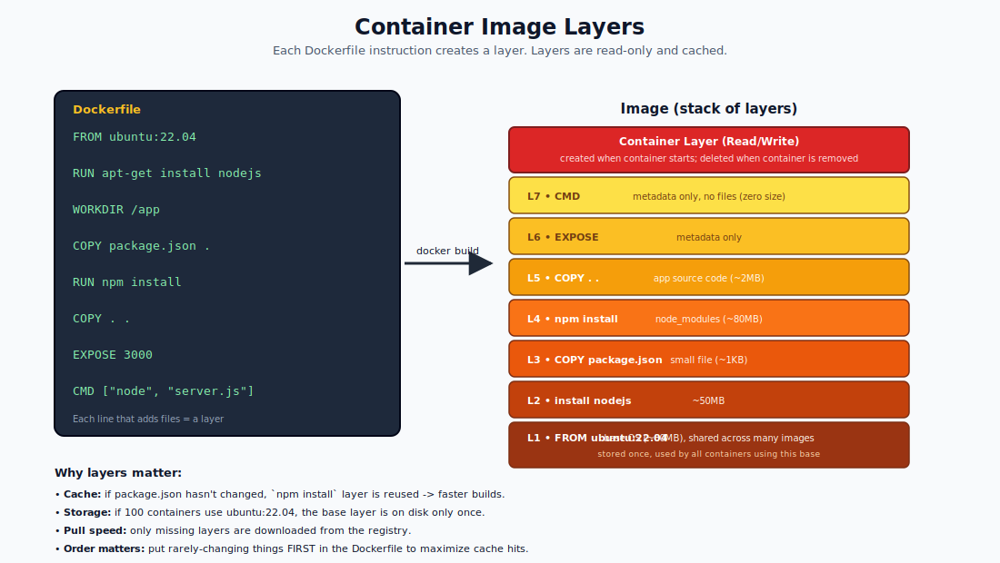
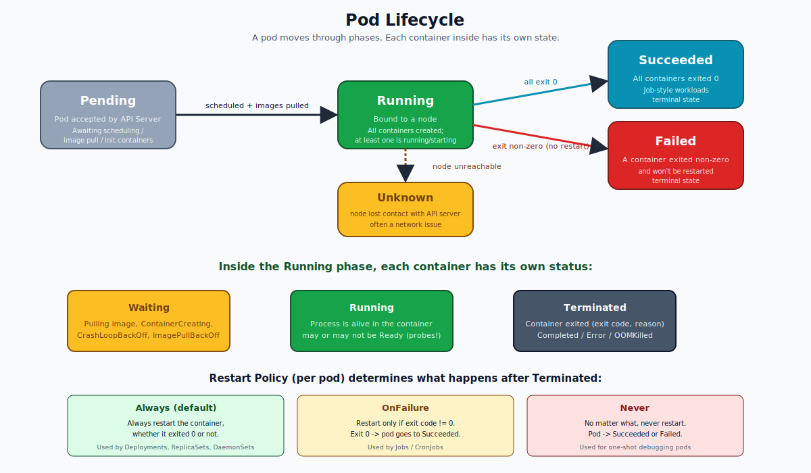
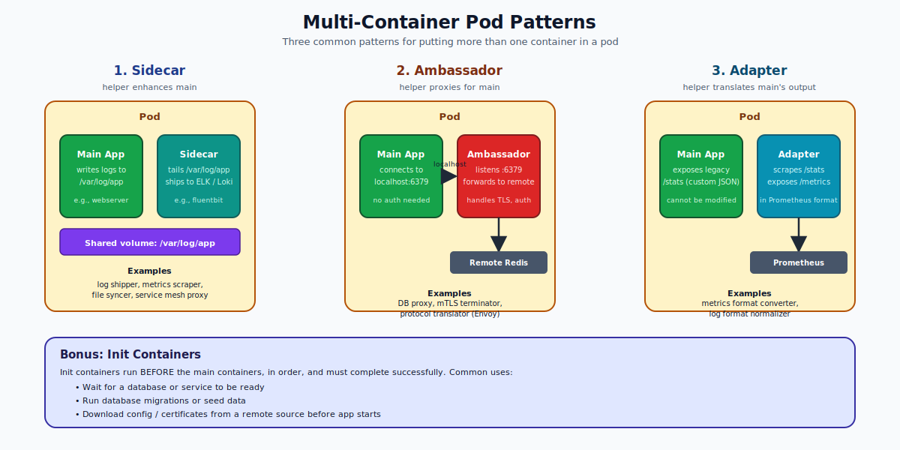
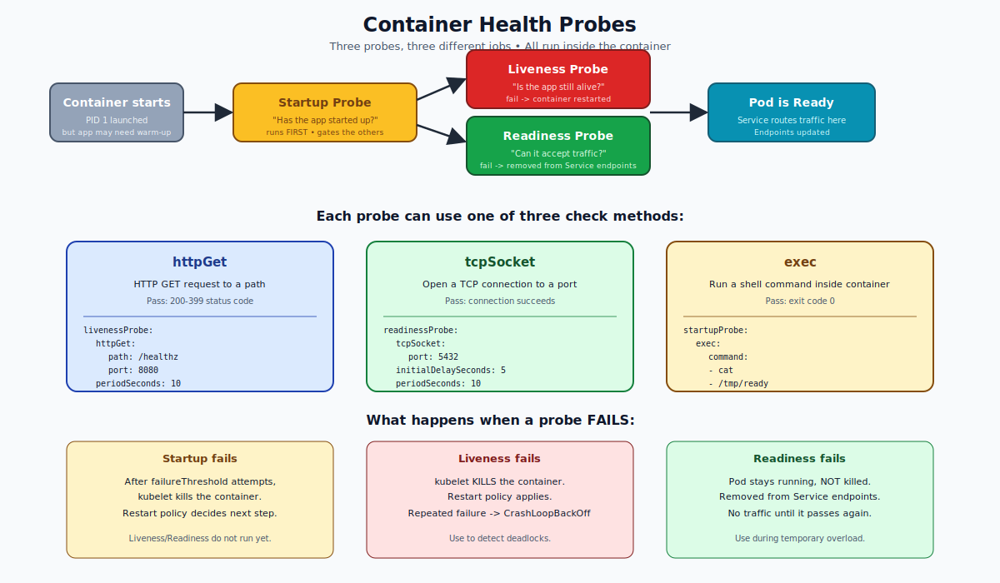

# Containers and Pods — Deep Dive

This is a deep technical dive into two foundational concepts. By the end of this page you will understand:

- What a container actually is at the Linux level
- How container images are built and stored
- Why Kubernetes invented the pod abstraction
- The full lifecycle of a pod and the state machine of each container
- Multi-container patterns, init containers, and probes
- Pod resources, QoS classes, and security context

---

## Part 1 — What Is a Container?

A common misconception: "a container is a tiny VM." It is not.

A **container is just a regular Linux process** that the kernel has deceived into thinking it is alone on the system. The kernel uses three Linux features to do this:

1. **Namespaces** — control what the process can SEE (its own filesystem, network, process tree, hostname, etc.)
2. **Cgroups (control groups)** — control HOW MUCH the process can USE (CPU, memory, disk I/O, processes)
3. **Union filesystems** (overlayfs) — give the process a layered, read-only-mostly filesystem built from image layers



Because there is no extra OS, no hypervisor, and no kernel boot, containers start in milliseconds and use megabytes instead of gigabytes.



### The Linux primitives in detail

**Namespaces** isolate the kernel resources a process can see:

| Namespace | Isolates |
|-----------|----------|
| `pid` | process IDs (your container's PID 1 is the host's PID 4287) |
| `net` | network interfaces, IPs, routes, iptables, sockets |
| `mnt` | mount points and filesystems |
| `uts` | hostname and domain name |
| `ipc` | shared memory, semaphores, message queues |
| `user` | UID/GID mappings (root inside != root outside) |
| `cgroup` | cgroup root view |

**Cgroups (v2)** limit what a process can consume:

- `cpu.max` — maximum CPU bandwidth (e.g., 50000 100000 = 0.5 CPU)
- `memory.max` — hard memory cap (going over = OOMKill)
- `io.max` — block-device read/write throttling
- `pids.max` — maximum number of tasks (prevents fork bombs)

**Union filesystem (overlayfs)** stacks read-only image layers and a writable container layer on top, all merged into a single view. When a process writes a file, copy-on-write copies it to the writable layer.

### Container runtimes — who actually creates the container?

Kubernetes does not create containers itself. It speaks the **CRI (Container Runtime Interface)** to a runtime such as:

- **containerd** — the most common runtime in Kubernetes today
- **CRI-O** — minimalist runtime for Kubernetes-only environments
- **Docker (deprecated)** — used to need `dockershim`; gone since K8s 1.24

The runtime delegates the actual `clone()` + namespace setup to a low-level runtime such as **runc** (the OCI reference implementation).

```
kubelet ── CRI gRPC ──▶ containerd ── OCI ──▶ runc ── syscall ──▶ Linux kernel
```

---

## Part 2 — Container Images

An **image** is an immutable, layered, content-addressable bundle of files plus metadata (entrypoint, env, exposed ports). Each instruction in a Dockerfile that adds files becomes a layer.



### Why layers matter

- **Cache.** Unchanged layers are reused on rebuild — only the diff is rebuilt.
- **Storage.** If 50 images share the same `ubuntu:22.04` base, the OS layer is on disk **once**.
- **Pull speed.** Registries only ship the layers you don't already have.
- **Order matters.** Put rarely-changing instructions first so cache invalidation flows downward, not the other way.

### The image manifest

A modern image is described by an OCI manifest — a JSON that lists each layer's SHA256 digest:

```
{
  "schemaVersion": 2,
  "mediaType": "application/vnd.oci.image.manifest.v1+json",
  "config": { "digest": "sha256:abc..." },
  "layers": [
    { "digest": "sha256:111...", "size": 78423102 },
    { "digest": "sha256:222...", "size": 4023 },
    ...
  ]
}
```

Images are content-addressed: the digest is derived from the bytes, so two images with the same digest are byte-for-byte identical. That is why you should pin to digests in production (`nginx@sha256:...`) rather than tags (`nginx:latest`).

---

## Part 3 — Why Pods?

If a container is the unit of packaging, why does Kubernetes schedule **pods** instead?

Because some containers are **truly inseparable**:

- A web server and the log shipper that tails its log files
- A main app and its mTLS sidecar proxy
- A database and a backup agent that streams WAL files

These need to:

- Run on the **same node**
- Share a **network namespace** (talk on `localhost`)
- Share **volumes** (read each other's files)
- Start and stop **together**

A pod gives you exactly that — it is a thin wrapper around one or more containers that share network and storage namespaces. The smallest deployable unit is therefore the pod, not the container.

### How does a pod share network?

Every pod has a hidden helper container called the **pause container**. It is the first thing started in the pod. Its only job is to hold the network and IPC namespaces. The "real" containers are then placed inside those namespaces, so they all see the same IP and can talk over `localhost`.

Run `crictl ps` on any node and you will see lots of pause containers — one per pod.

---

## Part 4 — Pod Lifecycle

A pod moves through phases. The kubelet reports the phase to the API Server.



| Phase | Meaning |
|-------|---------|
| Pending | API has accepted the pod; waiting on scheduling, image pull, or init containers |
| Running | Bound to a node; at least one container is running, starting, or restarting |
| Succeeded | All containers exited with code 0 and no restart will happen |
| Failed | At least one container exited non-zero and no restart will happen |
| Unknown | The kubelet on its node has lost contact with the API Server |

Each container inside also has its own status: `Waiting`, `Running`, or `Terminated`. So the pod's phase is the result of summarizing all container statuses plus the pod's overall state.

### Common waiting reasons (you will see these often)

- `ContainerCreating` — runtime is preparing the container
- `ImagePullBackOff` — image cannot be pulled (typo, auth, registry down)
- `CrashLoopBackOff` — container keeps crashing; kubelet is backing off restarts
- `CreateContainerConfigError` — bad volume mount, missing ConfigMap or Secret
- `ErrImagePull` — first pull failure (becomes ImagePullBackOff after retries)

### Restart policy (per pod, not per container)

| Policy | Behavior |
|--------|----------|
| `Always` (default) | Always restart, regardless of exit code |
| `OnFailure` | Restart only if exit code != 0 |
| `Never` | Never restart |

Used by:
- Deployments / ReplicaSets / DaemonSets force `Always`
- Jobs and CronJobs use `OnFailure` or `Never`

---

## Part 5 — Multi-Container Pod Patterns

When you do put more than one container in a pod, there are three classical patterns.



### Sidecar — the helper enhances the main container
The main container does its job; the sidecar adds a capability without changing the main app. Example: a web server writes logs to a shared `emptyDir` volume; a `fluentbit` sidecar tails them and ships to a logging system.

### Ambassador — the helper proxies for the main container
The main container connects to `localhost:6379` and never knows there is a network. The ambassador handles TLS, sharding, retry, auth, and forwards to the real upstream. Example: an Envoy sidecar handling all egress.

### Adapter — the helper translates the main's output
The main app exposes legacy metrics in a custom format. The adapter scrapes them and re-exposes them in Prometheus format. The legacy app stays unchanged.

### Init containers
Init containers run **before** the main containers, in order. Each must exit successfully before the next starts. Use them for:

- Waiting for a dependency (`until nslookup db; do sleep 1; done`)
- Running database migrations
- Downloading config or certificates
- Setting filesystem permissions on a mounted volume

If an init container fails, the pod is restarted (under `Always`/`OnFailure`) or marked Failed (under `Never`).

---

## Part 6 — Probes

Probes let the kubelet check the health of each container. There are three.



### Liveness — "is the app still alive?"
Fail repeatedly and the kubelet **kills the container**. Restart policy decides what happens next. Use when the app may deadlock without crashing.

### Readiness — "is the app ready to serve traffic?"
Fail and the pod is **removed from Service endpoints** (no traffic), but the container is **not killed**. Use during startup, warm-up, dependency loss, or graceful drain.

### Startup — "has slow-starting app finished starting up?"
Liveness and readiness are **suppressed** until startup passes. Use for legacy apps that take 60+ seconds to boot. Without it, an aggressive liveness probe kills your app before it ever finishes starting.

### Probe mechanisms

- `httpGet` — HTTP GET to a path. Pass = 200-399.
- `tcpSocket` — open a TCP connection. Pass = connection succeeds.
- `exec` — run a command inside the container. Pass = exit 0.
- `grpc` — gRPC health check (since K8s 1.24).

### Tuning fields

```yaml
livenessProbe:
  httpGet:
    path: /healthz
    port: 8080
  initialDelaySeconds: 10   # don't probe for the first 10s
  periodSeconds: 10         # probe every 10s
  timeoutSeconds: 1         # consider failed if no response in 1s
  successThreshold: 1       # consecutive passes to be Healthy
  failureThreshold: 3       # consecutive fails to be Unhealthy
```

---

## Part 7 — Resources & QoS

Each container can declare CPU and memory **requests** (what the scheduler reserves) and **limits** (the hard cap).

```yaml
resources:
  requests:
    cpu: "250m"        # 0.25 CPU reserved
    memory: "256Mi"
  limits:
    cpu: "500m"        # 0.5 CPU max
    memory: "512Mi"    # over this -> OOMKilled
```

### QoS classes (assigned automatically)

| Class | Condition |
|-------|-----------|
| `Guaranteed` | Every container has CPU+memory requests **equal to** limits |
| `Burstable` | At least one container has requests; not all are equal to limits |
| `BestEffort` | No container sets any requests or limits |

When the node runs low on memory, the kubelet evicts pods in this order: BestEffort first, Burstable next, Guaranteed last. If you care about reliability, use `Guaranteed`.

### CPU vs memory limits

- **Memory** is uncompressible. Over the limit -> OOMKilled.
- **CPU** is compressible. Over the limit -> throttled (slowed), not killed. This is why CPU limits can hurt latency-sensitive workloads.

---

## Part 8 — Pod Security Context

Use `securityContext` to drop privileges and reduce blast radius:

```yaml
spec:
  securityContext:
    runAsNonRoot: true       # refuse to start if image runs as root
    runAsUser: 1000
    fsGroup: 2000            # gid for mounted volumes
  containers:
  - name: app
    image: myapp
    securityContext:
      readOnlyRootFilesystem: true
      allowPrivilegeEscalation: false
      capabilities:
        drop: ["ALL"]
```

Best practices:
- Run as non-root (`runAsNonRoot: true`)
- Read-only root filesystem (writable volumes only where needed)
- Drop all Linux capabilities and add back only what you need
- Disable privilege escalation (`allowPrivilegeEscalation: false`)
- Use `seccomp` and AppArmor / SELinux profiles in production

---

## Part 9 — Pod Termination

Deletion is graceful by default:

1. Pod is marked for deletion in etcd.
2. Pod is removed from Service endpoints (no new traffic).
3. `preStop` hook runs (if defined).
4. Containers receive `SIGTERM`.
5. Kubelet waits up to `terminationGracePeriodSeconds` (default 30s).
6. If still running, kubelet sends `SIGKILL`.
7. Pod object removed from API.

Your app **must handle SIGTERM** — finish in-flight requests, close DB connections, then exit. Apps that ignore SIGTERM lose traffic during rolling updates.

A common pattern: a `preStop` sleep buys time for the load balancer to remove the pod before SIGTERM:

```yaml
lifecycle:
  preStop:
    exec:
      command: ["sh", "-c", "sleep 5"]
```

---

## Quick Reference — Useful Pod Spec Fields

```yaml
apiVersion: v1
kind: Pod
metadata:
  name: full-example
  labels:
    app: web
spec:
  serviceAccountName: web-sa
  restartPolicy: Always
  terminationGracePeriodSeconds: 30
  securityContext:
    runAsNonRoot: true
    runAsUser: 1000
  initContainers:
    - name: init-db-wait
      image: busybox
      command: ["sh", "-c", "until nslookup db; do sleep 2; done"]
  containers:
    - name: web
      image: nginx:1.25
      ports:
        - containerPort: 8080
      env:
        - name: LOG_LEVEL
          value: info
      resources:
        requests: { cpu: 250m, memory: 256Mi }
        limits:   { cpu: 500m, memory: 512Mi }
      livenessProbe:
        httpGet: { path: /healthz, port: 8080 }
        periodSeconds: 10
      readinessProbe:
        httpGet: { path: /ready, port: 8080 }
        periodSeconds: 5
      lifecycle:
        preStop:
          exec: { command: ["sh", "-c", "sleep 5"] }
      volumeMounts:
        - name: cache
          mountPath: /var/cache
  volumes:
    - name: cache
      emptyDir: {}
```

---

## Summary

A container is a Linux process boxed in by namespaces, cgroups, and a layered filesystem. A pod is a tiny wrapper that lets one or more containers share a network and storage and live/die together. Pods move through Pending -> Running -> Succeeded/Failed; each container inside has its own Waiting/Running/Terminated status. Probes (startup, liveness, readiness) tell the kubelet whether the container is healthy and ready for traffic. Resources, QoS, and security context determine reliability and isolation. Termination is graceful by default and your app must handle SIGTERM.

Open `02-Exercise.md` to actually break, observe, and rebuild all of this on your own cluster.
