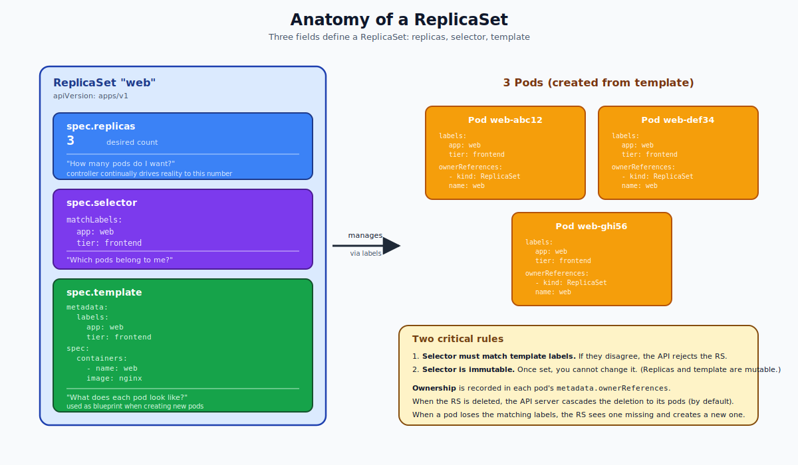
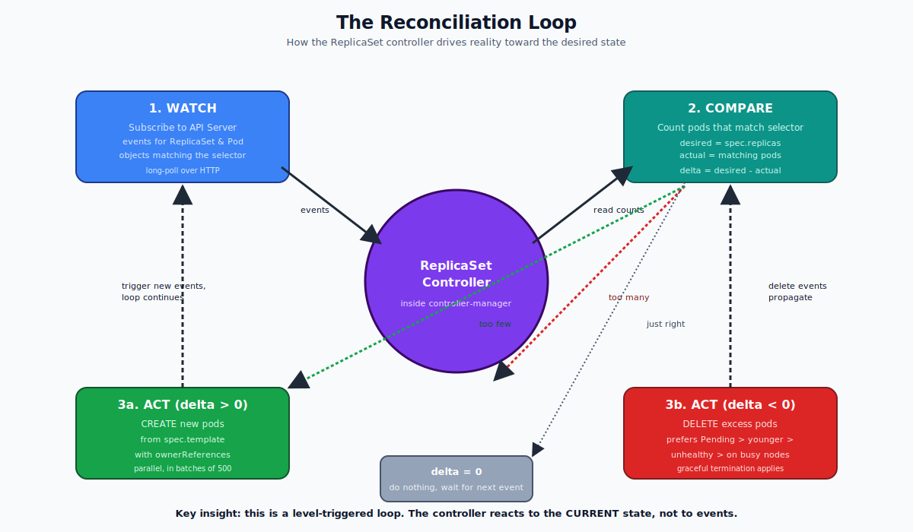
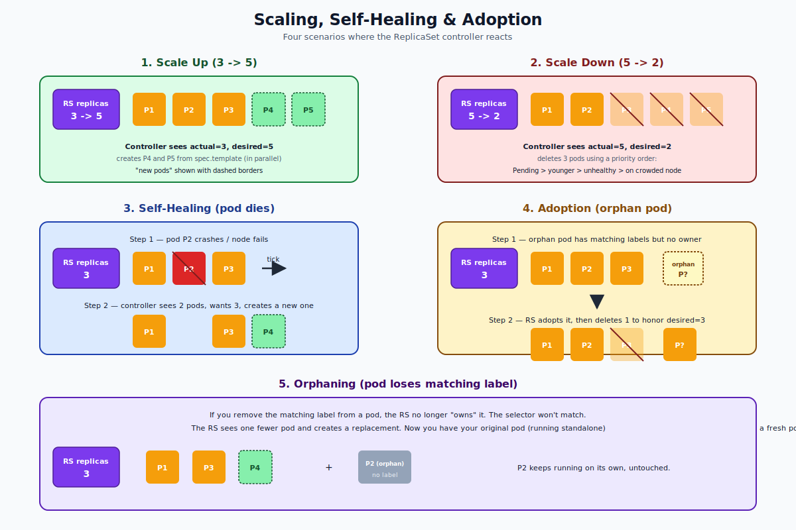
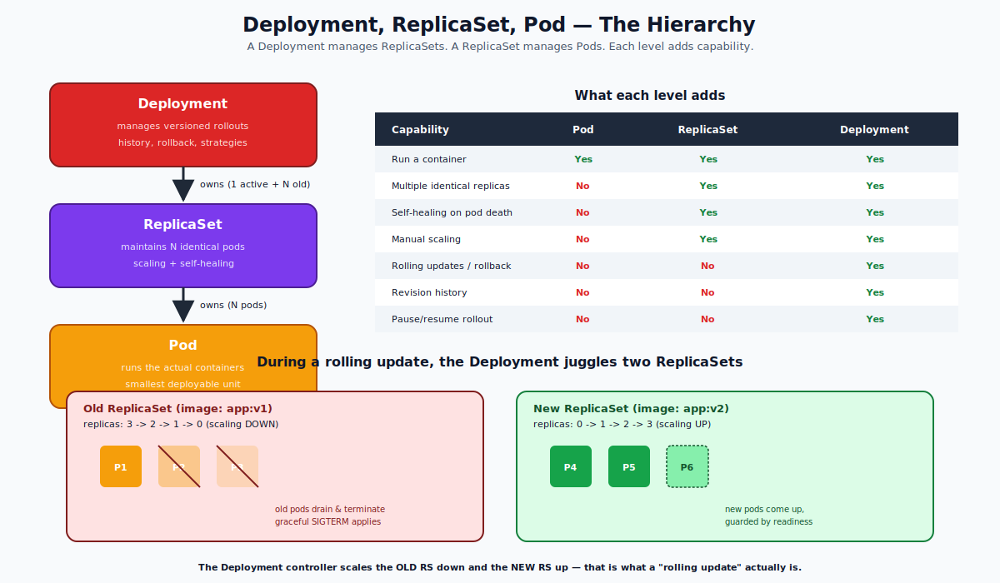

# ReplicaSet — Deep Dive

## Why Does a ReplicaSet Exist?

A pod by itself has no resilience. If you create a pod with `kubectl run` and it crashes, it stays crashed. If the node it runs on dies, the pod is gone forever. A pod has no concept of "I should always have N copies running."

The **ReplicaSet** (RS) is the smallest Kubernetes object whose only job is:

> "Make sure exactly N pods that match this selector exist at all times."

That sentence is the entire ReplicaSet. It is short but powerful — it gives you scaling and self-healing for free.

---

## The Three Fields That Define a ReplicaSet

A ReplicaSet spec has only three meaningful fields:

```yaml
apiVersion: apps/v1
kind: ReplicaSet
metadata:
  name: web
spec:
  replicas: 3                    # 1. how many pods I want
  selector:                      # 2. which pods belong to me
    matchLabels:
      app: web
      tier: frontend
  template:                      # 3. blueprint for new pods
    metadata:
      labels:
        app: web
        tier: frontend
    spec:
      containers:
      - name: web
        image: nginx:1.25
```



### Field 1 — `replicas`
The desired count. The controller will continually create/delete pods to match this number.

### Field 2 — `selector`
A set of labels that identify "my pods." This is a **logical** relationship — the RS doesn't have a hard list of pod names; it queries the API for pods matching the selector. Any pod with these labels is considered owned.

`matchLabels` is the simple form. `matchExpressions` allows set-based queries (`In`, `NotIn`, `Exists`, `DoesNotExist`).

### Field 3 — `template`
The pod blueprint used when the controller needs to create a new pod. The labels in the template **must include** the labels in the selector — otherwise newly-created pods wouldn't match the selector and the controller would loop forever creating pods it doesn't recognize as its own.

### Two iron-clad rules
1. **Selector must match the template's labels.** The API rejects creation if not.
2. **Selector is immutable.** Once you create the RS, you cannot change the selector. You can change `replicas` and `template` freely.

---

## How the Controller Works — The Reconciliation Loop

The ReplicaSet controller (one of many in the kube-controller-manager binary) runs the same loop forever for every RS:



1. **Watch.** Subscribe to the API Server for ReplicaSet and Pod events.
2. **Compare.** Count the pods that match the selector. Compare to `spec.replicas`.
3. **Act.**
   - If too few -> create new pods from `spec.template`.
   - If too many -> delete excess pods using a priority order (Pending first, then unhealthy, then youngest, then those on crowded nodes).
   - If equal -> do nothing.
4. **Loop.** The act in step 3 triggers new events, which the controller processes again.

This is called a **level-triggered** loop: the controller reacts to the *current state*, not to events. Even if the controller misses an event, the next loop iteration will see the discrepancy and fix it. That is what makes Kubernetes resilient.

---

## Pod Ownership — `ownerReferences`

When the RS creates a pod, it stamps the pod with an `ownerReferences` block:

```yaml
metadata:
  ownerReferences:
  - apiVersion: apps/v1
    kind: ReplicaSet
    name: web
    uid: abc-123-...
    controller: true
    blockOwnerDeletion: true
```

This is how garbage collection works. When you delete the RS, the API Server's garbage collector finds all pods whose `ownerReferences` point at the now-deleted RS and deletes them too. This is **cascading deletion** and it is the default.

You can change this with `--cascade=orphan`:
```bash
kubectl delete rs web --cascade=orphan
```
The RS goes away but its pods stay running (now ownerless / "naked").

---

## Scaling, Self-Healing, Adoption, Orphaning

Five things can happen as a result of the loop. They are all variations of "compare desired to actual."



### Scale up
You change `replicas` from 3 to 5. The controller sees actual=3, desired=5, creates 2 new pods using the template. Done.

### Scale down
You change `replicas` from 5 to 2. The controller sees actual=5, desired=2, deletes 3 pods. **Which 3?** The controller uses a priority order:

1. Pods in `Pending`
2. Pods that are not Ready
3. Younger pods first
4. Pods on crowded nodes

This minimizes disruption — it deletes pods that aren't doing useful work yet over pods that are.

### Self-healing
A node dies. The pods on it are lost. The controller sees one (or many) fewer pods than desired and creates replacements.

### Adoption
A pod exists with matching labels but no `ownerReferences`. The RS adopts it (sets the owner ref to itself). If this pushes the count over the desired number, the RS deletes one to compensate.

### Orphaning
You manually remove a label from a pod (e.g., `kubectl label pod web-abc app-`). The selector no longer matches, so the RS sees one fewer pod and creates a replacement. The labelless pod keeps running on its own — a useful trick for taking a pod out of rotation while debugging.

---

## ReplicaSet vs ReplicationController vs Deployment

There are three "I want N pods" objects. Here is the historical and practical landscape:

| Object | Status | What it is |
|---|---|---|
| `ReplicationController` (RC) | Deprecated | The original v1 object. Only equality selectors. |
| `ReplicaSet` (RS) | Current low-level building block | Adds set-based selectors. |
| `Deployment` | What you actually use | A higher-level object that manages ReplicaSets to support rolling updates and rollback. |

In modern Kubernetes you should **almost never create a ReplicaSet directly**. Use a Deployment instead. The Deployment will create and manage RSs for you.

But understanding ReplicaSets is essential because:
- Deployments use them — every "rollout" is just one RS scaling down while another scales up.
- You will read RS YAML when debugging Deployments.
- You may inherit codebases that still use bare RSs.



### What a Deployment adds on top of a ReplicaSet

- **Versioned rollouts.** A new template creates a new RS instead of modifying the existing one in place.
- **History and rollback.** `kubectl rollout undo deployment web` flips back to the previous RS.
- **Strategy choice.** RollingUpdate (default) or Recreate.
- **Rollout pause/resume.** Useful for canary patterns.
- **`maxSurge` / `maxUnavailable` knobs** to control rollout speed.

### The big gotcha — RSs do NOT do rolling updates

If you change `spec.template.spec.containers[0].image` on a bare ReplicaSet, **existing pods are not updated**. The selector still matches them, the count is still right, so the controller does nothing. New pods (created later) will use the new image, but old pods stick around forever.

This is exactly why you use a Deployment. A Deployment notices the template change, creates a new RS with the new template, and gracefully shifts pods between the two.

---

## Common Mistakes (and how to avoid them)

| Mistake | What happens | Fix |
|---|---|---|
| Selector doesn't match template labels | API rejects RS at creation | Make them match exactly |
| Two RSs with overlapping selectors | They fight: each one creates pods, sees too many, deletes some — chaos | Use unique labels per RS, or just use Deployments |
| Trying to change the selector | Cannot — selector is immutable | Delete and recreate |
| Editing image on a bare RS | Old pods keep running with old image | Use a Deployment, OR delete the pods so RS recreates them with new template |
| Hand-creating RSs and Deployments with the same selector | Deployment will adopt the existing pods, then weird things happen | Pick one tool; don't mix |

---

## When to Use a Bare ReplicaSet

Honestly, almost never. Two valid cases:

1. You're writing your own custom controller and want full control over rollout semantics.
2. You're learning how Kubernetes works (which is why this folder exists).

In production code: use a Deployment.

---

## Quick Reference

```yaml
apiVersion: apps/v1
kind: ReplicaSet
metadata:
  name: web
  labels: { app: web }
spec:
  replicas: 3
  selector:
    matchLabels:
      app: web
  template:
    metadata:
      labels: { app: web }
    spec:
      containers:
      - name: web
        image: nginx:1.25
        ports: [{ containerPort: 80 }]
        resources:
          requests: { cpu: 100m, memory: 128Mi }
          limits:   { cpu: 200m, memory: 256Mi }
```

### Useful commands at a glance

```bash
# Create / inspect
kubectl apply -f rs.yaml
kubectl get rs
kubectl get rs web -o yaml
kubectl describe rs web

# Scale
kubectl scale rs web --replicas=5

# Watch self-healing
kubectl delete pod <pod-name>
kubectl get pods -l app=web -w

# Cascade delete (default) vs orphan
kubectl delete rs web                  # deletes RS + pods
kubectl delete rs web --cascade=orphan # keeps pods

# Show ownerReferences
kubectl get pod <pod-name> -o jsonpath='{.metadata.ownerReferences}' | jq
```

---

## Summary

A ReplicaSet is a tiny declarative contract: "keep N pods matching this selector running, using this template when you need to make a new one." It runs a level-triggered loop in the controller-manager: watch -> compare desired vs actual -> create or delete pods. It gives you scaling, self-healing, adoption, and orphaning — but **not** rolling updates or version history. For those, you wrap an RS in a Deployment.

Open `02-Exercise.md` to actually create, scale, kill, adopt, orphan, and break ReplicaSets on a live cluster.
