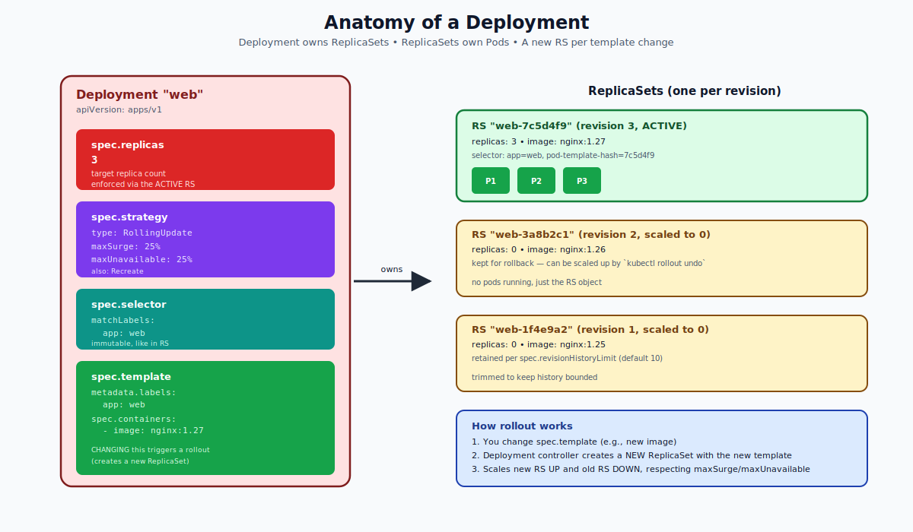
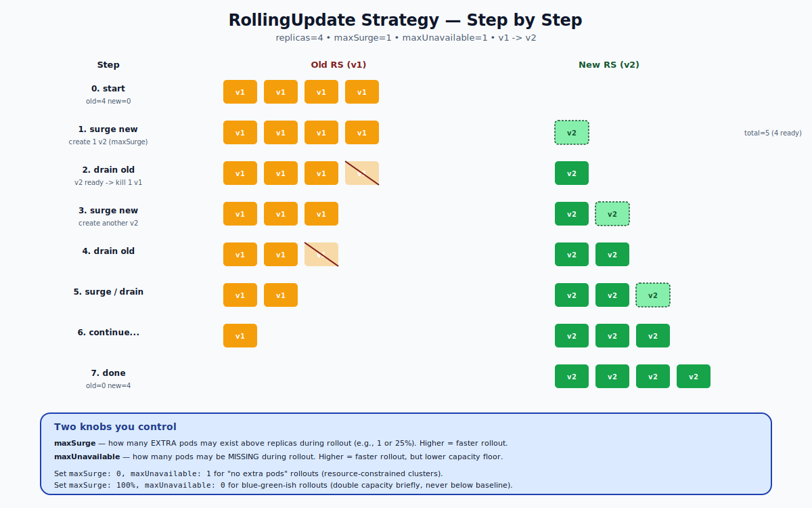
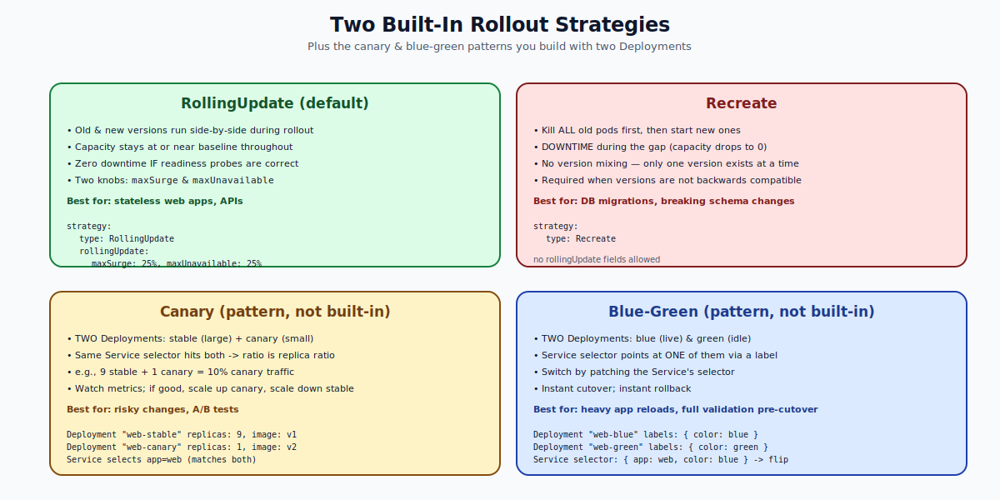

# Deployments — Deep Dive

## What a Deployment Is

A **Deployment** is the API object you actually use in production. It is one level above the ReplicaSet:

> "I want N pods of this template, AND I want a controlled, reversible way to change the template over time."

A Deployment manages ReplicaSets. ReplicaSets manage Pods. The Deployment never touches pods directly — it only creates and scales ReplicaSets, and lets each RS manage its own pods.



---

## Why Not Just Use a ReplicaSet?

Three things a bare ReplicaSet cannot do, but a Deployment can:

1. **Rolling updates.** Change the template image, gracefully replace old pods with new ones.
2. **Rollback.** Revert to a previous template with a single command.
3. **History.** Keep N previous ReplicaSets around so you can audit and restore.

Internally, a Deployment makes a new ReplicaSet every time the template changes. The old RS is scaled to zero (kept around for rollback). The new RS is scaled up to the desired replica count. This is exactly what a rolling update is.

---

## The Deployment Spec

```yaml
apiVersion: apps/v1
kind: Deployment
metadata:
  name: web
spec:
  replicas: 4
  revisionHistoryLimit: 10        # how many old RSs to keep
  minReadySeconds: 10             # delay before a new pod counts as Ready
  progressDeadlineSeconds: 600    # rollout fails after this
  strategy:
    type: RollingUpdate           # or Recreate
    rollingUpdate:
      maxSurge: 25%               # extra pods allowed
      maxUnavailable: 25%         # missing pods allowed
  selector:
    matchLabels:
      app: web
  template:
    metadata:
      labels:
        app: web
    spec:
      containers:
      - name: web
        image: nginx:1.27
        readinessProbe:
          httpGet: { path: /, port: 80 }
```

### Important fields explained

- **replicas** — desired pod count. Same as RS.
- **selector** — must match template labels. Immutable once set.
- **template** — the pod blueprint. Editing this triggers a rollout.
- **strategy** — how to roll out template changes (`RollingUpdate` or `Recreate`).
- **revisionHistoryLimit** — how many old RSs to keep for rollback (default 10).
- **minReadySeconds** — pod must stay Ready this long before being counted as Available. Useful for catching crash loops that take a few seconds to manifest.
- **progressDeadlineSeconds** — after this, the Deployment is marked `Progressing=False, Reason=ProgressDeadlineExceeded`. Useful with CI/CD to fail bad deploys.

---

## RollingUpdate — Step by Step

This is the default and the one you'll use 95% of the time.



The Deployment controller maintains the invariant:

```
(old + new ready) >= replicas - maxUnavailable
(old + new total) <= replicas + maxSurge
```

Every reconcile loop, it makes the smallest change possible toward the new state:
- Can it scale the new RS up by one without violating maxSurge? Do it.
- Can it scale the old RS down by one without violating maxUnavailable? Do it.
- Repeat until old=0 and new=replicas.

### maxSurge and maxUnavailable

- **maxSurge** — extra pods allowed above `replicas`. Default 25%. Higher = faster rollout, more nodes needed briefly.
- **maxUnavailable** — pods allowed missing during rollout. Default 25%. Higher = faster rollout, but capacity floor drops.

| Combination | Behavior |
|---|---|
| `maxSurge=25%, maxUnavailable=25%` | Default. Balanced. |
| `maxSurge=0, maxUnavailable=1` | Conservative. No extra pods needed. Useful on tight clusters. |
| `maxSurge=100%, maxUnavailable=0` | Doubled capacity briefly; never below baseline. Closest you get to blue-green with one Deployment. |
| `maxSurge=1, maxUnavailable=0` | Slow, safe rollout one pod at a time. |

Both can be percentages or absolute numbers. They cannot both be `0` (deadlock).

---

## Recreate — The Other Built-in Strategy

```yaml
strategy:
  type: Recreate
```

Behavior: kill ALL old pods first, then start the new ones. There is **downtime** during the gap.

Use it when:
- The new version is **not backward compatible** with the old. Two versions running side-by-side would corrupt data or break clients.
- You have a singleton workload that cannot tolerate two replicas (e.g., something writing to a single shared file).
- DB schema migrations where the old code can't speak the new schema.

Do **not** use it for typical web apps — RollingUpdate gives zero-downtime for free.



---

## Canary and Blue-Green Patterns

Kubernetes does not have built-in canary or blue-green strategies. You build them with **two Deployments** and a Service:

### Canary
- `web-stable`: 9 replicas of v1
- `web-canary`: 1 replica of v2
- Both have label `app=web`. The Service selects `app=web`. Result: 10% of traffic hits the canary.
- Monitor metrics. If good, scale canary up and stable down. If bad, delete canary.

### Blue-green
- `web-blue`: 4 replicas of v1, label `color=blue`.
- `web-green`: 4 replicas of v2, label `color=green`.
- The Service selector includes `color=blue`. To cut over, patch the Service to `color=green`. Instant flip.

Both patterns are common with **service meshes** (Istio, Linkerd) where traffic-split percentages can be set independently of replica counts.

---

## The Rollout Lifecycle in Commands

```bash
# Create
kubectl create deployment web --image=nginx:1.25 --replicas=3
# or apply -f web.yaml

# Trigger a rollout (any template change does this)
kubectl set image deployment/web web=nginx:1.27

# Watch it
kubectl rollout status deployment/web

# History
kubectl rollout history deployment/web
kubectl rollout history deployment/web --revision=2

# Pause / resume
kubectl rollout pause deployment/web
# (make multiple changes here without triggering a rollout each time)
kubectl rollout resume deployment/web

# Roll back
kubectl rollout undo deployment/web                    # to previous
kubectl rollout undo deployment/web --to-revision=2    # to specific
```

Behind the scenes:
- `set image` patches `spec.template.spec.containers[].image`.
- The Deployment controller sees the change and creates a new RS.
- `rollout undo` patches the template back to the old RS's template.
- `rollout pause` sets `spec.paused: true`. The controller stops reconciling until you resume.

---

## How the Deployment Names Its ReplicaSets

Every RS owned by a Deployment has a name like `web-7c5d4f9bd`. The suffix is the **pod-template-hash** — a hash of the pod template. This is added as a label to:

- The RS itself (`pod-template-hash=7c5d4f9bd`)
- The pods created by the RS (same label)
- The RS selector (so it only matches "its own" pods)

Why? Because two Deployments with the same `app=web` selector would otherwise fight. The pod-template-hash is the secret sauce that lets multiple Deployments coexist without controllers stepping on each other.

---

## Deployment Status Conditions

```bash
kubectl get deployment web -o jsonpath='{.status.conditions}' | jq
```

Three conditions you'll see:

- **Available** — at least `replicas - maxUnavailable` pods are Ready.
- **Progressing** — the Deployment is currently making progress (creating or deleting pods).
- **ReplicaFailure** — pod creation failed (e.g., quota exceeded, no nodes available).

A "good" rollout ends with `Available=True, Progressing=True, Reason=NewReplicaSetAvailable`.

A "bad" rollout shows `Progressing=False, Reason=ProgressDeadlineExceeded` after `progressDeadlineSeconds`.

---

## Common Operations & Patterns

### Scale
```bash
kubectl scale deployment web --replicas=10
# or
kubectl autoscale deployment web --min=2 --max=10 --cpu-percent=70
```

### Restart all pods (without changing the image)
```bash
kubectl rollout restart deployment/web
```
Internally this just patches the template with an annotation `kubectl.kubernetes.io/restartedAt` to force a rollout. Useful after rotating Secrets/ConfigMaps.

### Annotation-based change cause
```bash
kubectl annotate deployment web kubernetes.io/change-cause="upgrade nginx 1.27"
kubectl rollout history deployment/web
# CHANGE-CAUSE column now has your message
```

---

## Common Failure Modes

| Symptom | Likely cause | Fix |
|---|---|---|
| Rollout stuck Progressing | Readiness probe never passes | Check probe path/port; check app logs |
| `ProgressDeadlineExceeded` | Same as above, after timeout | Increase `progressDeadlineSeconds` only after fixing the real issue |
| `ImagePullBackOff` on new pods | Bad image tag, no auth | Fix image; add imagePullSecrets |
| Old pods still running after `set image` | You forgot — Deployment was paused | `kubectl rollout resume` |
| Two pods with different versions linger | maxSurge or maxUnavailable too generous; or new pods crashing in a loop | Watch logs; tighten knobs |
| `kubectl rollout undo` keeps failing | Old RS's template references a deleted ConfigMap/Secret | Recreate the dependency, then undo |

---

## Summary

A Deployment is the operational interface for stateless workloads in Kubernetes. It does the same thing a ReplicaSet does (`replicas` of `template`), plus it manages **change** — through versioned ReplicaSets, rolling updates with `maxSurge`/`maxUnavailable`, history, pause/resume, and rollback. Two strategies exist: `RollingUpdate` (default, zero downtime) and `Recreate` (downtime, used for incompatible upgrades). Canary and blue-green are patterns you build with two Deployments and clever Service selectors.

Open `02-Exercise.md` to do real rollouts, intentionally break them, roll back, pause/resume, and inspect history.
