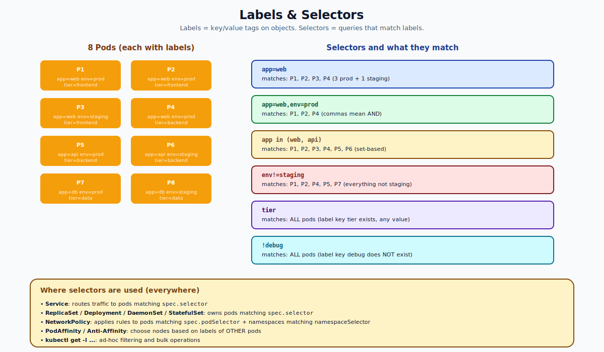

# Labels and Selectors — Deep Dive

## What Labels Are

A **label** is a key/value tag attached to any Kubernetes object. They live under `metadata.labels`:

```yaml
metadata:
  name: web-7c5d4f9bd-aaa11
  labels:
    app: web
    env: prod
    tier: frontend
    version: "1.27"
```

Labels are the **organizing principle** of Kubernetes. They are how every controller, Service, NetworkPolicy, and ad-hoc query identifies "the things I care about."

Without labels: there's no way to say "the 3 pods that make up my web app." You'd have to refer to them by name — but pod names change every restart.

With labels: "the 3 pods with `app=web,env=prod`" is a stable, declarative identity.

---

## Label Rules

- **Key**: optional prefix `/` name. Prefix is a DNS subdomain (e.g., `kubernetes.io/`). Reserved prefixes: `kubernetes.io/`, `k8s.io/`. Use your own domain (`example.com/team`) for custom keys.
- **Name**: 63 chars max, alphanumeric, `-`, `_`, `.`. Must start and end with alphanumeric.
- **Value**: 63 chars max, same character set, can be empty string.
- **Number of labels**: no hard limit, but keep them under ~10 per object for sanity.

Examples:
- `app: web` ✓
- `kubernetes.io/role: control-plane` ✓ (reserved prefix, K8s sets these)
- `example.com/team: payments` ✓ (custom prefix)
- `My App: Web` ✗ (uppercase + space)

---

## What Selectors Are

A **selector** is a query that matches labels. There are two forms.



### Equality-based (the simple form)
- `app=web` — has key `app` with value `web`
- `app!=web` — does NOT have value `web`
- Multiple are AND-ed: `app=web,env=prod` means both must hold.

### Set-based (the rich form)
- `app in (web, api)` — has `app` set to one of these
- `app notin (debug, test)` — has `app` but not those values
- `tier` — has the key `tier` (any value, even empty string)
- `!debug` — does NOT have the key `debug`

The two forms can be combined in `kubectl`:
```bash
kubectl get pods -l 'app in (web, api), env=prod, !debug'
```

In YAML, controllers use the structured forms:
```yaml
selector:
  matchLabels:                # equality-based AND
    app: web
    env: prod
  matchExpressions:           # set-based
  - { key: tier, operator: In, values: [frontend, backend] }
  - { key: debug, operator: DoesNotExist }
```
Both blocks are AND-ed. Operators: `In`, `NotIn`, `Exists`, `DoesNotExist`.

---

## Where Selectors Are Used

Almost every Kubernetes object that "groups" pods uses a selector:

| Object | What its selector picks |
|---|---|
| Service | Pods to send traffic to (becomes Endpoints) |
| ReplicaSet | Pods it owns and counts toward `replicas` |
| Deployment | (transitively, via the RS it manages) |
| DaemonSet | Pods it owns (one per node) |
| StatefulSet | Pods it owns (with stable identity) |
| Job / CronJob | Pods it owns |
| NetworkPolicy | Pods the policy applies to + Pods/namespaces traffic comes from |
| PodAffinity / AntiAffinity | OTHER pods to be near or far from |
| HorizontalPodAutoscaler | (via `scaleTargetRef`) the workload to scale |

This is why labels are foundational. Get them wrong and nothing else works.

---

## Recommended Labels (Kubernetes Convention)

The Kubernetes project documents a canonical set of labels for application metadata:

| Key | Description | Example |
|---|---|---|
| `app.kubernetes.io/name` | Application name | `mysql` |
| `app.kubernetes.io/instance` | Unique instance ID | `mysql-prod-1` |
| `app.kubernetes.io/version` | Version | `5.7.21` |
| `app.kubernetes.io/component` | Component within architecture | `database` |
| `app.kubernetes.io/part-of` | Larger app it belongs to | `wordpress` |
| `app.kubernetes.io/managed-by` | Tool managing the operation | `helm` |

These are conventions, not hard requirements. Helm and many other tools auto-set them. Tools like Lens and `kubectl` plugins can use them for grouping.

---

## Annotations vs Labels

Annotations are also key/value pairs on objects, but they are **not selectable**.

| | Labels | Annotations |
|---|---|---|
| Indexed for selection | Yes | No |
| Used by selectors | Yes | No |
| Length limits | Tight (63 chars) | Loose (256KB total per object) |
| Purpose | Identify, group, route | Attach arbitrary metadata for tools |
| Example | `app: web` | `kubernetes.io/change-cause: "upgrade nginx"` |

Use labels for **identity**. Use annotations for **metadata for tools** (CI/CD, dashboards, controllers).

---

## Common Mistakes

| Mistake | Result | Fix |
|---|---|---|
| Selector in a Service that doesn't match any pod | No endpoints, traffic goes nowhere | `kubectl get endpoints <svc>` |
| Selector matches more than expected (e.g., dev + prod) | Service routes traffic to wrong pods | Add `env` label to selector |
| Using uppercase or spaces in label keys | API rejects | Stick to lowercase a–z and `-` |
| Editing pod-template-hash by hand | Breaks Deployment ownership | Don't touch labels K8s sets |
| Two Deployments with the same selector | RSs fight over pods | Always include unique label per Deployment |
| Forgetting label on Pod template that selector requires | Selector can't match new pods | API rejects creation; fix the template |

---

## Working with Labels — kubectl

```bash
# Add / update a label
kubectl label pod web-abc env=prod
kubectl label pod web-abc env=staging --overwrite

# Remove a label
kubectl label pod web-abc env-

# Show labels in get output
kubectl get pods --show-labels
kubectl get pods -L app,env       # label as columns

# Query
kubectl get pods -l app=web
kubectl get pods -l 'app=web,env!=prod'
kubectl get pods -l 'app in (web,api)'
kubectl get pods -l '!debug'

# Apply to many objects via selector
kubectl delete pods -l env=test
kubectl get all -l app=web
```

---

## Why Labels Are Better Than Names

Pod names change. They're generated (`web-7c5d4f9bd-aaa11`). They die when the pod restarts. Names are useless for grouping.

Labels are stable across pod restarts (the controller copies them from the template into each new pod). They survive deletion and recreation. They are the right primitive for the question "which pods belong to my app?"

This is also why Services use selectors instead of pod-name lists. Services need to keep working as pods come and go — only labels make that possible.

---

## Summary

Labels are tiny key/value tags on objects. Selectors are queries that match labels (equality-based or set-based). Together, they're the wiring of Kubernetes — Services, controllers, NetworkPolicies, and your own ad-hoc filters all use them. Labels are stable identifiers that survive pod churn; names are not. Use the canonical `app.kubernetes.io/...` labels for portability and use annotations (not labels) for arbitrary metadata.

Open `02-Exercise.md` to label, query, and bulk-act on pods.
