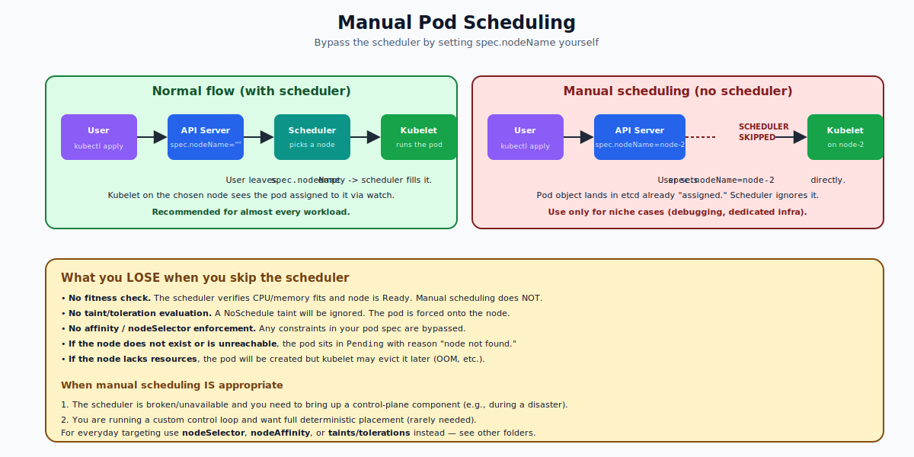

# Manual Pod Scheduling — Deep Dive

## What "Manual Scheduling" Means

In normal Kubernetes, you submit a pod and the **scheduler** decides which node should run it. The scheduler reads the pod's resource requests, taints/tolerations, affinity, and other constraints, then finds the best node and writes that node's name into `spec.nodeName`.

**Manual scheduling** is when *you* fill in `spec.nodeName` yourself. The scheduler is bypassed entirely.

```yaml
apiVersion: v1
kind: Pod
metadata:
  name: pinned
spec:
  nodeName: worker-2          # <- you set this; scheduler does nothing
  containers:
  - name: c
    image: nginx
```



The kubelet on `worker-2` sees a pod assigned to its node and starts it. Done.

---

## How the Scheduler Normally Fills `nodeName`

When you create a pod without `nodeName`:

1. The pod is persisted in etcd with `spec.nodeName: ""`.
2. The scheduler watches for unscheduled pods.
3. The scheduler runs its filter + score plugins to pick a node.
4. The scheduler PATCHes the pod, setting `spec.nodeName=<chosen>`.
5. The kubelet on `<chosen>` sees the assignment and starts the pod.

Manual scheduling skips steps 2–4. You write `nodeName` directly. Step 5 happens normally.

---

## What You Lose by Skipping the Scheduler

The scheduler does much more than pick a node. It also:

- **Verifies fit.** Checks the node has enough CPU/memory for the pod's `requests`.
- **Honors taints.** Refuses to place a pod on a tainted node unless the pod tolerates the taint.
- **Honors affinity / nodeSelector.** Respects your placement rules.
- **Filters by node condition.** Skips nodes that are NotReady, MemoryPressure, etc.

Manual scheduling does **none of this**. Whatever you write goes. If the node is full, your pod will still land — and the kubelet may evict it later. If the node has a `NoSchedule` taint, your pod ignores it. If the node doesn't exist, your pod sits in `Pending` with the reason "node not found."

---

## When Is Manual Scheduling Appropriate?

Genuinely few cases. Two that come up:

1. **Bootstrap / disaster recovery.** The scheduler itself is down or there's no scheduler running, and you need to start a control-plane component on a specific node.
2. **You're writing a custom controller** that needs full placement control and explicitly does not want the default scheduler involved.

For *any* normal placement requirement ("run on GPU nodes," "keep these pods together," "stay on same zone as DB pod") you should use:

- `nodeSelector` — simple equality match on labels
- `nodeAffinity` / `podAffinity` / `podAntiAffinity` — rich expressions
- Taints + tolerations — node-side filtering
- A custom scheduler with a unique `schedulerName`

These are all the "right way" to express placement.

---

## The Mechanics of Setting `nodeName`

You set it like any other field:

```yaml
apiVersion: v1
kind: Pod
metadata:
  name: pinned
spec:
  nodeName: worker-2
  containers:
  - name: c
    image: nginx
```

Or imperatively (after creation, with a patch — though this only works on a Pending pod):

```bash
kubectl patch pod mypod -p '{"spec":{"nodeName":"worker-2"}}'
```

`spec.nodeName` is **immutable once set on a running pod**. You cannot move a running pod from one node to another. You delete it and recreate it on the new node.

---

## What Happens If the Target Node Is Bad?

| Situation | Result |
|---|---|
| Node doesn't exist | Pod stays Pending. Events show `nodeName not found`. |
| Node is `NotReady` | Pod may stay Pending, or sit unscheduled until node returns. |
| Node has insufficient memory | Pod is created but may be `Evicted` by the kubelet. |
| Node has `NoSchedule` taint | Pod runs anyway — taints don't apply when scheduler is skipped. |
| Node is `cordoned` | Same — manual scheduling bypasses cordon. |
| Node has `NoExecute` taint already | Existing tolerations still apply at runtime — pod can be evicted. |

The first three rows are why manual scheduling is dangerous: errors that the scheduler would have caught silently slip through.

---

## Manual vs `nodeSelector` vs `nodeAffinity`

```yaml
# Manual: bypass the scheduler entirely
spec:
  nodeName: worker-2

# nodeSelector: scheduler MUST pick a node with these labels
spec:
  nodeSelector:
    disktype: ssd

# nodeAffinity: richer expressions, soft & hard
spec:
  affinity:
    nodeAffinity:
      requiredDuringSchedulingIgnoredDuringExecution:
        nodeSelectorTerms:
        - matchExpressions:
          - key: zone
            operator: In
            values: [us-east-1a, us-east-1b]
```

| Approach | Scheduler runs? | Validates fit? | Honors taints? | Use when |
|---|---|---|---|---|
| `nodeName` | No | No | No | Almost never |
| `nodeSelector` | Yes | Yes | Yes | "Pick any node with this label" |
| `nodeAffinity` | Yes | Yes | Yes | Complex placement rules |

---

## A Quick Word on Static Pods

Static pods are a related but different concept: the kubelet starts pods directly from YAML files in `/etc/kubernetes/manifests/` without the API Server's involvement. They aren't manually scheduled in the `nodeName` sense — they were never seen by the scheduler at all because they didn't go through the API. See the **Static Pods** folder.

---

## Summary

Manual pod scheduling means setting `spec.nodeName` yourself, which causes the scheduler to ignore the pod. The kubelet on the named node runs it. You lose every safety check the scheduler normally performs (fit, taints, affinity, node condition). Use this only in true bootstrap or recovery scenarios. For ordinary placement needs, use `nodeSelector`, `nodeAffinity`, or taints + tolerations.

Open `02-Exercise.md` to schedule pods manually, intentionally pick a bad node, and recover.
