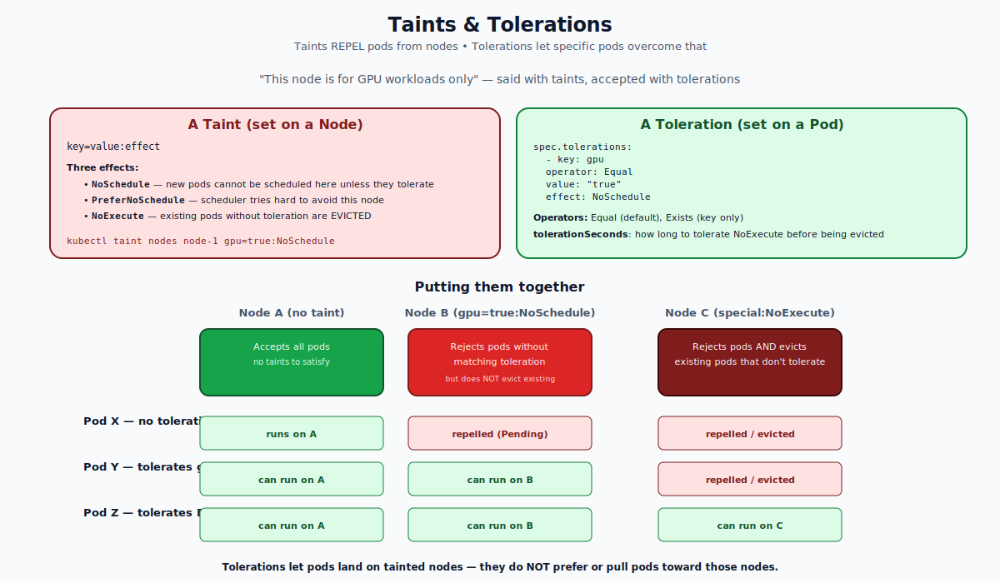

# Taints and Tolerations — Deep Dive

## The Mental Model

Think of taints and tolerations as a bouncer at a club:

- A **taint** on a node says: "This club has a dress code."
- A **toleration** on a pod says: "I'm wearing the right clothes."

A pod without the matching toleration is **repelled** by the node. A pod *with* the matching toleration is **allowed in**, but not pulled in — being tolerant doesn't mean being attracted.

This is the opposite of `nodeSelector` / `nodeAffinity`, which **attract** pods to nodes. Combine the two for full control.



---

## Anatomy of a Taint

A taint is `key=value:effect` on a node:

```bash
kubectl taint nodes node-1 gpu=true:NoSchedule
```

- **key** — any string (e.g., `gpu`, `dedicated`, `team`)
- **value** — optional; can be empty
- **effect** — one of:
  - `NoSchedule` — pods without a matching toleration **cannot be scheduled** to this node
  - `PreferNoSchedule` — softer; the scheduler **tries to avoid** this node
  - `NoExecute` — the strongest; pods without a matching toleration are **evicted** if they're already running, AND new pods are not scheduled

Remove a taint by appending `-`:
```bash
kubectl taint nodes node-1 gpu-              # remove key gpu (any effect)
kubectl taint nodes node-1 gpu:NoSchedule-   # remove only that effect
```

---

## Anatomy of a Toleration

A toleration goes on a pod (or pod template):

```yaml
spec:
  tolerations:
  - key: "gpu"
    operator: "Equal"        # or Exists
    value: "true"            # only if operator is Equal
    effect: "NoSchedule"     # or omit to match all effects
    tolerationSeconds: 60    # only with NoExecute; how long before evicting
```

### Operators

- `Equal` (default) — matches if `key`, `value`, and `effect` all match.
- `Exists` — matches if `key` and `effect` match. Value is ignored. (Don't set `value`.)

### Special wildcards

- `operator: Exists` with no `key` — tolerate **every** taint. Used by very privileged pods (`kube-proxy`, `cilium-agent`).
- Omitting `effect` — tolerate **any** effect for the matching key/value.

### tolerationSeconds (NoExecute only)

When a `NoExecute` taint is added to a node, pods without a tolerating toleration are evicted **immediately**. Pods with `tolerationSeconds: 60` are kept for 60 seconds, giving them time to drain gracefully.

---

## What Each Effect Does

| Effect | New pods without toleration | Existing pods without toleration |
|---|---|---|
| `NoSchedule` | Cannot be placed | Keep running (untouched) |
| `PreferNoSchedule` | Avoid if possible | Keep running |
| `NoExecute` | Cannot be placed | **Evicted** (subject to `tolerationSeconds`) |

**Key insight:** taints are evaluated by the **scheduler**. They only affect placement. The exception is `NoExecute`, which is enforced at runtime by the kubelet's eviction logic.

---

## Built-in Taints (Set by Kubernetes Itself)

The control plane automatically adds taints to express node conditions:

| Taint | Meaning |
|---|---|
| `node.kubernetes.io/not-ready` | Node is NotReady (kubelet hasn't reported). |
| `node.kubernetes.io/unreachable` | Node controller can't reach the kubelet. |
| `node.kubernetes.io/memory-pressure` | Node is low on memory. |
| `node.kubernetes.io/disk-pressure` | Node is low on disk. |
| `node.kubernetes.io/pid-pressure` | Node is running out of PIDs. |
| `node.kubernetes.io/network-unavailable` | Node has no network. |
| `node.kubernetes.io/unschedulable` | Node was cordoned. |
| `node-role.kubernetes.io/control-plane` | This is a control-plane node. |

Most of these are `NoSchedule` or `NoExecute`. They are why `kubectl describe node` shows taints even on nodes you didn't taint.

The control-plane taint (`node-role.kubernetes.io/control-plane:NoSchedule`) is why your workload pods don't normally land on the master in single-node clusters — except when they explicitly tolerate it. A common one-liner to make a single-node cluster usable for workloads:

```bash
kubectl taint nodes <node> node-role.kubernetes.io/control-plane:NoSchedule-
```

---

## Default Tolerations Kubernetes Adds for You

For `not-ready` and `unreachable` (both `NoExecute`), Kubernetes automatically adds tolerations to **all pods** with `tolerationSeconds: 300`. This is why a node going briefly NotReady doesn't immediately evict your pods — there's a 5-minute grace.

You can shorten this for stateless apps that don't care about node failures:

```yaml
tolerations:
- key: node.kubernetes.io/not-ready
  operator: Exists
  effect: NoExecute
  tolerationSeconds: 30
- key: node.kubernetes.io/unreachable
  operator: Exists
  effect: NoExecute
  tolerationSeconds: 30
```

---

## Common Patterns

### Pattern 1 — Dedicated nodes (e.g., GPU nodes)
```bash
kubectl taint nodes gpu-node-1 gpu=true:NoSchedule
```
Only pods that explicitly tolerate `gpu=true:NoSchedule` can run there.

### Pattern 2 — Spot / preemptible nodes
Cloud providers often add a `cloud.google.com/gke-preemptible:NoSchedule` (or AWS equivalent) taint. Workloads that tolerate it can use cheap spot instances.

### Pattern 3 — Maintenance / draining
```bash
kubectl drain node-1 --ignore-daemonsets
```
Internally, drain adds `node.kubernetes.io/unschedulable:NoSchedule` (cordon) and evicts pods.

### Pattern 4 — Soft preference: avoid this node
```bash
kubectl taint nodes node-1 noisy=true:PreferNoSchedule
```
Pods can still land there if no other capacity exists.

### Pattern 5 — Quarantine a misbehaving node
```bash
kubectl taint nodes node-1 quarantine=true:NoExecute
```
All pods without that toleration get evicted right away. Use `tolerationSeconds` for graceful drains.

---

## Taints + nodeSelector — Both Sides Matter

Taints **repel**. Selectors **attract**. They're independent.

If you taint nodes `gpu=true:NoSchedule` and you want only your GPU workload there:

1. Taint the GPU nodes.
2. Add the toleration to your GPU pods (so they're allowed in).
3. Add a `nodeSelector` or `nodeAffinity` to your GPU pods (so they go there preferentially).

Without step 3, your GPU pod might still land on a non-GPU node — toleration just permits, doesn't pull.

---

## Common Mistakes

| Mistake | Result | Fix |
|---|---|---|
| Tainting a node with active workloads (`NoExecute`) | Mass eviction | Use `NoSchedule` first, then drain |
| Toleration without nodeSelector | Pod is permitted on tainted node, but rarely lands there | Combine with affinity/selector |
| Pod has toleration with `Exists` and no key | Tolerates EVERY taint — usually too permissive | Specify the key explicitly |
| Forgetting toleration on a control-plane DaemonSet | DaemonSet pod never runs on the control-plane node | Add `node-role.kubernetes.io/control-plane:NoSchedule` toleration |
| `NoExecute` with no `tolerationSeconds` | Pod stays forever (no eviction) | Set a finite tolerationSeconds for grace |

---

## Quick Reference

```yaml
# Pod template
spec:
  tolerations:
  # Match a specific taint
  - key: "gpu"
    operator: "Equal"
    value: "true"
    effect: "NoSchedule"

  # Match any taint with a key (any value)
  - key: "spot-instance"
    operator: "Exists"
    effect: "NoSchedule"

  # Tolerate node-not-ready briefly
  - key: "node.kubernetes.io/not-ready"
    operator: "Exists"
    effect: "NoExecute"
    tolerationSeconds: 30

  # Tolerate everything (use with care)
  - operator: "Exists"
```

```bash
# Add taints
kubectl taint nodes node-1 gpu=true:NoSchedule
kubectl taint nodes node-1 dedicated=ml:NoExecute

# Remove taints
kubectl taint nodes node-1 gpu-
kubectl taint nodes node-1 gpu:NoSchedule-

# View taints on a node
kubectl get node node-1 -o jsonpath='{.spec.taints}'
kubectl describe node node-1 | grep -A2 Taints
```

---

## Summary

Taints repel pods from nodes. Tolerations are pod-side opt-ins that let specific pods bypass the repulsion. Three effects: `NoSchedule` (block placement), `PreferNoSchedule` (soft), `NoExecute` (block AND evict). Match by key, value, and effect; or use `Exists` for key-only matching. Tolerations only allow — they don't attract. Combine with `nodeSelector`/`nodeAffinity` to actually place pods on dedicated nodes.

Open `02-Exercise.md` to taint nodes, toleration-bypass them, watch evictions, and clean up.
