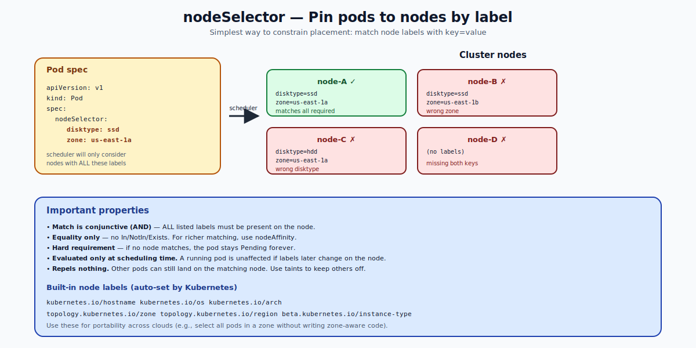

# nodeSelector — Deep Dive

## What `nodeSelector` Is

`nodeSelector` is the simplest way to constrain pod placement. You declare a map of label key/value pairs in your pod spec; the scheduler will only consider nodes that have **all** of those labels.

```yaml
apiVersion: v1
kind: Pod
metadata:
  name: ssd-pod
spec:
  nodeSelector:
    disktype: ssd
    zone: us-east-1a
  containers:
  - name: c
    image: nginx
```

The pod above will only be placed on a node that has both `disktype=ssd` AND `zone=us-east-1a` as labels. If no node matches, the pod stays `Pending`.



---

## Properties (and Limitations)

| Property | Detail |
|---|---|
| Match logic | **AND** of all entries (conjunction). |
| Operators | Equality only. No `In`, `NotIn`, `Exists`. |
| Strictness | Hard requirement. No "preferred" version. |
| Evaluation timing | Only at scheduling time. Already-running pods are not re-evaluated if node labels change. |
| Effect on others | Does NOT repel other pods from matching nodes. |

If you need OR logic, set membership, "soft" preferences, or anti-rules, use **nodeAffinity** (see the Node-Affinity folder). nodeSelector is the bare-bones tool; nodeAffinity is the rich one.

---

## Labeling Nodes

Nodes have automatic labels (set by the kubelet) and custom labels (set by you).

### Built-in labels

| Label | Set by | Examples |
|---|---|---|
| `kubernetes.io/hostname` | kubelet | `worker-1` |
| `kubernetes.io/os` | kubelet | `linux`, `windows` |
| `kubernetes.io/arch` | kubelet | `amd64`, `arm64` |
| `topology.kubernetes.io/zone` | cloud provider | `us-east-1a` |
| `topology.kubernetes.io/region` | cloud provider | `us-east-1` |
| `node.kubernetes.io/instance-type` | cloud provider | `m5.large` |

These are the safe ones to rely on for portable placement (e.g., spread across zones).

### Custom labels

```bash
kubectl label nodes worker-1 disktype=ssd
kubectl label nodes worker-1 environment=production
kubectl label nodes worker-1 team=payments

# Remove
kubectl label nodes worker-1 disktype-

# Update
kubectl label nodes worker-1 disktype=nvme --overwrite
```

Best practice: prefix custom labels with your domain (e.g., `example.com/team`) to avoid collisions with future built-in keys.

---

## Common Use Cases

### 1. Hardware classes
```yaml
nodeSelector:
  disktype: ssd
```

### 2. Workload tiers
```yaml
nodeSelector:
  workload: gpu
```

### 3. Zone pinning (rarely a good idea by itself)
```yaml
nodeSelector:
  topology.kubernetes.io/zone: us-east-1a
```

### 4. OS / architecture (multi-arch clusters)
```yaml
nodeSelector:
  kubernetes.io/os: linux
  kubernetes.io/arch: arm64
```

---

## What `nodeSelector` Does NOT Do

- It doesn't push other pods off the node.
- It doesn't prefer the node — it requires it.
- It can't say "OR" between two label values.
- It can't reschedule a running pod if the node's labels change.

For all of those, use `nodeAffinity` (richer matching) or taints/tolerations (repulsion).

---

## Combining with Other Mechanisms

### nodeSelector + Taints (the "dedicated nodes" pattern)
- Taint the node so others can't schedule there.
- Add toleration to your pod so it can.
- Add `nodeSelector` so it's actually placed there (not just permitted to be).

```yaml
spec:
  nodeSelector:
    workload: gpu
  tolerations:
  - { key: gpu, operator: Equal, value: "true", effect: NoSchedule }
```
Plus on the node:
```bash
kubectl taint  nodes gpu-1 gpu=true:NoSchedule
kubectl label  nodes gpu-1 workload=gpu
```

### nodeSelector + nodeAffinity
You can use both. They are AND-ed. Modern manifests usually skip nodeSelector entirely and use nodeAffinity for everything.

---

## Failure Mode: Pod Pending Forever

If no node matches your `nodeSelector`, the scheduler reports a clear failure:

```
Events:
  Warning  FailedScheduling   default-scheduler   0/3 nodes are available: 3 node(s) didn't match Pod's node affinity/selector.
```

Always run `kubectl describe pod` when a pod is stuck Pending — the events tell you exactly why.

---

## Quick Reference

```yaml
# Pod spec
spec:
  nodeSelector:
    key1: value1
    key2: value2
```

```bash
# Label management
kubectl label nodes <name> key=value
kubectl label nodes <name> key=newvalue --overwrite
kubectl label nodes <name> key-

# Inspect
kubectl get nodes --show-labels
kubectl get nodes -L disktype,zone
kubectl get nodes -l disktype=ssd
```

---

## Summary

`nodeSelector` is a map of `key=value` constraints on a pod that the scheduler enforces by AND-matching against node labels. It's simple, equality-only, and hard. For richer expressions or "soft" preferences, use `nodeAffinity`. For repulsion, use taints. The three mechanisms are independent and combine naturally.

Open `02-Exercise.md` to label nodes, target them with `nodeSelector`, and watch the scheduler obey.
