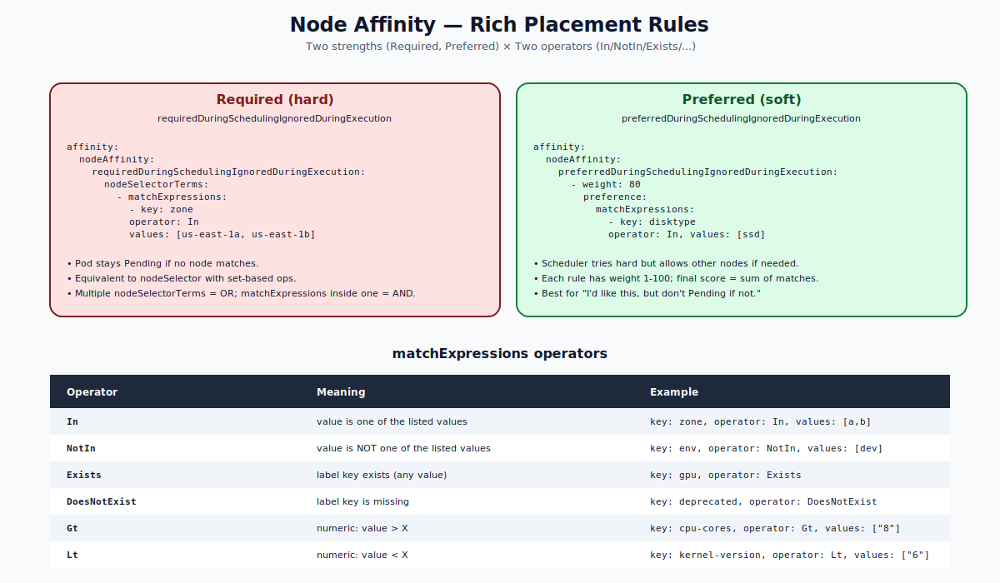

# Node Affinity — Deep Dive

## Why Node Affinity Exists

`nodeSelector` is fine for "must run on a node with key=value." But you'll quickly want:

- "Must run in zone A **or** zone B" (set-based OR)
- "**Prefer** SSD nodes, but don't fail if none available" (soft constraint)
- "Avoid nodes labeled deprecated" (NotIn)
- "Run only on nodes that have a GPU label set, regardless of value" (Exists)

`nodeAffinity` adds all of these. It's the rich version of `nodeSelector`.



---

## The Two Modes

`nodeAffinity` has two strengths:

### 1. Required (hard)
```yaml
spec:
  affinity:
    nodeAffinity:
      requiredDuringSchedulingIgnoredDuringExecution:
        nodeSelectorTerms:
        - matchExpressions:
          - key: zone
            operator: In
            values: [us-east-1a, us-east-1b]
```
- The pod stays `Pending` if no node matches.
- "IgnoredDuringExecution" — once placed, label changes on the node don't move it.

### 2. Preferred (soft)
```yaml
spec:
  affinity:
    nodeAffinity:
      preferredDuringSchedulingIgnoredDuringExecution:
      - weight: 80
        preference:
          matchExpressions:
          - key: disktype
            operator: In
            values: [ssd]
```
- Scheduler scores nodes; tries to land on matching nodes first.
- If no match, falls back to any node.
- `weight` is 1–100; multiple soft rules are summed for the final score.

You can use both `required` and `preferred` together: hard floor + soft preference.

---

## Operators

| Operator | Meaning |
|---|---|
| `In` | label value is in the listed set |
| `NotIn` | label value is NOT in the listed set |
| `Exists` | label key exists (value ignored) |
| `DoesNotExist` | label key is missing |
| `Gt` | numeric: value > X (string comparison rules apply for non-numeric) |
| `Lt` | numeric: value < X |

`Gt` and `Lt` are useful for numeric label values like CPU cores or kernel versions.

---

## OR / AND Logic

This is the crucial detail people miss.

```yaml
requiredDuringSchedulingIgnoredDuringExecution:
  nodeSelectorTerms:                 # OR between terms
  - matchExpressions:                # AND inside one term
    - { key: zone, operator: In, values: [us-east-1a] }
    - { key: tier, operator: In, values: [high-perf] }
  - matchExpressions:
    - { key: zone, operator: In, values: [us-east-1b] }
```

Reading order:
- A node passes if ANY of the `nodeSelectorTerms` matches (OR).
- Within a single term, ALL `matchExpressions` must hold (AND).

Above: pod runs on `(zone=a AND tier=high-perf) OR (zone=b)`.

---

## Required vs nodeSelector

`required... nodeAffinity` is a strict superset of `nodeSelector`:
- Same hard semantics ("Pending if no match").
- Plus operators (`NotIn`, `Exists`, `DoesNotExist`, `Gt`, `Lt`).
- Plus OR via multiple `nodeSelectorTerms`.

If you find yourself writing nodeSelector with non-trivial logic, switch to nodeAffinity.

---

## Preferred + Weights

Multiple preferred rules combine additively:

```yaml
preferredDuringSchedulingIgnoredDuringExecution:
- weight: 70
  preference:
    matchExpressions:
    - { key: disktype, operator: In, values: [ssd] }
- weight: 30
  preference:
    matchExpressions:
    - { key: zone, operator: In, values: [us-east-1a] }
```

For each candidate node:
- +70 if `disktype=ssd`
- +30 if `zone=us-east-1a`
- 0 otherwise

The scheduler picks among feasible nodes the one with the highest score. Ties are broken by other plugins (resource fit, balanced allocation, etc.).

---

## "IgnoredDuringExecution" — What It Means

Both modes say "...IgnoredDuringExecution" because once the pod is placed, the rule is no longer enforced. If you change a node label after a pod is running there, the pod stays put.

There's no "RequiredDuringExecution" mode that would re-check rules continuously. (It was on the roadmap once but never implemented.) For dynamic re-evaluation, you'd need a custom controller that deletes and recreates pods on label changes.

---

## Common Patterns

### Run only on Linux x86_64
```yaml
requiredDuringSchedulingIgnoredDuringExecution:
  nodeSelectorTerms:
  - matchExpressions:
    - { key: kubernetes.io/os, operator: In, values: [linux] }
    - { key: kubernetes.io/arch, operator: In, values: [amd64] }
```

### Spread across two zones
```yaml
requiredDuringSchedulingIgnoredDuringExecution:
  nodeSelectorTerms:
  - matchExpressions:
    - { key: topology.kubernetes.io/zone, operator: In, values: [us-east-1a, us-east-1b] }
```
(For balanced spread within those zones, also use `topologySpreadConstraints` — beyond this folder.)

### Strongly prefer GPU nodes
```yaml
preferredDuringSchedulingIgnoredDuringExecution:
- weight: 100
  preference:
    matchExpressions:
    - { key: gpu, operator: Exists }
```

### Avoid deprecated nodes
```yaml
requiredDuringSchedulingIgnoredDuringExecution:
  nodeSelectorTerms:
  - matchExpressions:
    - { key: deprecated, operator: DoesNotExist }
```

### Hard "must" + soft "prefer"
```yaml
affinity:
  nodeAffinity:
    requiredDuringSchedulingIgnoredDuringExecution:
      nodeSelectorTerms:
      - matchExpressions:
        - { key: kubernetes.io/os, operator: In, values: [linux] }
    preferredDuringSchedulingIgnoredDuringExecution:
    - weight: 80
      preference:
        matchExpressions:
        - { key: disktype, operator: In, values: [ssd] }
```

---

## Pod Affinity / Anti-Affinity (Brief Mention)

The same machinery exists for **pod-to-pod** placement:

- `podAffinity` — schedule near pods matching a selector (e.g., "next to my cache pod")
- `podAntiAffinity` — schedule away from pods matching a selector (e.g., "spread my replicas across nodes")

These deserve their own folder. For now, just know they exist and use the same `required`/`preferred` and operator vocabulary, but match against POD labels in given namespaces and TOPOLOGY (typically `topology.kubernetes.io/zone` or `kubernetes.io/hostname`).

---

## Common Mistakes

| Mistake | Result | Fix |
|---|---|---|
| Single `matchExpressions` with two values, expecting OR | It's AND inside, OR only between `nodeSelectorTerms` | Wrap each value in its own term |
| Forgot the `IgnoredDuringExecution` semantic | Expected pods to move on label change | Delete/recreate or use a controller |
| Used `Gt`/`Lt` on string label | Lexicographic compare, not numeric | Make sure values are decimal strings |
| `weight: 0` | No effect on scoring | Use 1–100 |
| Many heavy preferred rules | Scheduler does extra work per node | Keep preferred rules to 2-3 |

---

## Quick Reference

```yaml
spec:
  affinity:
    nodeAffinity:

      # Hard
      requiredDuringSchedulingIgnoredDuringExecution:
        nodeSelectorTerms:
        - matchExpressions:
          - { key: K, operator: OP, values: [V1, V2] }

      # Soft
      preferredDuringSchedulingIgnoredDuringExecution:
      - weight: 1-100
        preference:
          matchExpressions:
          - { key: K, operator: OP, values: [V1] }
```

---

## Summary

`nodeAffinity` is a richer, expression-based replacement for `nodeSelector`. Two strengths (`required` is hard, `preferred` is scored 1–100). Operators include `In`, `NotIn`, `Exists`, `DoesNotExist`, `Gt`, `Lt`. OR between `nodeSelectorTerms`, AND within `matchExpressions`. Both modes use `IgnoredDuringExecution`, so already-running pods are not re-evaluated when labels change.

Open `02-Exercise.md` to write hard and soft rules and watch the scheduler obey.
