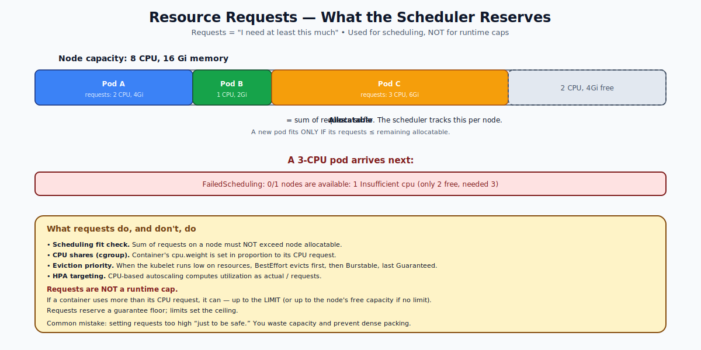

# Resource Requirements (Requests) — Deep Dive

## What `requests` Are

A container's `requests` are the **floor** of resources it needs. They're the contract you sign with the scheduler: "Promise me at least this much CPU and memory."

```yaml
spec:
  containers:
  - name: web
    image: nginx
    resources:
      requests:
        cpu: "250m"          # 0.25 CPU
        memory: "256Mi"
```

The scheduler uses requests to find a node that fits. The kubelet uses them to set cgroup CPU shares (proportional CPU access during contention). They are also the basis for QoS classification and autoscaling decisions.



---

## Units

### CPU
- `1` = 1 full CPU core (1 hyperthread on x86, 1 ARM core, etc.)
- `500m` = 500 milli-CPU = half a core
- `100m` = 0.1 of a core
- Decimal forms also work: `0.5` == `500m`

### Memory
Always **bytes** by default. Common suffixes:
- `K` / `M` / `G` / `T` — decimal (1000^N)
- `Ki` / `Mi` / `Gi` / `Ti` — binary (1024^N)

Examples: `128Mi` = 128 × 1024² bytes ≈ 134 MB. `2G` = 2 × 10^9 bytes = 2 GB exactly.

Use the binary suffixes (`Mi`, `Gi`) for memory — they match what tools and humans usually mean.

---

## How the Scheduler Uses Requests

For every node, the scheduler tracks:

```
node.allocatable.cpu - sum(requests.cpu of all pods on that node) = remaining CPU
```

A new pod fits if `requests.cpu` ≤ remaining CPU AND `requests.memory` ≤ remaining memory (and other dimensions like ephemeral-storage and PIDs).

If no node has enough free, the pod stays `Pending` with `FailedScheduling: Insufficient cpu` or `Insufficient memory`.

**Critical:** the scheduler reasons about **requests**, not actual usage. A pod that requests 4 CPU but only uses 0.1 CPU still consumes 4 CPU of "scheduler budget" on its node.

---

## How the Kubelet Uses Requests

After scheduling:
- **CPU request** sets the container's cgroup `cpu.weight` (or `cpu.shares` on cgroup v1) proportional to the request. During contention, containers get CPU in the same ratio as their requests.
- **Memory request** is informational at runtime. It does not enforce a floor — the kernel doesn't reserve memory.

This is why a container can use **more** CPU than its request when others are idle (no contention).

---

## QoS Classes (Determined by Requests + Limits)

| Class | Condition |
|---|---|
| `Guaranteed` | EVERY container has CPU & memory requests **equal to** limits |
| `Burstable` | At least one container has requests; not all are equal to limits |
| `BestEffort` | NO container has any requests or limits |

The class controls eviction priority when the node runs low on memory:
1. BestEffort — evicted first
2. Burstable — evicted next
3. Guaranteed — evicted last

This is why critical pods should be `Guaranteed`.

---

## What Happens Without Requests?

If you omit `requests`:

- The pod becomes `BestEffort` (assuming no limits either).
- The scheduler doesn't reserve anything for it. It can land on any node, including overloaded ones.
- During contention, it gets the LEAST CPU and is the FIRST to be evicted on memory pressure.

In short: **always set requests** for production workloads. "BestEffort" sounds nice but means "first to die."

---

## Sizing Requests Properly

Two extremes to avoid:

### Too low
- Pod oversubscribes the node.
- During traffic spikes, contention is severe.
- HPA reads inflated utilization (actual / tiny request) and over-scales.

### Too high
- Wasted capacity. The node "looks full" to the scheduler but is mostly idle.
- Cluster appears to need more nodes than it does.
- Pods get evicted prematurely if you misjudged.

The right approach: measure actual usage (Prometheus, `kubectl top`, `metrics-server`) and set `requests` to roughly the **steady-state** consumption (e.g., 50th–75th percentile of CPU) and `limits` to a safe ceiling.

The Vertical Pod Autoscaler (VPA) can do this automatically — it observes usage and recommends or applies request adjustments.

---

## Requests in Init Containers

Init containers run sequentially before the main containers. The pod's effective requests are:

```
max(
  sum of any init containers running concurrently,    // basically: max init request
  sum of all main containers
)
```

You usually only need to set requests on init containers if they do heavy work (DB migrations, large file copies). Lightweight init scripts can leave them out.

---

## ResourceQuotas and LimitRanges (Brief)

Two namespace-scoped objects shape requests:

- **ResourceQuota** — "this namespace can request at most 100 CPU and 200Gi of memory total."
- **LimitRange** — "any container without explicit requests gets these defaults; nothing exceeds these maximums."

Together they prevent runaway resource use. With LimitRange in place, even pods that omit requests get sensible defaults.

---

## Common Mistakes

| Mistake | Symptom | Fix |
|---|---|---|
| No requests at all | Pods evicted under load | Set requests at the 50–75th percentile of usage |
| Requests = limits = 4 CPU when actual usage is 0.2 | Cluster looks full but is empty | Right-size based on real metrics |
| Requesting massive memory "to be safe" | Pod stuck Pending forever | Profile real usage; reduce requests |
| Setting requests but not limits | Pod can hog a node and starve neighbors | Add a limit |
| Different units (`500m` vs `0.5`) | Same value, harmless | Pick one style and stick to it |

---

## Quick Reference

```yaml
spec:
  containers:
  - name: web
    image: nginx
    resources:
      requests:
        cpu: "250m"
        memory: "256Mi"
        ephemeral-storage: "1Gi"      # disk on container's writable layer
```

```bash
# Inspect actual usage (needs metrics-server)
kubectl top pods
kubectl top nodes

# Inspect requests already declared
kubectl get pod X -o jsonpath='{.spec.containers[*].resources}'
kubectl describe node Y | grep -A5 "Allocated resources"
```

---

## Summary

Requests are the resource floor a container needs. The scheduler uses them to find a node with enough free capacity. The kubelet uses CPU requests to compute cgroup shares for fair access during contention. Requests + limits jointly determine the pod's QoS class, which sets eviction priority. Always set requests for production workloads — sized from actual measurements, not guesses.

Open `02-Exercise.md` to set requests, watch scheduling failures, and inspect cgroup mappings.
