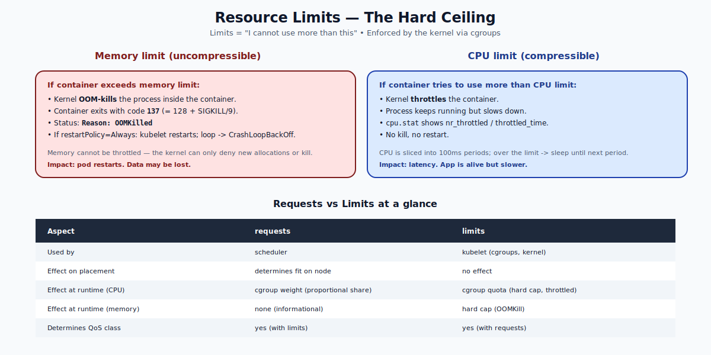

# Resource Limits — Deep Dive

## What `limits` Are

A container's `limits` are the **hard ceiling** of resources it can use. They are the contract you sign with the kernel: "If I try to exceed this, kill me or slow me."

```yaml
spec:
  containers:
  - name: web
    image: nginx
    resources:
      requests: { cpu: "200m", memory: "256Mi" }
      limits:   { cpu: "500m", memory: "512Mi" }
```

Limits are enforced by the **Linux kernel via cgroups**, not by the scheduler. The kernel does the policing.



---

## The Two Resources Behave Differently

### Memory — uncompressible
If a container tries to allocate beyond its memory limit, the kernel **OOM-kills** the process. The container exits with code 137 (= 128 + SIGKILL). The pod's status reads:

```
State:  Terminated
  Reason:    OOMKilled
  Exit Code: 137
```

If `restartPolicy: Always` (the default), the kubelet restarts the container. Repeated OOMKills lead to `CrashLoopBackOff`.

There is no graceful path: the kernel cannot "throttle" memory the way it does CPU. It can only deny allocation or kill.

### CPU — compressible
If a container tries to use more CPU than its limit, the kernel **throttles** it. The process keeps running, just slower. Throttled time accumulates in `/sys/fs/cgroup/.../cpu.stat`.

No kill, no restart, no error. Just degraded performance.

This asymmetry is why CPU limits are controversial — they cause silent latency without alerting anyone. Many teams set CPU requests but **no CPU limits**, allowing pods to burst into idle capacity.

---

## How Cgroups Implement Limits

For each container, the kubelet writes:

| Limit | cgroup v2 file | What it does |
|---|---|---|
| `cpu.max` | e.g., `50000 100000` | 50ms CPU per 100ms period = 0.5 CPU |
| `memory.max` | e.g., `536870912` | hard cap in bytes |

Inside the container:
```bash
cat /sys/fs/cgroup/cpu.max
# 50000 100000
cat /sys/fs/cgroup/memory.max
# 536870912
```

When usage approaches these, the kernel acts:
- **memory.max**: deny `mmap`/`brk`; if the process keeps trying, OOM kill.
- **cpu.max**: schedule the process out until the next period.

---

## Limits and QoS

The combination of requests and limits determines the QoS class:

| Class | Condition |
|---|---|
| Guaranteed | Every container has CPU + memory requests **equal to** limits |
| Burstable | Mixed (some requests, not all equal to limits) |
| BestEffort | No requests or limits |

Guaranteed pods are evicted last during memory pressure. They also get **exclusive cores** when CPU manager policy is set to `static` (advanced topic).

---

## When to Set CPU Limits

The classic debate. Two views:

### "Always set CPU limits."
- Predictable performance: every container gets exactly the CPU it pays for.
- Prevents noisy-neighbor surprises.
- Required for some HPA configurations.

### "Don't set CPU limits."
- Containers can burst into idle node capacity, improving utilization.
- Avoids silent latency spikes from throttling.
- Combined with `Guaranteed` memory + CPU requests, gives a predictable floor without an arbitrary ceiling.

The truth: it depends on your workload. Latency-sensitive services (web, gRPC) often suffer from CPU throttling and benefit from no CPU limit. Batch jobs and mixed-tenancy clusters benefit from CPU limits.

---

## Memory Limits — Always Set Them

Unlike CPU, memory limits are necessary:
- Without a limit, a single runaway pod can OOM the kernel and crash the entire node.
- Memory pressure at the node level is far more disruptive than throttling.

A reasonable default: `limits.memory ≈ 1.5x to 2x the steady-state usage`, and `requests.memory ≈ steady-state`.

---

## Common Failure Modes

### `OOMKilled`
```
$ kubectl describe pod x | grep -A4 "Last State"
Last State:    Terminated
  Reason:      OOMKilled
  Exit Code:   137
```
**Cause:** the container's memory limit was reached. **Fix:** raise the limit, or fix the leak.

### `CrashLoopBackOff`
Repeated restarts (often from OOMKill or app crashes). The kubelet backs off (10s, 20s, 40s, …, capped at 5 min) between restarts.

### High latency / throttling
```
$ kubectl exec POD -- cat /sys/fs/cgroup/cpu.stat
nr_periods 12345
nr_throttled 6789                 # high number = a lot of throttling
throttled_time 4567890123
```
**Fix:** raise CPU limit, or remove it.

### Init container and main container limits compound
The pod's `effective limits` for scheduling are `max(initContainers' resources, sum of main containers' resources)`. The runtime limits remain per-container.

---

## Quick Reference

```yaml
spec:
  containers:
  - name: web
    image: nginx
    resources:
      requests:
        cpu: "200m"
        memory: "256Mi"
      limits:
        cpu: "500m"            # optional but recommended
        memory: "512Mi"        # required for safety
        ephemeral-storage: "2Gi"
```

```bash
# See if a pod has been OOMKilled
kubectl describe pod X | grep -i oom

# Inspect cgroup files (on the node)
kubectl exec X -- cat /sys/fs/cgroup/memory.max
kubectl exec X -- cat /sys/fs/cgroup/cpu.max
kubectl exec X -- cat /sys/fs/cgroup/cpu.stat

# Watch memory usage approach the limit
kubectl top pod X --containers
```

---

## Summary

Limits are the hard ceiling enforced by Linux cgroups. Memory limits cause **OOMKill** when exceeded — uncompressible. CPU limits cause **throttling** — compressible, no kill. Always set memory limits to protect node stability. CPU limits are situational. Limits combined with requests determine QoS class, which controls eviction order during pressure.

Open `02-Exercise.md` to set limits, OOM-kill on purpose, observe throttling, and read cgroup files.
