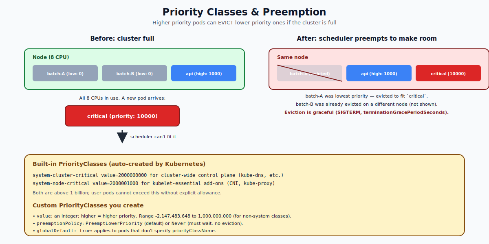

# Priority Classes & Preemption — Deep Dive

## What Priority Does

When the cluster is full and a new pod arrives, Kubernetes can do two things:
1. Leave the new pod `Pending` until something frees up (default for non-prioritized pods).
2. **Evict** lower-priority pods to make room for the new one (preemption).

A **PriorityClass** is the integer that controls this. Higher = more important. If a high-priority pod can't fit, the scheduler may evict (preempt) lower-priority pods to make space.

```yaml
apiVersion: scheduling.k8s.io/v1
kind: PriorityClass
metadata:
  name: high-priority
value: 1000
preemptionPolicy: PreemptLowerPriority
description: "User-facing services that must always run."
```

Then in a pod:
```yaml
spec:
  priorityClassName: high-priority
```



---

## How Priority Affects Scheduling

Every pod has a numeric priority (default 0 if no PriorityClass is set). The scheduler uses it in two phases:

### Phase 1 — Scheduling order
Pods in the scheduler's queue are sorted by priority. High-priority pods are considered first. This matters when many pods are pending and only some can fit.

### Phase 2 — Preemption
If no node fits the high-priority pod, the scheduler looks for nodes where evicting one or more lower-priority pods would create enough space. It picks the smallest disruption (fewest evictions) and gracefully evicts those pods.

Evicted pods are deleted via the **eviction API** — same as `kubectl drain`, respecting `terminationGracePeriodSeconds` and PodDisruptionBudgets where applicable.

---

## Built-in PriorityClasses

Kubernetes ships with two built-in priority classes:

| Name | Value | Used by |
|---|---|---|
| `system-cluster-critical` | 2,000,000,000 | core system add-ons (kube-dns, metrics-server) |
| `system-node-critical` | 2,000,001,000 | absolutely-required-per-node (kube-proxy, CNI agents) |

Both are above 1 billion. **User-defined PriorityClasses are capped at 1,000,000,000**, so user pods can never preempt these system pods. This is intentional: you cannot accidentally evict the kubelet's CNI agent.

---

## Custom PriorityClass — Important Fields

```yaml
apiVersion: scheduling.k8s.io/v1
kind: PriorityClass
metadata:
  name: critical-services
value: 1000000                      # 0 to 1,000,000,000
preemptionPolicy: PreemptLowerPriority   # default
globalDefault: false
description: "User-facing services."
```

- `value`: integer; higher means higher priority. Negative values are allowed (lower than default 0).
- `preemptionPolicy`:
  - `PreemptLowerPriority` (default): can evict lower-priority pods.
  - `Never`: cannot evict; pod waits in the queue if no fit. Use for batch jobs that should not disrupt others.
- `globalDefault: true` — pods without `priorityClassName` get this priority. Only one PriorityClass in the cluster can be global default.

---

## Preemption Rules

When the scheduler tries to preempt:

1. It only considers nodes where preemption would make the high-priority pod fit.
2. It will not preempt pods at the same priority as the incoming pod (only strictly lower).
3. PodDisruptionBudgets are **respected as a soft signal** — the scheduler tries not to break them, but will if no other option exists.
4. Evicted pods get a graceful termination (`terminationGracePeriodSeconds`).

Preemption is best-effort. If your high-priority pod still won't fit (e.g., a giant memory request and no node is big enough), it stays Pending.

---

## When to Use Priority Classes

Common patterns:

### "Critical" tier
```yaml
metadata:
  name: critical
value: 1000
```
Apply to user-facing services that must always run.

### "Default" tier (globalDefault)
```yaml
metadata:
  name: default-priority
value: 0
globalDefault: true
```
Most production workloads.

### "Best effort / batch" tier
```yaml
metadata:
  name: low
value: -1000
preemptionPolicy: Never
```
Batch jobs that should yield to anything else and never preempt.

This three-tier model works for many clusters. The cluster autoscaler also uses priorities to decide whether to provision new nodes vs. let a low-priority pod stay Pending.

---

## What Priority Does NOT Do

- It is **not** a runtime resource scheduler. Once a pod is running, priority has no effect on CPU or memory it gets — that's controlled by requests/limits and QoS class.
- It is **not** about eviction-on-pressure. When the kubelet runs low on resources, it evicts based on QoS class, not priority. Both signals are independent.
- It is **not** a queue position guarantee. The scheduler's queue ordering is by priority, but other factors (resource fit, affinity) still apply.

---

## Common Mistakes

| Mistake | What happens | Fix |
|---|---|---|
| Setting too many tiers | Confusing, hard to reason about | Use 3-5 tiers max |
| `globalDefault: true` on multiple classes | API rejects creation of the second | Pick one |
| High-priority pod with `Never` policy expecting preemption | Pod just waits | Use `PreemptLowerPriority` (default) |
| Forgetting that system-* classes exist | Surprised that user-priority can't evict CNI | They're protected; design accordingly |
| Using priority instead of QoS for runtime resilience | Pod still gets evicted under memory pressure | Use Guaranteed QoS for runtime, priority for scheduling |

---

## Quick Reference

```bash
# List PriorityClasses
kubectl get priorityclasses

# Create
cat <<EOF | kubectl apply -f -
apiVersion: scheduling.k8s.io/v1
kind: PriorityClass
metadata: { name: high }
value: 1000
description: "high priority"
EOF

# Use
spec:
  priorityClassName: high
```

---

## Summary

PriorityClass is a numeric ranking for pod scheduling. Higher-value pods are scheduled first and can evict lower-priority pods to make room (preemption). Two built-in classes (`system-cluster-critical`, `system-node-critical`) protect cluster components. User classes can be 0 to 1 billion. `preemptionPolicy: Never` lets a pod wait without disrupting others. Independent of QoS class (which controls eviction during runtime memory pressure).

Open `02-Exercise.md` to create classes, watch preemption happen, and see the events.
