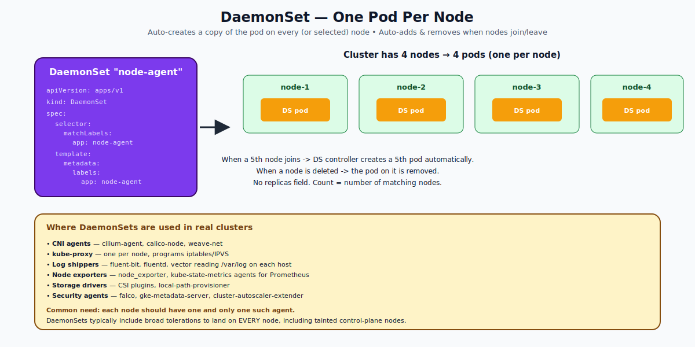

# DaemonSets — Deep Dive

## What a DaemonSet Is

A **DaemonSet** ensures that a copy of a pod runs on **every node** (or every node matching a selector). It does not have a `replicas` field — the count is dynamic, equal to the number of matching nodes.

When a node joins the cluster, the DaemonSet controller adds a pod to it. When a node leaves, that pod is garbage-collected.

```yaml
apiVersion: apps/v1
kind: DaemonSet
metadata:
  name: node-exporter
spec:
  selector:
    matchLabels:
      app: node-exporter
  template:
    metadata:
      labels:
        app: node-exporter
    spec:
      hostNetwork: true
      tolerations:
      - operator: Exists           # land on every node, including tainted
      containers:
      - name: exporter
        image: prom/node-exporter
        ports:
        - containerPort: 9100
```



---

## When To Use a DaemonSet

The pattern: "every node needs this thing." Examples:

- **CNI agents** (cilium-agent, calico-node) — networking on each node
- **kube-proxy** — iptables/IPVS rules per node
- **Log shippers** (fluent-bit, vector) — read `/var/log` from each host
- **Metric exporters** (node_exporter, dcgm-exporter for GPU nodes)
- **CSI storage drivers** — talk to host's block devices
- **Security agents** (Falco, OSquery) — host-level monitoring

These all share the property that they need direct access to the node's resources (host filesystem, host network, host PID namespace).

---

## DaemonSet vs Deployment

| Aspect | Deployment | DaemonSet |
|---|---|---|
| Replica count | You set it (`spec.replicas`) | Number of matching nodes (auto) |
| Scheduling | Default scheduler picks nodes | Controller targets specific nodes directly |
| Use case | Scale-out apps | Per-node agents |
| Rolling updates | Yes (gradient between two RSs) | Yes (per-node strategy) |

---

## How DaemonSet Targets Nodes

By default, a DaemonSet pod runs on **every node**. To narrow this down, use `spec.template.spec.nodeSelector` or `nodeAffinity`:

```yaml
spec:
  template:
    spec:
      nodeSelector:
        gpu: "true"               # only on GPU nodes
```

The DaemonSet controller respects:
- `nodeSelector` / `nodeAffinity`
- Taints (the pod must have a matching toleration to land)
- Node conditions (NotReady nodes are skipped)

Most production DaemonSets carry broad tolerations like `operator: Exists` to override every taint, including the control-plane taint. This is correct: a CNI agent or log shipper truly does need to run everywhere.

---

## How DaemonSets Schedule

Originally, DaemonSets had their own placement logic and bypassed the scheduler. Since Kubernetes 1.12, DaemonSets are scheduled by the **default scheduler** like any other pod. The controller creates the pods with `spec.nodeAffinity` set to bind each one to a specific node, and the scheduler then places them.

This means DaemonSet pods now respect:
- Resource requests (and pod won't be created if node can't fit it)
- Pod-level scheduling constraints
- Priority classes

---

## Update Strategies

DaemonSets support two update strategies (similar to Deployments but per-node):

### `RollingUpdate` (default)
```yaml
spec:
  updateStrategy:
    type: RollingUpdate
    rollingUpdate:
      maxUnavailable: 1            # how many node-pods may be down at once
      maxSurge: 0                  # extra pods allowed (1.21+)
```
Replaces pods one (or N) at a time. Old pod terminated → new pod started → next node.

### `OnDelete`
```yaml
spec:
  updateStrategy:
    type: OnDelete
```
The controller does NOT automatically replace pods after a template change. You must delete each pod manually for the new template to take effect. Used for very sensitive workloads where you want explicit control.

---

## DaemonSet Pods Are Special

A DaemonSet pod has a few peculiarities:

- It often uses `hostNetwork: true` to share the node's network (so port 9100 is the host's port 9100, not a pod-specific IP).
- It often uses `hostPID: true` or `hostIPC: true` for visibility into host processes.
- It often mounts host paths (`/var/log`, `/var/lib/docker`, etc.) via `hostPath` volumes.
- It typically has very broad tolerations.

These pods are privileged in practical terms; treat them with extra care.

---

## Common Mistakes

| Mistake | Result | Fix |
|---|---|---|
| No tolerations | Pod doesn't land on tainted nodes (e.g., control plane) | Add `operator: Exists` toleration or specific ones |
| `hostPort` collision | Two DSes try to bind same port on the same node | Coordinate ports or use different node selectors |
| Resource requests too high | DS pod can't fit on small nodes | Right-size or use `priorityClassName: system-node-critical` |
| Forgot rolling update strategy | Whole-cluster outage on bad update | Always use RollingUpdate with maxUnavailable=1 |
| DS update breaks node | Cluster degrades node-by-node automatically | Use a canary node label and gate the rollout |

---

## Quick Reference

```yaml
apiVersion: apps/v1
kind: DaemonSet
metadata:
  name: my-agent
spec:
  selector:
    matchLabels: { app: my-agent }
  updateStrategy:
    type: RollingUpdate
    rollingUpdate: { maxUnavailable: 1 }
  template:
    metadata:
      labels: { app: my-agent }
    spec:
      tolerations:
      - operator: Exists                           # tolerate everything
      containers:
      - name: agent
        image: my-agent:1.0
        resources:
          requests: { cpu: 50m, memory: 64Mi }
          limits:   { cpu: 200m, memory: 256Mi }
```

```bash
kubectl get ds -A
kubectl rollout status ds/my-agent
kubectl rollout restart ds/my-agent
```

---

## Summary

DaemonSets run one pod per node and dynamically scale with the cluster. Use them for per-node infrastructure: CNI, kube-proxy, log shippers, metric exporters, security agents. They schedule via the default scheduler with auto-injected `nodeAffinity` per node. Update strategies are `RollingUpdate` (default) or `OnDelete`. Tolerations and host-level access are common — DSes are typically privileged.

Open `02-Exercise.md` to create a DaemonSet, watch it spread across nodes, do a rolling update, and observe taint behavior.
