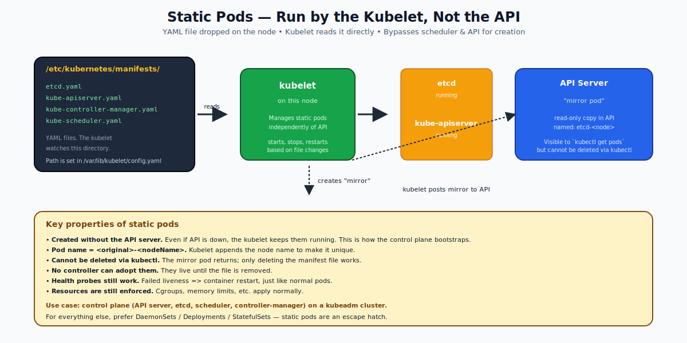

# Static Pods — Deep Dive

## What a Static Pod Is

A **static pod** is a pod created and managed directly by the **kubelet on a specific node**, not by the API Server. The kubelet watches a directory on the local filesystem (typically `/etc/kubernetes/manifests/`) and runs whatever pod YAMLs it finds there.

If you drop `nginx.yaml` into that directory, the kubelet starts an nginx pod. If you delete the file, the kubelet stops the pod. The API Server gets a read-only "mirror pod" so you can see it with `kubectl get pods`, but you cannot manage it via the API.



---

## Why Static Pods Exist — Bootstrapping

When you bring up a new Kubernetes cluster, there is a chicken-and-egg problem: the control plane components (API server, etcd, scheduler, controller-manager) **are themselves pods**. But pods are managed by the API server. How do you start the API server when there's no API server yet?

Answer: static pods. The kubelet starts on a node and reads `/etc/kubernetes/manifests/`, where kubeadm has placed the four control-plane component YAMLs. The kubelet starts them as pods directly. Once the API server is up, the kubelet creates **mirror pods** in the API so you can observe them.

This is exactly what kubeadm does on every kubeadm-managed cluster. If you `ls /etc/kubernetes/manifests/` on a control plane node you will see `etcd.yaml`, `kube-apiserver.yaml`, `kube-controller-manager.yaml`, `kube-scheduler.yaml`.

---

## Static Pod vs Regular Pod

| Aspect | Regular Pod | Static Pod |
|---|---|---|
| Created via | API Server | Kubelet reading local file |
| Deleted via | API Server | Removing the file |
| Scheduler involved? | Yes | No (the kubelet runs it on its own node) |
| Visible in `kubectl get pods`? | Yes (the real pod) | Yes (the mirror) |
| Can be edited via `kubectl`? | Yes | No (writes are rejected) |
| Survives API outage? | Existing ones keep running, new ones can't be created | Yes — the kubelet doesn't need the API |
| Pod name | random suffix | `<filename-base>-<nodeName>` |
| ownerReferences | controller (RS, etc.) | none |

---

## Where the Manifest Path Comes From

The kubelet's config file (`/var/lib/kubelet/config.yaml` on most distros) has:

```yaml
staticPodPath: /etc/kubernetes/manifests
```

You can change this to a different directory or even a URL (`staticPodURL`), although a URL is rare in practice. Restart the kubelet (`systemctl restart kubelet`) for changes to take effect.

---

## How the Mirror Pod Works

When the kubelet starts a static pod, it creates a "mirror" object in the API:

```bash
$ kubectl get pod -n kube-system kube-apiserver-minikube -o yaml | head
apiVersion: v1
kind: Pod
metadata:
  annotations:
    kubernetes.io/config.hash: ...
    kubernetes.io/config.mirror: ...
    kubernetes.io/config.seen: ...
    kubernetes.io/config.source: file
  name: kube-apiserver-minikube
  namespace: kube-system
  ownerReferences:
  - apiVersion: v1
    kind: Node
    name: minikube                    # owned by the node, not by a controller
```

The annotation `kubernetes.io/config.source: file` is the giveaway — this came from a file, not from `kubectl apply`.

If you `kubectl delete` a mirror pod, the API removes its mirror object. The kubelet immediately re-creates it because the underlying file is still there. The pod won't actually go away until you remove the file.

---

## When to Use Static Pods (Almost Never)

Static pods are an **escape hatch**, not a tool you reach for. Reach for them only when:

1. You're bootstrapping a control plane.
2. You're deeply customizing kubeadm's outputs.
3. You need a pod to run before the API server is up (e.g., a node-local helper that pulls bootstrap config).

For *anything else* — a per-node agent, a one-off pod, a debugging container — use a DaemonSet, Deployment, or just a regular pod. Those benefit from API-driven workflows: `kubectl apply`, `kubectl delete`, RBAC, audit logging.

---

## Common Mistakes

| Mistake | What happens | Fix |
|---|---|---|
| Putting an app's pod in `/etc/kubernetes/manifests/` "to make it always run" | Bypasses every API-driven control (deployments, RBAC, audit) | Use a DaemonSet or static pod alternative |
| `kubectl delete` to remove a static pod | Mirror is briefly removed, kubelet recreates immediately | Delete the YAML file from the node |
| Editing the YAML to upgrade | Kubelet sees changes and restarts the pod with new spec | This is fine, just be aware |
| Same pod name on multiple nodes | Each gets `<base>-<nodeName>`, so unique | No fix needed |

---

## Quick Reference

```bash
# On a kubeadm node:
ls -l /etc/kubernetes/manifests/
sudo cat /etc/kubernetes/manifests/kube-apiserver.yaml

# To create your own static pod (on the node):
sudo cat > /etc/kubernetes/manifests/myapp.yaml <<'EOF'
apiVersion: v1
kind: Pod
metadata:
  name: myapp
spec:
  containers:
  - name: c
    image: nginx
EOF

# A few seconds later:
kubectl get pods -A | grep myapp
# myapp-<nodeName> appears

# To remove:
sudo rm /etc/kubernetes/manifests/myapp.yaml

# Find which kubelet is doing the work:
sudo systemctl status kubelet
sudo cat /var/lib/kubelet/config.yaml | grep staticPodPath
```

---

## Summary

Static pods are pods managed directly by a node's kubelet, bypassing the API server for creation. The kubelet watches a directory of YAMLs and runs whatever it finds. The API gets a read-only mirror pod so they appear in `kubectl get pods` but cannot be managed there. Used to bootstrap control plane components on kubeadm clusters. For everything else, prefer DaemonSets and Deployments.

Open `02-Exercise.md` to drop a static pod onto your node and watch it appear in the API.
