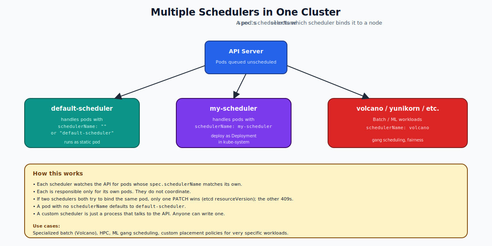

# Multiple Schedulers — Deep Dive

## Why Run More Than One Scheduler?

The default `kube-scheduler` is good at its job: filter feasible nodes, score them, bind the pod. But it's a general-purpose tool. Some workloads need different placement policies:

- **Gang scheduling** for ML jobs — start ALL pods of a job atomically, or none
- **Bin-packing for batch** — pack pods tightly to minimize active nodes
- **Topology-aware** — keep co-dependent pods within the same NUMA node
- **Budget-aware** — pick the cheapest spot instances

Rather than fork the default scheduler, you can run a **second scheduler** alongside it. Each pod picks which scheduler binds it via `spec.schedulerName`.



---

## The Mechanism

A scheduler is just a program that:
1. Watches the API for pods with `spec.schedulerName: <my-name>` and `spec.nodeName: ""` (unscheduled).
2. Picks a node.
3. PATCHes the pod with `spec.nodeName=<chosen>`.

That's it. There's nothing magical. You can write your own scheduler in 200 lines of Go (or even bash, technically) using the Go client or a curl loop.

The default scheduler claims the name `default-scheduler`. Pods that don't set `schedulerName` are assumed to want `default-scheduler`.

---

## Adding a Second Scheduler

The most common pattern is to run a **second instance of `kube-scheduler`** with a different name and configuration. This gives you all the standard logic (filters, scoring) plus your customizations.

```yaml
apiVersion: apps/v1
kind: Deployment
metadata:
  name: my-scheduler
  namespace: kube-system
spec:
  replicas: 1
  selector:
    matchLabels: { component: scheduler, tier: control-plane, name: my-scheduler }
  template:
    metadata:
      labels: { component: scheduler, tier: control-plane, name: my-scheduler }
    spec:
      serviceAccountName: my-scheduler
      containers:
      - name: kube-scheduler
        image: registry.k8s.io/kube-scheduler:v1.30.0
        command:
        - kube-scheduler
        - --config=/etc/kubernetes/my-scheduler-config.yaml
        volumeMounts:
        - name: config
          mountPath: /etc/kubernetes
      volumes:
      - name: config
        configMap:
          name: my-scheduler-config
```

Plus the config:
```yaml
apiVersion: kubescheduler.config.k8s.io/v1
kind: KubeSchedulerConfiguration
profiles:
- schedulerName: my-scheduler
  plugins:
    score:
      enabled:
      - name: NodeResourcesBalancedAllocation
```

And the matching ServiceAccount + ClusterRoleBinding so the new scheduler has permission to bind pods (typically `system:kube-scheduler`).

---

## Selecting the Scheduler in a Pod

```yaml
apiVersion: v1
kind: Pod
metadata: { name: special }
spec:
  schedulerName: my-scheduler
  containers: [{ name: c, image: nginx }]
```

If you forget `schedulerName`, the pod is taken by the default scheduler. If the named scheduler isn't running at all, the pod stays Pending — no other scheduler will pick it up.

---

## Race Conditions Between Schedulers

What if two schedulers both try to bind the same pod?

The first one to PATCH `spec.nodeName` wins because the API server uses optimistic concurrency control (the etcd `resourceVersion`). The second PATCH fails with a 409 Conflict, and the second scheduler sees that the pod is already bound and moves on.

In practice, schedulers should only handle pods matching their `schedulerName`, so this conflict shouldn't happen — but the API protects you if it does.

---

## Real Multi-Scheduler Systems

You don't usually write a scheduler from scratch. Popular drop-in alternatives:

| Project | Use case |
|---|---|
| **Volcano** | Batch and ML; gang scheduling, queues, fairness |
| **Apache YuniKorn** | Multi-tenant resource sharing with hierarchical queues |
| **Karmada / Karpenter** | Cluster-spanning scheduling, autoscaling |
| **descheduler** | Not a scheduler — periodically rebalances pods |

These ship as a Deployment + ServiceAccount + RBAC + a CRD or two. Pods pick them via `schedulerName`.

---

## Scheduler Profiles (Same Binary, Multiple Personas)

Since Kubernetes 1.18, `kube-scheduler` supports **multiple profiles in one binary**. You don't need two Deployments to have two scheduler names. See the **Scheduler Profile** folder for the deep dive.

A profile is a named set of plugins. The same `kube-scheduler` process exposes itself as multiple `schedulerName` values — one per profile. This is usually preferred over running two separate scheduler Deployments because it's simpler and uses fewer resources.

---

## Common Mistakes

| Mistake | What happens | Fix |
|---|---|---|
| Custom scheduler not running, but pods specify it | Pods stuck Pending | Run the scheduler or remove the schedulerName |
| RBAC missing | Custom scheduler can't bind | Bind to `system:kube-scheduler` ClusterRole |
| Two schedulers handling overlapping names | Race conditions, double-binding | One name per scheduler |
| Custom scheduler crashes | Pods queue up, then get scheduled when it's back | Run multiple replicas with leader election |

---

## Quick Reference

```yaml
# Pod
spec:
  schedulerName: my-scheduler

# Inspect which scheduler is running
kubectl get pods -n kube-system -l component=scheduler

# Inspect which scheduler bound a pod
kubectl get pod X -o jsonpath='{.spec.schedulerName}'

# Recent scheduling events for a custom scheduler
kubectl get events --field-selector source.component=my-scheduler
```

---

## Summary

You can run multiple schedulers in one cluster. Each pod picks one via `spec.schedulerName`. The default scheduler claims `default-scheduler`. Custom schedulers (Volcano, YuniKorn) cover specialized workloads. For lighter-weight customization, prefer **scheduler profiles** within the default kube-scheduler binary.

Open `02-Exercise.md` to deploy a second scheduler and route a pod to it.
