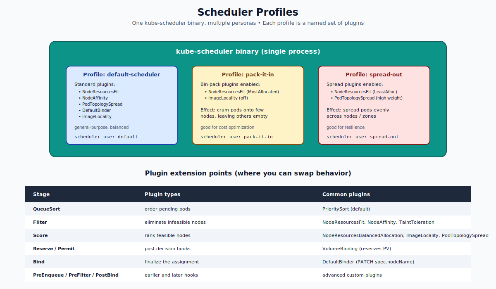

# Scheduler Profiles — Deep Dive

## What a Profile Is

Since Kubernetes 1.18, a single `kube-scheduler` binary can host **multiple profiles**. Each profile is a named set of plugin configurations. Pods select one via `spec.schedulerName`.

Think of it like running multiple schedulers — but with one process and shared code. This is the modern, lightweight alternative to running multiple `kube-scheduler` Deployments.

```yaml
apiVersion: kubescheduler.config.k8s.io/v1
kind: KubeSchedulerConfiguration
profiles:
- schedulerName: default-scheduler
  # default plugins, default config
- schedulerName: pack-it-in
  pluginConfig:
  - name: NodeResourcesFit
    args:
      scoringStrategy:
        type: MostAllocated         # bin-pack
- schedulerName: spread-out
  pluginConfig:
  - name: NodeResourcesFit
    args:
      scoringStrategy:
        type: LeastAllocated        # spread
```



---

## The Plugin Model

The scheduler is implemented as a sequence of **extension points**. At each point, the scheduler runs a list of plugins. Profiles let you enable, disable, reorder, and configure those plugins.

### Extension points

| Point | Purpose | Common plugin |
|---|---|---|
| `QueueSort` | Order the pending pod queue | `PrioritySort` |
| `PreFilter` | Pre-compute state for filters | `InterPodAffinity` |
| `Filter` | Eliminate infeasible nodes | `NodeResourcesFit`, `NodeAffinity`, `TaintToleration` |
| `PostFilter` | Run when no nodes are feasible | `DefaultPreemption` (preemption!) |
| `PreScore` | Pre-compute scoring data | `InterPodAffinity` |
| `Score` | Rank feasible nodes | `NodeResourcesBalancedAllocation`, `ImageLocality`, `PodTopologySpread` |
| `Reserve` / `Permit` | Side effects before binding | `VolumeBinding` |
| `Bind` | Finalize | `DefaultBinder` |
| `PostBind` | Cleanup hooks | (custom) |

### Scoring strategies for `NodeResourcesFit`

The most-customized plugin. Three strategies:

- `LeastAllocated` (default) — prefer nodes with more free resources (spread).
- `MostAllocated` — prefer nodes with less free resources (bin-pack).
- `RequestedToCapacityRatio` — explicit shape function for cost-aware scheduling.

Switching this between profiles is the most common reason to define multiple profiles.

---

## Why Use Profiles vs Multiple Schedulers

| Option | Pros | Cons |
|---|---|---|
| Multiple `kube-scheduler` Deployments | Total isolation; different versions possible | More resources, more complexity, race conditions if misconfigured |
| **Profiles in one binary** | Lightweight, no race conditions, shared cache | All profiles share the same scheduler code/version |

For 95% of needs, profiles are the right answer. They give you the customization without the operational overhead.

---

## A Simple Example

You have a cluster and want:
- "Default" pods to spread across nodes (resilience).
- "Batch" pods to pack densely (cost).

### Step 1 — KubeSchedulerConfiguration
```yaml
apiVersion: kubescheduler.config.k8s.io/v1
kind: KubeSchedulerConfiguration

profiles:
- schedulerName: default-scheduler
  pluginConfig:
  - name: NodeResourcesFit
    args:
      scoringStrategy:
        type: LeastAllocated      # spread

- schedulerName: bin-packer
  pluginConfig:
  - name: NodeResourcesFit
    args:
      scoringStrategy:
        type: MostAllocated       # pack
```

### Step 2 — Pass it to kube-scheduler
On a kubeadm cluster, edit `/etc/kubernetes/manifests/kube-scheduler.yaml` to add `--config=/etc/kubernetes/scheduler-config.yaml` and mount the file.

### Step 3 — Use it
```yaml
# A normal pod uses the default profile (spread):
spec:
  containers: [{ name: c, image: nginx }]

# A batch pod uses the bin-packer:
spec:
  schedulerName: bin-packer
  containers: [{ name: c, image: nginx }]
```

---

## Common Profile Customizations

### Enable / disable individual plugins
```yaml
profiles:
- schedulerName: minimal
  plugins:
    score:
      disabled:
      - name: ImageLocality          # don't bias toward nodes that already have the image
      enabled:
      - name: NodeResourcesBalancedAllocation
        weight: 5
```

### Increase weight of a scoring plugin
```yaml
plugins:
  score:
    enabled:
    - name: PodTopologySpread
      weight: 5                     # quintuple the spread bias
```

### Disable preemption
```yaml
profiles:
- schedulerName: no-preempt
  plugins:
    postFilter:
      disabled:
      - name: DefaultPreemption
```
Pods using this profile will never preempt others, regardless of priority.

---

## Limits & Caveats

- **All profiles in one binary share the scheduler's cache.** Pods scheduled by different profiles still see the same node state.
- **You cannot dynamically add profiles** — you must restart the scheduler with new config.
- **Custom plugins** (your own Go code) must be compiled into the scheduler binary. Use the **Scheduler Framework** SDK and rebuild kube-scheduler. This is significant work; many users stick with the built-in plugins.

---

## Common Mistakes

| Mistake | What happens | Fix |
|---|---|---|
| Two profiles with the same `schedulerName` | API rejects | Each must be unique |
| Forgot to mount the config file | scheduler uses defaults | Mount as a ConfigMap volume in the static-pod manifest |
| Renamed `default-scheduler` profile | Pods without explicit name don't bind | Always keep one profile named `default-scheduler` |
| Disabled `DefaultBinder` | Pods are filtered+scored but never bound | Don't disable Bind |

---

## Quick Reference

```yaml
apiVersion: kubescheduler.config.k8s.io/v1
kind: KubeSchedulerConfiguration

profiles:
- schedulerName: default-scheduler         # required: keep default name
  plugins:
    score:
      enabled:
      - { name: PodTopologySpread, weight: 3 }

- schedulerName: my-profile
  pluginConfig:
  - name: NodeResourcesFit
    args:
      scoringStrategy:
        type: MostAllocated
```

---

## Summary

Profiles are named sets of scheduler plugin configurations within a single `kube-scheduler`. They're the lightweight way to have multiple scheduling strategies (spread vs pack, with/without preemption, etc.). Pods pick a profile via `spec.schedulerName`. Customize plugins, weights, and scoring strategies via `KubeSchedulerConfiguration`. For full custom logic, you'd build your own scheduler binary using the Scheduler Framework SDK.

Open `02-Exercise.md` to define and use profiles.
