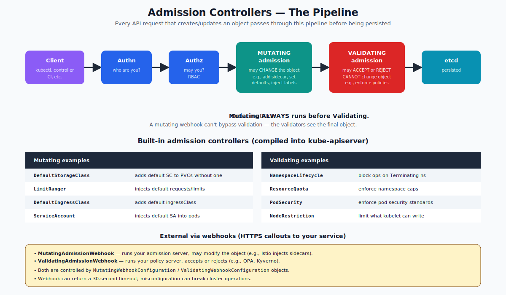

# Admission Controllers — Deep Dive

## What an Admission Controller Is

Every API request that creates, updates, or deletes an object passes through a **pipeline** before being persisted to etcd:

1. Authentication (who are you?)
2. Authorization (RBAC — may you do this?)
3. **Mutating admission** (modify the request)
4. Schema validation (object shape correctness)
5. **Validating admission** (accept or reject)
6. Persist to etcd

Admission controllers run after authn/authz but before persistence. They're the cluster's policy enforcement layer. There are two flavors:

- **Mutating** — can modify the request (e.g., add a label, inject a sidecar, set defaults).
- **Validating** — can only accept or reject; never modify.



Mutating always runs **before** validating. The validators see the final, mutated object.

---

## Two Sources of Admission Controllers

### 1. Built-in (compiled into kube-apiserver)
Around 30 controllers ship with the API server. They're enabled/disabled via the `--enable-admission-plugins` and `--disable-admission-plugins` flags on kube-apiserver. The default set is sensible for most clusters.

Notable built-ins:

| Name | Type | Purpose |
|---|---|---|
| `NamespaceLifecycle` | validating | block ops on Terminating namespaces |
| `LimitRanger` | mutating + validating | inject default requests/limits, enforce min/max |
| `ServiceAccount` | mutating | inject default ServiceAccount on pods |
| `DefaultStorageClass` | mutating | set default StorageClass on PVCs |
| `ResourceQuota` | validating | enforce per-namespace caps |
| `PodSecurity` | validating | enforce Pod Security Standards (restricted/baseline/privileged) |
| `NodeRestriction` | validating | limit what the kubelet can change in the API |
| `DefaultIngressClass` | mutating | set default ingressClass |

You list the active ones with:
```bash
kubectl exec -n kube-system kube-apiserver-<node> -- kube-apiserver -h | grep enable-admission
```

### 2. External via webhooks
Anyone can write a webhook that the API server calls during admission. Two CRDs control this:

- `MutatingWebhookConfiguration` — registers a mutating webhook.
- `ValidatingWebhookConfiguration` — registers a validating webhook.

Each webhook is a HTTPS endpoint your server hosts. The API server POSTs an `AdmissionReview` to it; your service replies with an `AdmissionResponse` (allowed/not allowed, optionally a JSON Patch for mutations).

This is how:
- **Istio** auto-injects its sidecar proxy (mutating).
- **OPA/Gatekeeper** enforces custom policies (validating).
- **Kyverno** does both.
- **cert-manager** validates Certificate resources (validating).

---

## When Admission Runs vs Other Phases

```
kubectl apply
    |
    v
[Authn] -> [Authz] -> [Mutating Admission] -> [Schema validation]
                                                    |
                                                    v
                                          [Validating Admission]
                                                    |
                                                    v
                                                  [etcd]
                                                    |
                                                    v
                                          [Watch loop -> controllers]
```

Admission only runs on writes (`POST`, `PUT`, `PATCH`, `DELETE`). Reads bypass it.

---

## Why You Care

Three big reasons:

1. **Defaults arrive automatically.** Pods that don't set requests/limits suddenly do (LimitRanger). PVCs without a storageClass get one (DefaultStorageClass). This is admission at work.
2. **Policies are enforced.** PodSecurity rejects privileged pods in restricted namespaces. ResourceQuota rejects pods exceeding budget. Custom webhooks (OPA) reject anything that breaks your team's policies.
3. **Behavior is invisible if you don't know.** Many "magic" defaults come from admission. When something behaves unexpectedly, "what admission controllers ran?" is a useful question.

---

## Inspecting What's Active

```bash
# Built-in plugins (look at the static pod manifest)
sudo grep enable-admission /etc/kubernetes/manifests/kube-apiserver.yaml

# All webhook configurations
kubectl get mutatingwebhookconfigurations
kubectl get validatingwebhookconfigurations

# Inspect a specific webhook config
kubectl get mutatingwebhookconfiguration sidecar-injector -o yaml
```

---

## The AdmissionReview Object

When the API calls your webhook, it sends:
```json
{
  "kind": "AdmissionReview",
  "request": {
    "uid": "...",
    "kind": {"kind": "Pod"},
    "operation": "CREATE",
    "object": { /* the pod the user submitted */ },
    "userInfo": {"username": "system:..."},
    "namespace": "default"
  }
}
```

Your webhook responds:
```json
{
  "kind": "AdmissionReview",
  "response": {
    "uid": "...",                                 # echo
    "allowed": true,
    "patchType": "JSONPatch",                     # mutating only
    "patch": "<base64 of [{\"op\":\"add\", ...}]>"
  }
}
```

For validating, just `allowed: true|false` plus an optional `status.message`.

---

## Common Mistakes & Failure Modes

| Mistake | Result | Fix |
|---|---|---|
| Webhook server down | API operations time out | Set `failurePolicy: Ignore` for non-critical webhooks |
| `failurePolicy: Fail` and your webhook crashes | Cluster becomes read-only-ish | Always health-check webhook deployments |
| Missing CA bundle | API can't verify webhook TLS | Set `caBundle` correctly (often via cert-manager) |
| Webhook touches its own namespace | Can lock itself out during upgrade | Add `namespaceSelector` or `objectSelector` to exclude the webhook's namespace |
| Mutating + validating loops | Object can mutate to invalid forms | Validators see the final state |

---

## CEL-Based Built-in Validation (1.30+)

A newer alternative to webhooks: `ValidatingAdmissionPolicy` — express validation rules in CEL (Common Expression Language) without writing a server. Cheaper, faster, and now stable.

```yaml
apiVersion: admissionregistration.k8s.io/v1
kind: ValidatingAdmissionPolicy
metadata: { name: deny-privileged }
spec:
  matchConstraints:
    resourceRules:
    - apiGroups: [""]
      apiVersions: ["v1"]
      operations: ["CREATE", "UPDATE"]
      resources: ["pods"]
  validations:
  - expression: "!has(object.spec.securityContext) || object.spec.securityContext.privileged != true"
    message: "Privileged pods are not allowed."
```

For new policies, prefer this over webhooks when possible.

---

## Quick Reference

```bash
# Inspect built-ins
grep enable-admission /etc/kubernetes/manifests/kube-apiserver.yaml

# Webhook configs
kubectl get mutatingwebhookconfigurations
kubectl get validatingwebhookconfigurations

# Logs of an admission server (if you deployed one)
kubectl logs -n my-policies my-webhook-pod
```

---

## Summary

Admission controllers run between authorization and persistence on every write. Mutating ones can modify the object (default injection, sidecar injection); validating ones only accept/reject (policy enforcement). Built-ins are compiled into the API server (PodSecurity, ResourceQuota, LimitRanger, etc.). External ones run as webhooks (Istio, OPA, Kyverno). Mutating always runs before validating.

Open `02-Exercise.md` to inspect active admission, see LimitRanger inject defaults, and observe webhook configurations.
