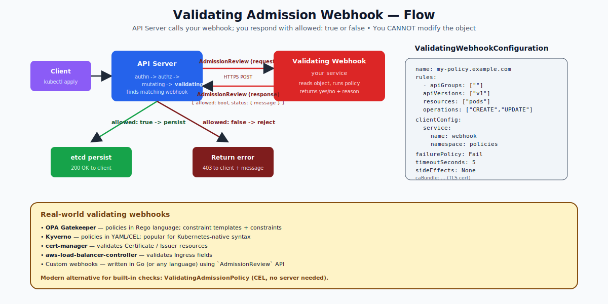

# Validating Admission Controllers — Deep Dive

## What "Validating" Means

A **validating admission controller** runs after the request has been authenticated, authorized, mutated, and schema-validated. Its only job: say `allowed: true` or `allowed: false`. It cannot modify the object — it only judges.

If any validating controller says no, the request is rejected and the API returns a 403 Forbidden to the client.



---

## Three Ways to Add Validation

### 1. Built-in validating controllers
Compiled into kube-apiserver. Examples: `ResourceQuota`, `PodSecurity`, `NamespaceLifecycle`, `NodeRestriction`. Enabled via `--enable-admission-plugins`.

### 2. ValidatingAdmissionWebhook
You run an HTTPS server. The API server posts an `AdmissionReview` to it; you respond with allowed/not allowed. Used by tools like:
- **OPA Gatekeeper** (Rego policies)
- **Kyverno** (Kubernetes-native YAML policies)
- **cert-manager** (validates Certificate/Issuer specs)
- Cloud-provider controllers (validate Ingress fields)

Configuration via a `ValidatingWebhookConfiguration` object.

### 3. ValidatingAdmissionPolicy (1.30+ stable, CEL-based)
The newest approach: write rules in **CEL** (Common Expression Language) directly in YAML, no server required. The API server evaluates them inline. Faster, simpler, no operational burden of running a webhook server.

For new validation needs, prefer this when CEL is expressive enough.

---

## The Webhook Configuration Object

```yaml
apiVersion: admissionregistration.k8s.io/v1
kind: ValidatingWebhookConfiguration
metadata:
  name: deny-no-labels.example.com
webhooks:
- name: deny-no-labels.example.com
  rules:
  - apiGroups: [""]
    apiVersions: ["v1"]
    resources: ["pods"]
    operations: ["CREATE", "UPDATE"]
  clientConfig:
    service:
      name: my-webhook
      namespace: policies
      path: /validate
    caBundle: <base64 PEM>
  failurePolicy: Fail              # if webhook is down
  sideEffects: None                # required since v1
  admissionReviewVersions: ["v1"]
  timeoutSeconds: 5
  namespaceSelector:               # only applies to namespaces matching
    matchExpressions:
    - { key: kubernetes.io/metadata.name, operator: NotIn, values: [kube-system] }
```

### Important fields

- **rules** — what to intercept (resources + operations).
- **clientConfig** — where to call. Either `service:` (in-cluster) or `url:` (external).
- **caBundle** — PEM-encoded CA cert for TLS verification (or use the `service.k8s.io/v1.cert-manager.io` injection).
- **failurePolicy** — `Fail` (reject if webhook is down) or `Ignore` (allow). For security policies, use `Fail`. For convenience webhooks, use `Ignore`.
- **sideEffects** — declare side effects of running the webhook. `None`, `NoneOnDryRun`, etc. (`None` is the safe default for pure validators.)
- **timeoutSeconds** — max 30. After timeout, behavior follows `failurePolicy`.
- **namespaceSelector** / **objectSelector** — restrict which namespaces/objects the webhook applies to. Critical for not locking yourself out.

---

## The AdmissionReview API Contract

The API server POSTs to your webhook:
```json
{
  "kind": "AdmissionReview",
  "apiVersion": "admission.k8s.io/v1",
  "request": {
    "uid": "abc-123",
    "kind": {"group":"","version":"v1","kind":"Pod"},
    "resource": {"group":"","version":"v1","resource":"pods"},
    "namespace": "default",
    "operation": "CREATE",
    "userInfo": {"username":"alice","groups":["dev"]},
    "object": { /* full pod manifest */ },
    "oldObject": null
  }
}
```

You respond with the same envelope, just the `response` field:
```json
{
  "kind": "AdmissionReview",
  "apiVersion": "admission.k8s.io/v1",
  "response": {
    "uid": "abc-123",
    "allowed": false,
    "status": {
      "code": 403,
      "message": "Pod must have an 'owner' label."
    }
  }
}
```

---

## A Minimal CEL Policy (No Webhook Server!)

```yaml
apiVersion: admissionregistration.k8s.io/v1
kind: ValidatingAdmissionPolicy
metadata: { name: require-owner-label }
spec:
  failurePolicy: Fail
  matchConstraints:
    resourceRules:
    - apiGroups: [""]
      apiVersions: ["v1"]
      operations: ["CREATE", "UPDATE"]
      resources: ["pods"]
  validations:
  - expression: "has(object.metadata.labels) && 'owner' in object.metadata.labels"
    message: "Pods must carry an 'owner' label."
---
apiVersion: admissionregistration.k8s.io/v1
kind: ValidatingAdmissionPolicyBinding
metadata: { name: require-owner-label-binding }
spec:
  policyName: require-owner-label
  validationActions: ["Deny"]
  matchResources:
    namespaceSelector:
      matchExpressions:
      - { key: kubernetes.io/metadata.name, operator: NotIn, values: [kube-system] }
```

This rejects any pod creation without a `metadata.labels.owner` field, with a clear message — no webhook server, no TLS certs to manage.

---

## Common Patterns

| Pattern | Tool / approach |
|---|---|
| "Pods must have certain labels" | CEL policy or Kyverno |
| "No latest image tags" | CEL policy or Kyverno |
| "No privileged pods in shared namespaces" | PodSecurity (built-in) |
| "Only certain registries" | Kyverno or OPA Gatekeeper |
| "TLS certs must be issued by my CA" | cert-manager validating webhook |
| "Custom resource fields are well-formed" | OpenAPI schema in CRD + CEL `x-kubernetes-validations` |

---

## failurePolicy — A Critical Choice

If your webhook server crashes:
- `failurePolicy: Fail` → all validation requests fail. The cluster cannot create or update intercepted resources. **Use for security-critical webhooks.**
- `failurePolicy: Ignore` → validation is skipped; resource is admitted. **Use for non-critical webhooks** (e.g., a logging webhook).

Combine with `namespaceSelector` to skip webhook-hosting namespaces, so the webhook can be upgraded without locking itself out.

---

## Common Mistakes

| Mistake | Result | Fix |
|---|---|---|
| Webhook server in `kube-system` with `failurePolicy: Fail` | Cluster bricked when webhook restarts | Exclude kube-system in `namespaceSelector` |
| Forgot `sideEffects: None` | API rejects the webhook config | Add the field |
| Self-signed cert without caBundle | TLS verification fails | Use cert-manager or set `caBundle` correctly |
| Webhook runs on every namespace including its own | Circular dependency | `namespaceSelector` to exclude |
| Long-running webhook (>5s) | Timeouts; dropped admissions | Keep webhook fast; use `timeoutSeconds` |

---

## Summary

Validating admission controllers say yes/no on every API write. They never modify the object. Three flavors: built-in (`PodSecurity`, `ResourceQuota`, etc.), `ValidatingAdmissionWebhook` (your HTTPS server, used by OPA/Kyverno), and `ValidatingAdmissionPolicy` (CEL inline, no server). Configure with care — `failurePolicy` and `namespaceSelector` are your safety nets.

Open `02-Exercise.md` to write a CEL validation, see it reject a bad pod, and inspect a real webhook configuration.
