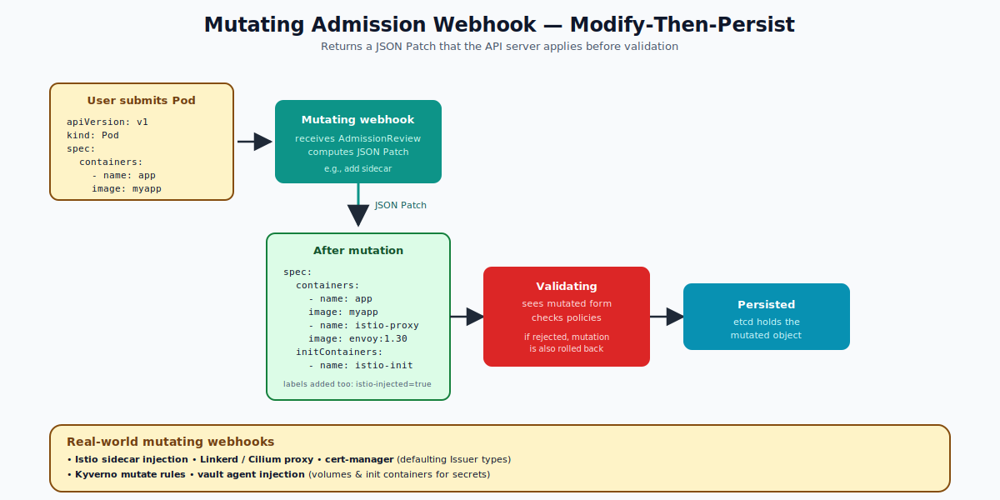

# Mutating Admission Controllers — Deep Dive

## What "Mutating" Means

A **mutating admission controller** runs in the admission pipeline and may **modify** the object before it is persisted. It returns a JSON Patch that the API server applies to the object.

This is how:
- **Istio** automatically injects its `istio-proxy` sidecar into every pod in a labeled namespace.
- **LimitRanger** injects default `requests` and `limits`.
- **ServiceAccount** injects the default ServiceAccount and its token volume.
- **DefaultStorageClass** sets `storageClassName` on PVCs that omit it.
- **vault-agent-injector** adds an init container and volumes for secrets.

The user submits a small object; what gets persisted is a much richer one.



---

## The Order Matters

Admission runs in this order:
1. All mutating controllers (in alphabetic order, but order is **not guaranteed** between webhooks — the API may run them in arbitrary order).
2. Schema validation.
3. All validating controllers.

The output of mutating is what validating sees. If validating rejects, the whole request fails — including any mutations. (Mutations are "ephemeral" until persistence.)

Multiple mutating webhooks may run **multiple times** (the API replays them until the object is stable). Idempotency matters!

---

## The MutatingWebhookConfiguration

```yaml
apiVersion: admissionregistration.k8s.io/v1
kind: MutatingWebhookConfiguration
metadata:
  name: sidecar-injector.example.com
webhooks:
- name: sidecar-injector.example.com
  rules:
  - apiGroups: [""]
    apiVersions: ["v1"]
    resources: ["pods"]
    operations: ["CREATE"]
  clientConfig:
    service:
      name: sidecar-injector
      namespace: istio-system
      path: /mutate
    caBundle: <base64 PEM>
  failurePolicy: Ignore           # safer for non-critical injection
  sideEffects: None
  admissionReviewVersions: ["v1"]
  reinvocationPolicy: Never       # or IfNeeded
  namespaceSelector:
    matchLabels:
      istio-injection: enabled
  timeoutSeconds: 5
```

### Key fields

- **rules** — the same as validating webhooks: which resources/operations.
- **reinvocationPolicy** — `Never` (default) or `IfNeeded`. With `IfNeeded`, the API may re-call your webhook after another mutating webhook changes the object.
- **failurePolicy** — `Fail` is dangerous for mutating webhooks (any outage breaks pod creation). Most use `Ignore`.
- **namespaceSelector** — restrict scope. Common: only mutate in namespaces with `istio-injection=enabled`.

---

## The JSON Patch Response

Your webhook returns a base64-encoded JSON Patch that lists operations to apply:

```json
{
  "kind": "AdmissionReview",
  "apiVersion": "admission.k8s.io/v1",
  "response": {
    "uid": "abc-123",
    "allowed": true,
    "patchType": "JSONPatch",
    "patch": "<base64 of the JSON Patch>"
  }
}
```

The patch itself looks like:
```json
[
  { "op": "add", "path": "/spec/containers/-", "value": { "name": "sidecar", "image": "envoy" } },
  { "op": "add", "path": "/metadata/labels/injected", "value": "true" }
]
```

Standard operations: `add`, `remove`, `replace`, `move`, `copy`, `test`.

---

## CEL-Based MutatingAdmissionPolicy (Beta in 1.32, GA Coming)

Like ValidatingAdmissionPolicy, there's now a CEL-based mutating equivalent under development. It lets you express simple mutations in YAML without running a webhook server:

```yaml
apiVersion: admissionregistration.k8s.io/v1alpha1
kind: MutatingAdmissionPolicy
metadata: { name: add-default-label }
spec:
  matchConstraints:
    resourceRules:
    - apiGroups: [""]
      apiVersions: ["v1"]
      operations: ["CREATE"]
      resources: ["pods"]
  mutations:
  - patchType: ApplyConfiguration
    applyConfiguration:
      expression: |
        Object{ metadata: Object.metadata{ labels: { "injected-by": "policy" } } }
```

For new mutations where CEL fits, prefer this when it stabilizes.

---

## Common Patterns

### Inject a sidecar
The classic Istio pattern: namespace labeled `istio-injection=enabled`, mutating webhook adds the `istio-proxy` container, an `istio-init` initContainer, and labels.

### Inject default labels / annotations
Tag pods with team ownership info:
```json
[{ "op": "add", "path": "/metadata/labels/team", "value": "payments" }]
```

### Override image registry
Rewrite `image: nginx` to `image: my-registry.example.com/nginx`:
```json
[{ "op": "replace", "path": "/spec/containers/0/image", "value": "registry.example.com/nginx:1.27" }]
```

### Add tolerations
Inject a default toleration for tainted nodes:
```json
[{ "op": "add", "path": "/spec/tolerations", "value": [{"key":"team","operator":"Equal","value":"backend","effect":"NoSchedule"}] }]
```

### Set defaults the user can override
Only patch if the field is empty:
- Use a `test` op first to confirm absence.
- Or compute the patch only when needed.

---

## Idempotency

Because mutating webhooks may be re-invoked (if `reinvocationPolicy: IfNeeded`), they should be **idempotent**: running them twice on the same object should produce the same result. Check whether the field already exists before adding it. Adding the same sidecar twice is a bug.

---

## Common Mistakes

| Mistake | Result | Fix |
|---|---|---|
| `failurePolicy: Fail` on optional webhook | Pod creation broken when webhook is down | Use `Ignore` for non-critical |
| Non-idempotent webhook | Sidecar appears twice on second invocation | Check before adding |
| Webhook mutates control-plane pods | Cluster lockout | `namespaceSelector` to exclude `kube-system` |
| Returns invalid JSON Patch | API errors out, request fails | Test patches with sample input |
| Slow mutating logic | All pod creates slow down | Cache; keep webhook fast |

---

## Mutating vs Validating — When to Use Which

| Scenario | Use |
|---|---|
| Set defaults missing fields | Mutating |
| Inject sidecars / init containers | Mutating |
| Apply labels / annotations | Mutating |
| Reject objects violating policy | Validating |
| Verify image is from approved registry | Validating |
| Enforce naming convention | Validating |

A mutating webhook can also **reject** (return `allowed: false`), but the convention is: validators reject, mutators modify.

---

## Inspecting Existing Mutating Webhooks

```bash
kubectl get mutatingwebhookconfigurations
kubectl get mutatingwebhookconfiguration sidecar-injector.istio.io -o yaml

# See what tools are mutating in your cluster:
kubectl get mutatingwebhookconfigurations -o jsonpath='{range .items[*]}{.metadata.name}{": "}{.webhooks[*].rules[*].resources}{"\n"}{end}'
```

---

## Summary

Mutating admission controllers modify API requests before persistence. They run before validating, so validators see the final form. Used for sidecar injection (Istio), defaulting (LimitRanger, ServiceAccount), label decoration, and image rewriting. Configure via `MutatingWebhookConfiguration`. Always idempotent; usually `failurePolicy: Ignore`. New CEL-based `MutatingAdmissionPolicy` is emerging for simple cases.

Open `02-Exercise.md` to see existing mutating webhooks at work.
