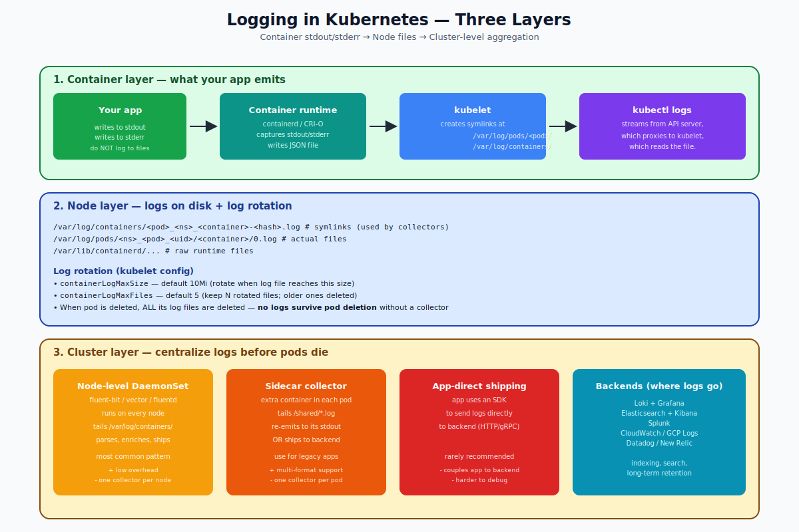

# Logging — Deep Dive

## How Logs Flow in Kubernetes

Kubernetes does not have a built-in centralized logging system. What it has is:

1. A convention: containers write to **stdout/stderr**.
2. The **container runtime** (containerd, CRI-O) captures those streams and writes them to JSON files on the node.
3. The **kubelet** maintains symlinks at known paths so external tools can find them.
4. `kubectl logs` reads them on demand by going through the API server, which proxies to the kubelet.

For anything beyond "tail recent logs of a single pod," you need a **cluster-level logging stack** that you install yourself.



---

## Layer 1 — Container Output

Your application should:

- Write to **stdout** for normal output.
- Write to **stderr** for errors.
- Write to **files only when forced to** (and use a sidecar to tail them).

Why? The kubelet only sees stdout/stderr. Logs written to files inside the container disappear when the container dies.

```python
# Good
print("user 123 logged in")             # stdout
print("ERROR: db connection lost", file=sys.stderr)

# Avoid in container
with open("/var/log/app.log","a") as f:    # writes to ephemeral container fs
    f.write(...)
```

---

## Layer 2 — Where Logs Live on the Node

The runtime writes each container's stdout/stderr to a file like:

```
/var/lib/containerd/containers/<container-id>/<container-id>.log
```

The **kubelet** creates two human-friendly symlink trees:

```
/var/log/pods/<namespace>_<pod>_<uid>/<container>/0.log
/var/log/containers/<pod>_<namespace>_<container>-<hash>.log
```

The format is **JSON-per-line**:
```json
{"log":"user 123 logged in\n","stream":"stdout","time":"2026-04-25T10:30:00.123Z"}
```

This is what log shippers tail.

### Log rotation

The kubelet rotates these files. Defaults (in `/var/lib/kubelet/config.yaml`):

```yaml
containerLogMaxSize: 10Mi      # rotate at this size
containerLogMaxFiles: 5        # keep this many rotated
```

When a pod is **deleted**, all its log files are deleted. There's no grace period. A crash-loop pod's previous-run logs are kept until the next rotation.

---

## Layer 3 — Cluster-Level Logging

To survive pod deletion and to query logs across the whole cluster, install a logging stack. Three patterns:

### 1. Node-level DaemonSet (most common)
Run a single log shipper on every node. It tails `/var/log/containers/` and ships every container's logs to a backend.

- **fluent-bit** — small, fast, written in C
- **vector** — Rust, modern, very flexible
- **fluentd** — older, ruby; still common

```yaml
apiVersion: apps/v1
kind: DaemonSet
metadata:
  name: fluent-bit
  namespace: logging
spec:
  selector: { matchLabels: { app: fluent-bit } }
  template:
    metadata: { labels: { app: fluent-bit } }
    spec:
      tolerations: [{ operator: Exists }]
      containers:
      - name: fluent-bit
        image: fluent/fluent-bit:3.0
        volumeMounts:
        - name: varlog
          mountPath: /var/log
        - name: containers
          mountPath: /var/lib/docker/containers
          readOnly: true
      volumes:
      - name: varlog
        hostPath: { path: /var/log }
      - name: containers
        hostPath: { path: /var/lib/docker/containers }
```

This is the recommended default. Low overhead, simple, scales naturally.

### 2. Sidecar collector

When your app:
- Writes to multiple log files inside the container
- Writes in a non-JSON format you need to parse
- Cannot write to stdout (legacy app)

Add a **sidecar container** that tails the files and re-emits to its own stdout (where the node-level shipper picks it up), or ships directly to the backend.

```yaml
spec:
  containers:
  - name: app
    image: legacy-app
    volumeMounts:
    - name: logs
      mountPath: /var/log/legacy
  - name: log-tailer
    image: busybox
    args: [tail, -F, /shared/legacy/access.log, /shared/legacy/error.log]
    volumeMounts:
    - name: logs
      mountPath: /shared/legacy
  volumes:
  - name: logs
    emptyDir: {}
```

The cost is one extra container per pod. Use sparingly.

### 3. App-direct shipping

The app uses an SDK (Datadog, Sentry) to ship logs directly. This couples your code to the backend and makes local dev harder. Generally avoid unless the SDK provides irreplaceable value (rich tracing, etc.).

---

## Common Backends

| Backend | Note |
|---|---|
| **Grafana Loki** | Lightweight, label-based; pairs with Grafana. Cheap. |
| **Elasticsearch + Kibana (EFK)** | Heavy, powerful, expensive. The classic. |
| **Splunk** | Enterprise, paid. |
| **Datadog / New Relic** | SaaS observability. Logs + metrics + traces in one UI. |
| **CloudWatch / Stackdriver / Azure Logs** | The cloud you're on. |

The collector and the backend are independent choices. fluent-bit can ship to any of them.

---

## `kubectl logs` Cheat Sheet

```bash
# Last 100 lines of a single-container pod
kubectl logs my-pod --tail=100

# Multi-container: pick a container
kubectl logs my-pod -c sidecar

# Follow (like tail -f)
kubectl logs my-pod -f

# Logs from a previous restart
kubectl logs my-pod --previous

# Logs from a Deployment (kubectl picks one pod)
kubectl logs deployment/web

# Logs from all pods matching a label
kubectl logs -l app=web --max-log-requests=10 --prefix

# Time-bounded
kubectl logs my-pod --since=1h
kubectl logs my-pod --since-time="2026-04-25T10:00:00Z"

# Both stdout and stderr (the default)
kubectl logs my-pod

# Just print, don't include K8s metadata
kubectl logs my-pod  | jq .
```

---

## Audit Logs (Different Thing)

Don't confuse application logs with **audit logs** — those are kube-apiserver's record of every API request. Configured separately via `--audit-log-path` and `--audit-policy-file` on kube-apiserver. These tell you "who created what when," not what your apps did.

---

## Common Mistakes

| Mistake | Result | Fix |
|---|---|---|
| Apps writing to files inside container | Logs lost when pod dies | Always log to stdout/stderr |
| No node-level shipper | `kubectl logs` is your only tool, bad on busy clusters | Install fluent-bit DaemonSet |
| Logging at DEBUG in production | Crushing volume + cost | Use levels; default INFO |
| Multi-line stack traces split into N entries | Hard to read | Use a logging library that emits a single JSON event |
| Logs contain secrets | Compliance breach | Redact at the source |
| No log retention policy | Disk fills up | Configure rotation + backend retention |

---

## Summary

Logs in Kubernetes flow: app stdout/stderr → runtime → node files → optional collector → backend. `kubectl logs` reads node files via the kubelet. Install a node-level DaemonSet (fluent-bit, vector) to centralize logs before pods die. Use sidecars only when your app cannot log to stdout. Backends (Loki, Elasticsearch, Splunk, cloud-provider) are interchangeable.

Open `02-Exercise.md` to inspect node files, follow logs across restarts, and see kubelet rotation in action.
