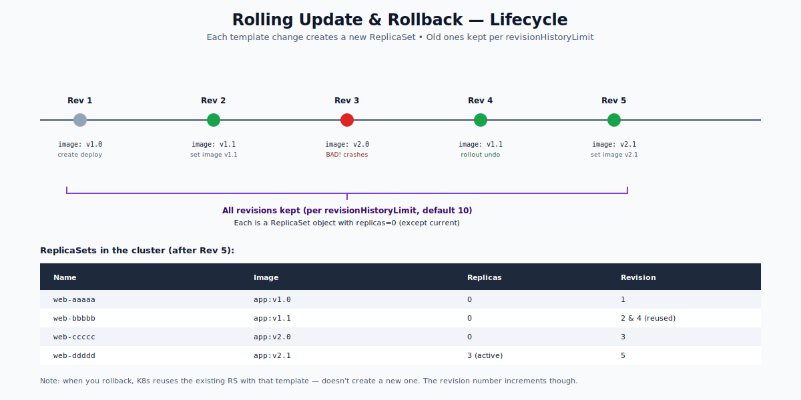

# Rolling Update and Rollback — Deep Dive

(Companion to the Deployments folder; this one focuses specifically on the upgrade-and-revert lifecycle.)

## What "Rolling Update" Means

When you change a Deployment's pod template (image, env vars, command, resource requests, ConfigMap reference — anything inside `spec.template`), the Deployment controller does NOT modify existing pods. Instead it:

1. Computes a hash of the new template (`pod-template-hash`).
2. Creates a **new ReplicaSet** with that hash.
3. Scales the new RS up while scaling the old RS down — within the bounds of `maxSurge` and `maxUnavailable`.
4. Old RS ends up with `replicas: 0`. The new RS is the active one.

The old RS object stays around (scaled to 0) so you can roll back to it without re-pulling images or rebuilding state.



---

## Anatomy of a Rolling Update

```
maxSurge: 25%       maxUnavailable: 25%
Initial:    OLD=4 NEW=0
Step 1:     OLD=4 NEW=1   (surge: total=5)
Step 2:     OLD=3 NEW=1   (drain: total=4)
Step 3:     OLD=3 NEW=2
Step 4:     OLD=2 NEW=2
Step 5:     OLD=2 NEW=3
Step 6:     OLD=1 NEW=3
Step 7:     OLD=1 NEW=4
Step 8:     OLD=0 NEW=4   (done)
```

The Deployment controller drives toward `(old + new ready) >= 4 - maxUnavailable` and `(old + new total) <= 4 + maxSurge`. It picks the smallest move toward done at each tick.

---

## Triggering an Update

Anything that changes `spec.template` triggers a rollout:

```bash
kubectl set image deployment/web nginx=nginx:1.27
kubectl set env deployment/web LOG_LEVEL=debug
kubectl set resources deployment/web -c=nginx --requests=cpu=200m,memory=256Mi
kubectl edit deployment/web              # any save
kubectl apply -f web-updated.yaml
kubectl rollout restart deployment/web   # forces restart via annotation
```

Things that do NOT trigger a rollout:
- Changing `spec.replicas` (just rescaling)
- Changing the Deployment's own labels (not the template)
- Adding annotations to the Deployment (not the template)

---

## Watching a Rollout

```bash
kubectl rollout status deployment/web
# blocks until done; non-zero exit on failure or timeout
kubectl rollout status deployment/web --timeout=5m
```

For CI:
```bash
if ! kubectl rollout status deployment/web --timeout=5m; then
  echo "rollout failed; rolling back"
  kubectl rollout undo deployment/web
  exit 1
fi
```

The `--timeout` is enforced by `kubectl`; the `progressDeadlineSeconds` on the Deployment object is what marks the rollout as failed in the cluster (independent of `kubectl`).

---

## Rollback

```bash
# History of revisions
kubectl rollout history deployment/web

# Inspect a specific revision (template at that point)
kubectl rollout history deployment/web --revision=3

# Roll back to the immediately previous revision
kubectl rollout undo deployment/web

# Roll back to a specific revision
kubectl rollout undo deployment/web --to-revision=2
```

What happens during `undo`:
1. The Deployment's template is reverted to the chosen revision's template.
2. This triggers a normal rolling update — same `maxSurge` / `maxUnavailable` rules.
3. The new RS for the rolled-back template either reuses an existing one (same hash) or creates a fresh one.

Rolling back is **just another rollout**, with a different target template. No magic.

---

## CHANGE-CAUSE — Tracking Why Each Rev Exists

Empty by default:
```
$ kubectl rollout history deployment/web
REVISION  CHANGE-CAUSE
1         <none>
2         <none>
```

Annotate to populate it:
```bash
kubectl annotate deployment web kubernetes.io/change-cause="upgrade nginx to 1.27" --overwrite
```

Or set in your manifest:
```yaml
metadata:
  annotations:
    kubernetes.io/change-cause: "upgrade nginx to 1.27"
```

Apply this annotation in CI on every deploy. It makes `rollout history` actually useful.

---

## `revisionHistoryLimit` — How Many Old RSs to Keep

```yaml
spec:
  revisionHistoryLimit: 10        # default
```

After `N` rollouts, only the `N` most-recent inactive RSs are kept. Older ones are garbage-collected. You can roll back to anything still in history; older revisions are unrecoverable.

For non-critical workloads, set this lower (e.g., 3) to reduce clutter. Don't set to 0 unless you really don't care about rollback.

---

## Pause and Resume

```bash
kubectl rollout pause deployment/web
# All template changes pile up; no rollout starts
kubectl set image deployment/web nginx=nginx:1.27
kubectl set env  deployment/web LEVEL=info
kubectl set resources deployment/web -c=nginx --requests=cpu=200m
# Still no rollout
kubectl rollout resume deployment/web
# One rollout reflects all three changes
```

Useful in CI scripts to avoid 3 partial rollouts when making 3 changes.

---

## Failure Modes & Recovery

### Stuck rollout (image pull error)
```
$ kubectl rollout status deployment/web
Waiting for deployment "web" rollout to finish: 1 out of 3 new replicas have been updated...
(hangs forever)
```

Diagnose:
```bash
kubectl get pods -l app=web
# new pod stuck in ImagePullBackOff
kubectl describe pod <new-pod-name>
```

Fix the image, OR roll back:
```bash
kubectl rollout undo deployment/web
```

### Old pods linger (readiness probe never passes)
The new pods are Running but not Ready. The Deployment controller refuses to scale down the old RS (because that would drop available count below `replicas - maxUnavailable`). Fix the readiness probe or the app, OR roll back.

### Deployment in a bad state (`ProgressDeadlineExceeded`)
```bash
kubectl get deployment web -o jsonpath='{.status.conditions}'
# Progressing=False, Reason=ProgressDeadlineExceeded
kubectl rollout undo deployment/web
```

---

## Quick Reference

```bash
# Monitor
kubectl rollout status deployment/web

# History
kubectl rollout history deployment/web
kubectl rollout history deployment/web --revision=3

# Rollback
kubectl rollout undo deployment/web
kubectl rollout undo deployment/web --to-revision=N

# Pause / resume
kubectl rollout pause deployment/web
kubectl rollout resume deployment/web

# Force restart (annotation-based)
kubectl rollout restart deployment/web

# Annotate for change-cause
kubectl annotate deployment web kubernetes.io/change-cause="reason" --overwrite
```

---

## Summary

A rolling update is what happens when you change a Deployment's pod template — a new ReplicaSet is created and scaled up while the old one is scaled down, controlled by `maxSurge` and `maxUnavailable`. Rollback is the reverse: the previous RS is brought back. History is bounded by `revisionHistoryLimit`. Use `kubectl rollout` commands to monitor, pause, resume, and undo. Always annotate change-cause in CI. Never auto-rollback in K8s itself; orchestrate it from CI based on `kubectl rollout status` exit code.

Open `02-Exercise.md` to update, fail, and recover.
