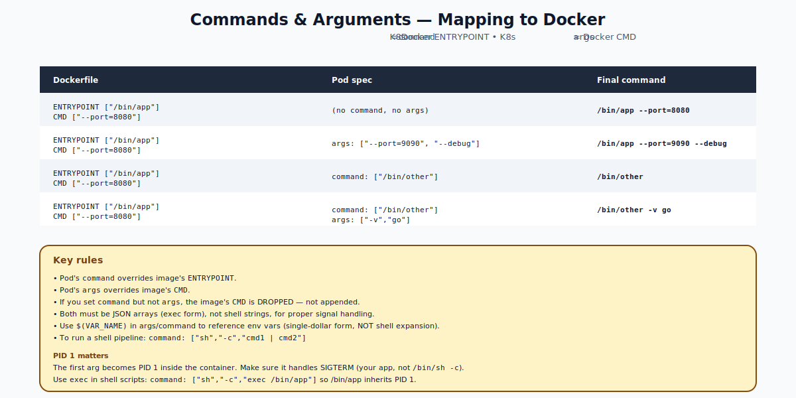

# Commands and Arguments — Deep Dive

## What `command` and `args` Mean

A container image is a recipe with two execution-related fields:

- `ENTRYPOINT` — the binary that runs when the container starts.
- `CMD` — the default arguments to that binary.

In a Pod spec:
- `spec.containers[].command` overrides `ENTRYPOINT`.
- `spec.containers[].args` overrides `CMD`.

If you set neither, the image's defaults apply.



---

## The Mapping Table

| Dockerfile | Pod spec | Final command |
|---|---|---|
| `ENTRYPOINT ["/bin/app"]` `CMD ["--port=8080"]` | (none) | `/bin/app --port=8080` |
| `ENTRYPOINT ["/bin/app"]` `CMD ["--port=8080"]` | `args: ["--port=9090"]` | `/bin/app --port=9090` |
| `ENTRYPOINT ["/bin/app"]` `CMD ["--port=8080"]` | `command: ["/bin/other"]` | `/bin/other` (CMD dropped!) |
| `ENTRYPOINT ["/bin/app"]` `CMD ["--port=8080"]` | `command: ["/bin/other"]` `args: ["-x"]` | `/bin/other -x` |

**Key rule:** if you set `command`, the image's `CMD` is **completely discarded**. `command` and `args` are independent.

---

## Always Use Exec Form (JSON Array)

Wrong (shell form, treats as string):
```yaml
command: /bin/app --port=8080         # NO
```

Right (exec form, JSON array):
```yaml
command: ["/bin/app"]
args: ["--port=8080"]
```

Why exec form matters: with shell form Docker would have wrapped the command in `sh -c`, leaving `sh` as PID 1. PID 1 must handle SIGTERM correctly for graceful shutdown — your app should be PID 1, not a shell.

---

## Running a Shell Pipeline

Sometimes you need shell features:
```yaml
command: ["sh", "-c", "echo starting; exec /bin/app --port=$PORT"]
```

The `exec` is critical — without it, `sh` stays as PID 1 and forwards signals (sometimes incorrectly) to your app. With `exec`, `/bin/app` replaces the shell process and becomes PID 1.

---

## Variable References in Args

```yaml
env:
- name: PORT
  value: "8080"
args:
- "--port=$(PORT)"      # NOT $PORT — this is K8s syntax, not shell
```

K8s substitutes `$(VAR_NAME)` from declared env vars before passing to the container. Use `$$(VAR)` to escape (passes literal `$(VAR)`).

This expansion happens at pod creation. It does NOT execute shell — just text replacement of declared env vars.

---

## Common Patterns

### Override a generic image
```yaml
# busybox image's default is `sh`. We override to run a long sleep:
command: ["sleep"]
args: ["3600"]
```

### Pass config-derived flags
```yaml
env:
- name: MAX_THREADS
  valueFrom:
    configMapKeyRef: { name: settings, key: max-threads }
args:
- --threads=$(MAX_THREADS)
```

### Run a script from a ConfigMap
```yaml
spec:
  containers:
  - name: c
    image: alpine
    command: ["/bin/sh", "/scripts/start.sh"]
    volumeMounts:
    - { name: scripts, mountPath: /scripts }
  volumes:
  - name: scripts
    configMap:
      name: bootstrap-scripts
      defaultMode: 0755
```

### Use multiple commands (and stop)
```yaml
command: ["sh", "-c"]
args:
- |
  set -e
  /usr/bin/migrate
  /usr/bin/seed
  exec /usr/bin/server --port=8080
```

The `exec` ensures `/usr/bin/server` becomes PID 1.

---

## What `command` Does Not Do

- Does not run a shell unless you explicitly invoke one.
- Does not expand `$VAR` (shell syntax) — only `$(VAR)` (K8s syntax) and only against declared env vars.
- Does not change the image — affects this single container instance.

---

## Common Mistakes

| Mistake | Result | Fix |
|---|---|---|
| Setting `command` to a shell string | Treated as a single argv element; usually fails | Use exec form (JSON array) |
| Setting `command` and forgetting CMD | Image's defaults are gone | Re-add necessary args via `args` |
| Using `$VAR` in args | Not expanded; literal | Use `$(VAR)` |
| Using shell tricks without `sh -c` | Pipes/redirects don't work | `command: ["sh","-c","..."]` |
| Forgetting `exec` in shell-wrapped scripts | Shell stays PID 1; SIGTERM mis-handled | Use `exec` to replace the shell |

---

## Quick Reference

```yaml
spec:
  containers:
  - name: c
    image: my-app
    command: ["/usr/bin/myapp"]              # override ENTRYPOINT
    args: ["--port=8080", "--config=/etc/conf.yaml"]   # override CMD
    env:
    - name: LOG_LEVEL
      value: info
```

```bash
# Imperative override at run time
kubectl run test --image=busybox --command -- /bin/sh -c "echo hello && sleep 3600"
# Args after `--` are command; --command flag forces it to be `command` not `args`
```

---

## Summary

`command` overrides Dockerfile `ENTRYPOINT`; `args` overrides Dockerfile `CMD`. Setting `command` discards the image's `CMD`. Always use exec form (JSON arrays) for proper signal handling. Use `$(VAR)` for env-var substitution. For shell features, invoke `sh -c` explicitly and use `exec` to keep your app as PID 1.

Open `02-Exercise.md` to override commands, observe how PID 1 changes, and inject env vars into args.
