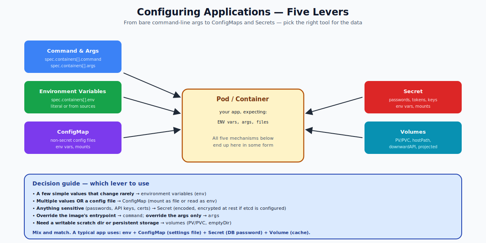

# Configuring Applications — Overview

This is the umbrella topic for everything you do to inject configuration into a container without rebuilding the image. The core principle: **the image is reusable; the config is environment-specific.**

The five mechanisms — covered in their own folders for depth:

1. **Commands & Arguments** — what binary runs and with what flags
2. **Environment Variables** — key=value pairs in the process's environment
3. **ConfigMaps** — non-secret config data, stored in the API
4. **Secrets** — sensitive values (passwords, tokens, certs)
5. **Volumes** — files mounted into the container, possibly from a ConfigMap or Secret



---

## The 12-Factor Idea

Twelve-Factor App principle III: "Store config in the environment." This is the heart of Kubernetes configuration. Don't bake env-specific values into the image. Pass them in via env vars or files at runtime. The same image runs identically in dev, staging, and prod — only the config changes.

---

## Quick Decision Guide

| Need | Mechanism |
|---|---|
| 1-3 simple values | env vars |
| A configuration file (e.g., nginx.conf) | ConfigMap mounted as file |
| Many env vars from one place | ConfigMap with `envFrom` |
| Database password / API key | Secret |
| TLS certificate | Secret (kubernetes.io/tls type) |
| Override default image entrypoint | command + args |
| Cache that survives restarts | PersistentVolumeClaim |

---

## A Realistic Pod Using All Five

```yaml
apiVersion: v1
kind: Pod
metadata: { name: full-config }
spec:
  containers:
  - name: app
    image: my-app:1.0
    command: ["/usr/bin/myapp"]                      # 1. command
    args: ["--port=8080", "--config=/etc/app/conf.yaml"]    # 1. args
    env:                                              # 2. env vars
    - name: LOG_LEVEL
      value: info
    - name: DB_PASSWORD
      valueFrom:
        secretKeyRef:                                 # 4. secret as env
          name: db-creds
          key: password
    envFrom:
    - configMapRef:                                   # 3. configmap as env
        name: app-defaults
    volumeMounts:
    - name: config-file                               # 3. configmap as file
      mountPath: /etc/app
      readOnly: true
    - name: tls
      mountPath: /etc/tls                             # 4. secret as file
      readOnly: true
    - name: cache                                     # 5. volume
      mountPath: /var/cache
  volumes:
  - name: config-file
    configMap:
      name: app-config
  - name: tls
    secret:
      secretName: app-tls
  - name: cache
    emptyDir: {}
```

Five concepts. Each is its own folder in this repo for the deep dive.

---

## Configuration Lifecycle

When config changes, what happens to running pods? Depends on **how** the config is consumed:

| Consumption | Reflects changes live? | How to apply |
|---|---|---|
| `env: value:` literal | Never (baked into pod spec) | Restart pod / new RS |
| `env: valueFrom: configMapKeyRef` | Never | Restart pod |
| `envFrom: configMapRef` | Never | Restart pod |
| ConfigMap mounted as file | **Yes**, eventually (within ~1 min) | App must re-read the file |
| Secret mounted as file | **Yes**, eventually | App must re-read |
| Subpath mount of ConfigMap | No | Restart pod |

Apps that need to react to live config changes:
- Detect file changes (inotify, polling)
- Or use `kubectl rollout restart deployment/X` to bounce the pods

---

## Common Mistakes

| Mistake | Result | Fix |
|---|---|---|
| Hard-coding env vars in the image | Same image can't be reused across envs | Pass at runtime |
| Logging secrets via env in `kubectl describe` | Secrets visible in event log | Use `valueFrom` references; mounted files better |
| ConfigMap mounted as env vars and changed | Running pods don't pick up the change | Restart, or use a file mount with reload |
| Sharing one Secret across many namespaces | Cross-namespace coupling | Use Secret per ns, sync with ESO/Vault |
| Storing binary data in ConfigMap | Up to 1 MB limit | Use Secret's `binaryData` field |

---

## Summary

Five mechanisms (command/args, env, ConfigMap, Secret, Volume) cover all configuration needs. They compose freely. Pick the right one for the data shape: env for simple values, ConfigMap for non-secret config, Secret for sensitive data, Volume for files and persistence. File-mounted ConfigMaps and Secrets reflect updates live; env-based ones do not.

For details, see the dedicated folders: `Commands-and-Arguments/`, `Environment-Variables/`, `ConfigMaps/`, `Secrets/`, plus `Volumes/` (in a future iteration).
