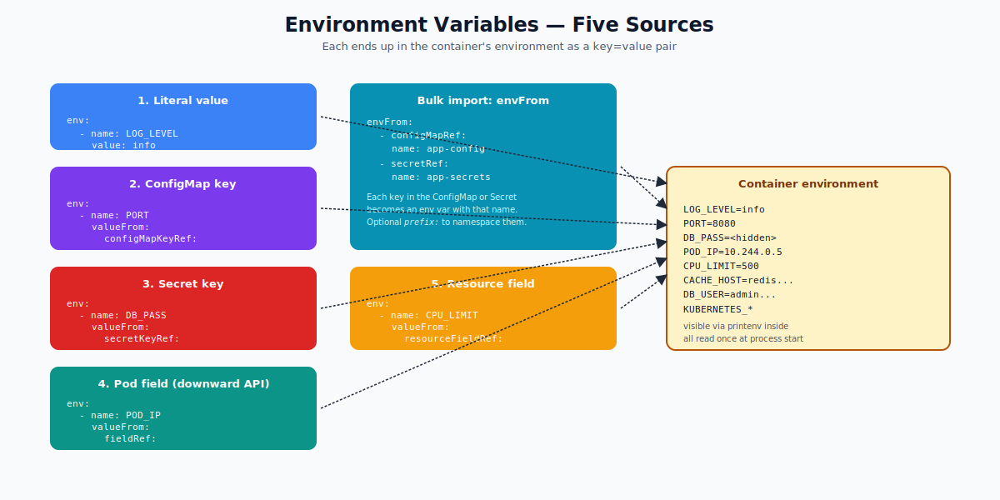

# Environment Variables — Deep Dive

## Why Env Vars

Env vars are the simplest, most universal way to inject configuration: every language reads them, every CI/CD tool sets them, every developer understands them. For a few simple values, `env` beats files.

```yaml
spec:
  containers:
  - name: web
    image: my-app
    env:
    - name: LOG_LEVEL
      value: info
    - name: PORT
      value: "8080"
```



---

## Five Sources of Env Var Values

### 1. Literal value
```yaml
env:
- name: LOG_LEVEL
  value: info
```
Hard-coded in the manifest. Simplest case.

### 2. From a ConfigMap key
```yaml
env:
- name: PORT
  valueFrom:
    configMapKeyRef:
      name: app-config
      key: port
      optional: true        # if true, missing CM doesn't block pod start
```
Lets you change the value by editing the ConfigMap (but the pod must restart to pick up the change).

### 3. From a Secret key
```yaml
env:
- name: DB_PASSWORD
  valueFrom:
    secretKeyRef:
      name: db-creds
      key: password
```
Same pattern as ConfigMap, but the source is a Secret. Important: the value ends up as plaintext in the container's environment — anyone with `kubectl exec` can read it via `printenv`.

### 4. From the Pod's own fields (Downward API)
```yaml
env:
- name: POD_NAME
  valueFrom:
    fieldRef:
      fieldPath: metadata.name
- name: NAMESPACE
  valueFrom:
    fieldRef:
      fieldPath: metadata.namespace
- name: POD_IP
  valueFrom:
    fieldRef:
      fieldPath: status.podIP
- name: NODE_NAME
  valueFrom:
    fieldRef:
      fieldPath: spec.nodeName
```
Useful so the app knows its own identity without external lookups. Common for logging, tracing, sharding.

### 5. From resource requests/limits
```yaml
env:
- name: CPU_REQUEST
  valueFrom:
    resourceFieldRef:
      resource: requests.cpu
      divisor: 1m            # express in millicores
- name: MEMORY_LIMIT
  valueFrom:
    resourceFieldRef:
      resource: limits.memory
      divisor: 1Mi
```
Apps can size their threadpools/JVM heap based on their actual cgroup-enforced limits.

---

## Bulk Import: `envFrom`

When you want all keys of a ConfigMap or Secret as env vars at once:

```yaml
envFrom:
- configMapRef:
    name: app-defaults
- secretRef:
    name: app-secrets
- configMapRef:
    name: cache-config
    prefix: CACHE_           # CACHE_HOST, CACHE_PORT, ...
```

Caveats:
- Each key in the ConfigMap/Secret must be a valid env var name (alphanumeric + underscore). Invalid names are silently skipped.
- Use `prefix:` to namespace them (avoids collisions when importing several sources).

---

## Order and Precedence

If two `env` entries have the same name, the **later one wins**. Same with bulk import: a literal `env:` after `envFrom:` overrides the bulk-imported one.

Order: `envFrom` is processed first, then `env` in declaration order. So you can use `envFrom` for defaults and `env` for overrides:

```yaml
envFrom:
- configMapRef: { name: defaults }     # PORT=8080
env:
- { name: PORT, value: "9090" }        # overrides to 9090
```

---

## Auto-Injected Env Vars

Kubernetes injects these on every pod (per the legacy "service links" behavior, plus a few others):

```
KUBERNETES_SERVICE_HOST=10.96.0.1
KUBERNETES_SERVICE_PORT=443
KUBERNETES_PORT=tcp://10.96.0.1:443
HOSTNAME=<pod-name>
PATH=/usr/local/sbin:/usr/local/bin:/usr/sbin:/usr/bin:/sbin:/bin
HOME=/root           # or whatever the user's home is
```

Plus, for every Service in the same namespace:
```
WEBAPP_SERVICE_HOST=10.96.45.32
WEBAPP_SERVICE_PORT=80
```

Disable this if you don't want it:
```yaml
spec:
  enableServiceLinks: false
```

---

## Variable Interpolation

You can reference earlier env vars within `value:`:
```yaml
env:
- name: GREETING
  value: hello
- name: TARGET
  value: world
- name: MESSAGE
  value: "$(GREETING), $(TARGET)!"   # -> hello, world!
```

The `$(VAR)` form references env vars defined **earlier in the list** of the same container. Use `$$(VAR)` to escape (literal `$(VAR)`).

---

## Updates Don't Propagate

Once a pod starts, its env vars are fixed. If you edit the ConfigMap or Secret that an env var came from, **the pod's env does not update**. To pick up new values, you must restart the pod.

Force a rollout via:
```bash
kubectl rollout restart deployment/web
```

This is why mounted-volume ConfigMaps are preferred for live-changing config — they update in place.

---

## Common Mistakes

| Mistake | Result | Fix |
|---|---|---|
| Numeric value without quotes | `value: 8080` is a YAML int — works, but Use string | `value: "8080"` |
| ConfigMap key contains a `.` or `-` | not a valid env var name; silently skipped | use `key: "..."` rename or `valueFrom` |
| Secret in `env:` printed in `kubectl describe` | leaks via event log | prefer file mounts |
| Expecting env to update | doesn't happen | use file mount, or `kubectl rollout restart` |
| Forgetting `optional: true` | pod stuck in `CreateContainerConfigError` if CM missing | set optional during gradual rollouts |

---

## Summary

Env vars come from five sources: literal, ConfigMap key, Secret key, downward-API field, or resource field. `envFrom` bulk-imports an entire ConfigMap/Secret. Variable interpolation uses `$(VAR)`. Env vars are snapshotted at pod start — they don't update when their sources change. For live updates, mount as a file instead.

Open `02-Exercise.md` to set env vars, observe them inside the container, and watch what does (and doesn't) update.
