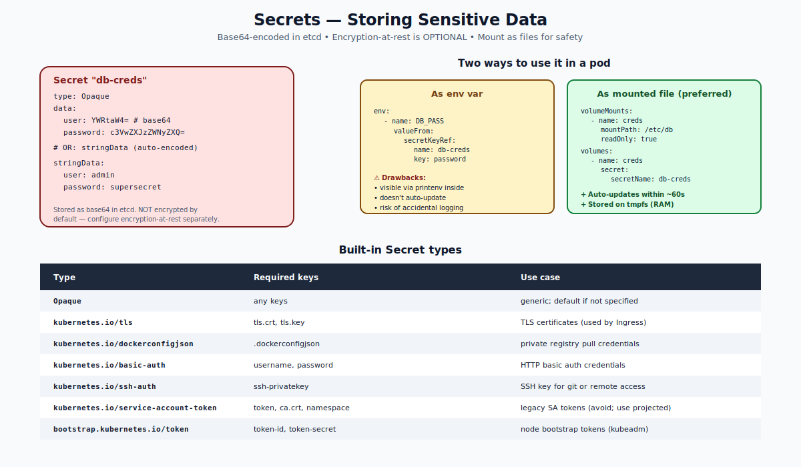

# Secrets — Deep Dive

## What a Secret Is

A **Secret** is a Kubernetes object that holds sensitive data — passwords, tokens, certificates, SSH keys. It looks almost identical to a ConfigMap, but with a few important differences:

- Stored as base64-encoded values in the API.
- Mounted as `tmpfs` (RAM-backed) when used as a volume — never written to disk.
- Hidden by default in `kubectl describe` and `kubectl get -o yaml` (mostly).
- Can be encrypted at rest in etcd (via separate config).

```yaml
apiVersion: v1
kind: Secret
metadata: { name: db-creds }
type: Opaque
data:
  user: YWRtaW4=                    # base64 of "admin"
  password: c3VwZXJzZWNyZXQ=        # base64 of "supersecret"
```

Or write the plain values and let the API encode them:
```yaml
type: Opaque
stringData:
  user: admin
  password: supersecret
```



---

## Base64 Is NOT Encryption

Base64 is just an encoding. Anyone with read access to the Secret can decode it:
```bash
echo c3VwZXJzZWNyZXQ= | base64 -d
# supersecret
```

Base64 exists so binary data fits in JSON/YAML cleanly, not for security. Real protection comes from:

1. **RBAC** — restrict `get`/`watch` on Secrets in your namespace.
2. **Encryption at rest** in etcd — configured via `--encryption-provider-config` on kube-apiserver. Without this, anyone with etcd access reads everything.
3. **External secret managers** — keep secrets in Vault/AWS Secrets Manager and sync into K8s with the External Secrets Operator (ESO) or CSI Secrets Store driver.

A managed cluster (EKS/GKE/AKS) usually has at-rest encryption on by default. Self-managed clusters often don't.

---

## Built-in Secret Types

| Type | Required keys | Use case |
|---|---|---|
| `Opaque` | any keys | generic |
| `kubernetes.io/tls` | `tls.crt`, `tls.key` | TLS certs (Ingress) |
| `kubernetes.io/dockerconfigjson` | `.dockerconfigjson` | private registry pull |
| `kubernetes.io/basic-auth` | `username`, `password` | HTTP basic auth |
| `kubernetes.io/ssh-auth` | `ssh-privatekey` | SSH key |
| `kubernetes.io/service-account-token` | `token`, `ca.crt`, `namespace` | (legacy) SA token |
| `bootstrap.kubernetes.io/token` | `token-id`, `token-secret` | kubeadm bootstrap |

Type is informational — the API checks that required keys exist for typed Secrets, but most controllers only care about the data inside.

---

## Two Ways to Consume

### As env vars
```yaml
env:
- name: DB_PASSWORD
  valueFrom:
    secretKeyRef: { name: db-creds, key: password }
```

Drawbacks:
- Visible to anyone with `kubectl exec` (`printenv`).
- Doesn't update when the Secret changes — pod must restart.
- Risk of accidental logging.

### As mounted files (preferred)
```yaml
volumeMounts:
- name: creds
  mountPath: /etc/db
  readOnly: true
volumes:
- name: creds
  secret:
    secretName: db-creds
    defaultMode: 0400              # restrict to owner-read
    items:                         # optionally project specific keys
    - key: password
      path: db-password.txt
```

Inside the pod:
```bash
$ ls /etc/db
db-password.txt
$ cat /etc/db/db-password.txt
supersecret
```

Benefits:
- Secret is on tmpfs (RAM-backed), not disk.
- Updates within ~60s when the Secret changes.
- File permissions can restrict access (`defaultMode`).
- App reads from a file, which is the conventional pattern for tools like databases.

---

## Image Pull Secrets

For pulling from a private registry:
```bash
kubectl create secret docker-registry regcred \
  --docker-server=registry.example.com \
  --docker-username=alice \
  --docker-password=t0psecret \
  --docker-email=alice@example.com
```

Then attach it to a pod:
```yaml
spec:
  imagePullSecrets:
  - name: regcred
  containers:
  - name: c
    image: registry.example.com/private/app:1.0
```

Or attach to the default ServiceAccount so all pods in the namespace inherit it:
```bash
kubectl patch serviceaccount default -p '{"imagePullSecrets":[{"name":"regcred"}]}'
```

---

## TLS Secrets for Ingress

```bash
kubectl create secret tls web-tls \
  --cert=path/to/server.crt \
  --key=path/to/server.key
```

Used in:
```yaml
apiVersion: networking.k8s.io/v1
kind: Ingress
metadata: { name: web }
spec:
  tls:
  - hosts: [web.example.com]
    secretName: web-tls            # the Ingress controller mounts this
```

`cert-manager` automates this — it creates and renews TLS Secrets via Let's Encrypt or other ACME issuers.

---

## Auto-Generated Secrets

The API automatically creates Secrets in some cases:
- Pre-1.24: every ServiceAccount got an associated Secret with its token. Removed in 1.24+ in favor of projected service-account tokens.
- TLS bootstrap tokens for new nodes (kubeadm).

---

## Encryption at Rest (Brief)

Configure on kube-apiserver:
```yaml
apiVersion: apiserver.config.k8s.io/v1
kind: EncryptionConfiguration
resources:
- resources: [secrets]
  providers:
  - aescbc:
      keys:
      - name: key1
        secret: <base64 32-byte key>
  - identity: {}
```

After this, Secret values in etcd are encrypted with AES-CBC. Existing Secrets must be re-saved (the controller re-writes on next update). Key rotation via key list reordering.

---

## External Secret Managers

For production, keep secrets in a dedicated vault and sync to Kubernetes:

- **External Secrets Operator (ESO)** — defines `ExternalSecret` CRD that pulls from AWS Secrets Manager, Vault, GCP Secret Manager, etc., and creates K8s Secrets.
- **Secrets Store CSI Driver** — mounts secrets directly from a vault as files; optionally syncs to K8s Secrets.

This avoids putting raw secrets in your manifests / Git.

---

## Common Mistakes

| Mistake | Result | Fix |
|---|---|---|
| Committing Secret YAML to Git | Plaintext key in the repo | Use ESO, sealed-secrets, or sops |
| `kubectl describe pod` shows env vars | Secret in plaintext in events | Use file mounts |
| Same Secret in 5 namespaces | Drift, hard to rotate | Sync via ESO, or use a controller |
| Forgetting `imagePullSecrets` | Image pull errors | Attach to pod or to default SA |
| Using long-lived SA token Secrets | Hard to rotate | Use bound service-account tokens (projected volumes) |
| `defaultMode` not restrictive | World-readable | Set `0400` for sensitive files |

---

## Quick Reference

```bash
# Create
kubectl create secret generic creds --from-literal=user=admin --from-literal=password=s3cret
kubectl create secret tls web-tls --cert=server.crt --key=server.key
kubectl create secret docker-registry regcred --docker-... etc.

# Inspect
kubectl get secret creds -o yaml
kubectl get secret creds -o jsonpath='{.data.password}' | base64 -d

# Edit
kubectl edit secret creds         # use stringData for plain values
```

```yaml
spec:
  containers:
  - name: c
    image: app
    volumeMounts:
    - { name: creds, mountPath: /etc/creds, readOnly: true }
  volumes:
  - name: creds
    secret:
      secretName: creds
      defaultMode: 0400
```

---

## Summary

Secrets are like ConfigMaps but for sensitive data: base64-encoded, mounted on tmpfs, optional encryption at rest. Built-in types (`Opaque`, `tls`, `dockerconfigjson`, etc.) carry conventions. Prefer file mounts over env vars to limit accidental exposure. For production, integrate with an external secret manager (Vault, AWS, Azure Key Vault) via ESO or the CSI driver.

Open `02-Exercise.md` to create, mount, and rotate Secrets.
