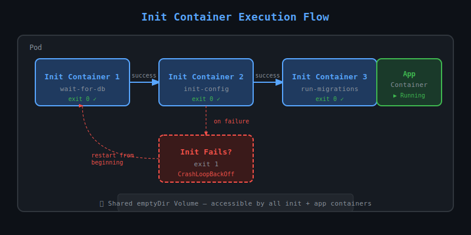

# 26 — Init Containers

## What are Init Containers?

Init containers are **specialised containers that run to completion before any app containers start** in a Pod. They always run sequentially — each must succeed before the next starts, and all must complete before the main containers begin.



---

## Why use Init Containers?

| Use Case | Example |
|----------|---------|
| Wait for a dependency | Wait for DB to be ready before app starts |
| Pre-populate data | Clone a git repo into a shared volume |
| Register/configure | Write config files before the main app reads them |
| Security separation | Run privileged setup tasks separately from the app |

---

## Key Differences: Init vs App Containers

| Feature | Init Container | App Container |
|---------|---------------|---------------|
| Runs to completion | Yes — must exit 0 | No — runs continuously |
| Run order | Sequential | Parallel |
| Restarts on failure | Yes (until success) | Based on restartPolicy |
| Probes (liveness/readiness) | Not supported | Supported |
| Resource limits | Separate from app | Own limits |

---

## Basic Syntax

```yaml
apiVersion: v1
kind: Pod
metadata:
  name: myapp-pod
spec:
  initContainers:
  - name: init-db-check
    image: busybox
    command: ['sh', '-c', 'until nslookup mydb; do echo waiting for db; sleep 2; done']
  - name: init-config
    image: busybox
    command: ['sh', '-c', 'echo app-config > /shared/config.txt']
    volumeMounts:
    - name: shared-vol
      mountPath: /shared
  containers:
  - name: app
    image: myapp:latest
    volumeMounts:
    - name: shared-vol
      mountPath: /config
  volumes:
  - name: shared-vol
    emptyDir: {}
```

---

## Execution Flow

1. Pod is scheduled to a node
2. `init-db-check` runs → waits for DNS resolution of `mydb`
3. Once `init-db-check` exits 0, `init-config` starts
4. `init-config` writes config file → exits 0
5. Main `app` container starts and reads `/config/config.txt`

---

## Init Container States

```bash
kubectl describe pod myapp-pod
```

You will see under `Init Containers:` section:
- `State: Running` — currently executing
- `State: Terminated (exit 0)` — completed successfully
- `State: Terminated (exit 1)` — failed, will retry

---

## Resource Considerations

The **effective resource request** for a Pod with init containers is the **maximum** of:
- The highest resource request among all init containers
- The sum of all app container requests

Init containers run one at a time, so Kubernetes only needs resources for one at a time.

---

## Common Patterns

### Pattern 1: Wait for a Service
```yaml
initContainers:
- name: wait-for-redis
  image: busybox
  command: ['sh', '-c', 'until nc -z redis 6379; do sleep 1; done']
```

### Pattern 2: Clone a Repo
```yaml
initContainers:
- name: git-clone
  image: alpine/git
  command: ['git', 'clone', 'https://github.com/myorg/config.git', '/config']
  volumeMounts:
  - name: config-vol
    mountPath: /config
```

### Pattern 3: Database Migration
```yaml
initContainers:
- name: run-migrations
  image: myapp:latest
  command: ['python', 'manage.py', 'migrate']
  env:
  - name: DB_URL
    valueFrom:
      secretKeyRef:
        name: db-secret
        key: url
```

---

## Debugging Init Containers

```bash
# See init container logs
kubectl logs <pod-name> -c <init-container-name>

# Watch pod startup
kubectl get pod <pod-name> -w

# Describe to see init container status
kubectl describe pod <pod-name>
```

Pod status shows `Init:0/2` meaning 0 of 2 init containers have completed.

---

## Key Points to Remember

- Init containers **always restart on failure** regardless of `restartPolicy: Never` on the pod
- If a Pod is restarted, all init containers run again
- Init containers do **not** support `lifecycle`, `livenessProbe`, `readinessProbe`, or `startupProbe`
- They share the same network namespace and volumes as app containers
