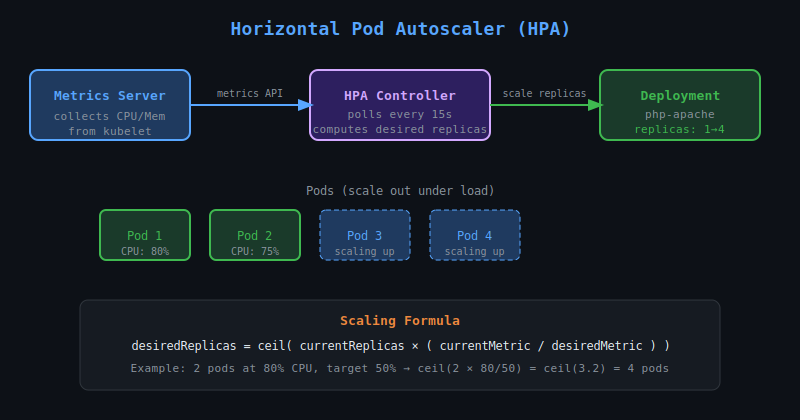

# 27 — Horizontal Pod Autoscaler (HPA)

## What is HPA?

The **Horizontal Pod Autoscaler** automatically scales the number of Pod replicas in a Deployment, ReplicaSet, or StatefulSet based on observed metrics (CPU, memory, or custom metrics).



---

## How HPA Works

1. **Metrics Server** collects resource usage from nodes/pods
2. **HPA controller** queries Metrics Server every 15 seconds (default)
3. It compares current usage vs target threshold
4. It scales replicas up or down accordingly

**Formula:**
```
desiredReplicas = ceil(currentReplicas × (currentMetric / desiredMetric))
```

Example: 2 replicas at 80% CPU, target is 50%:
```
ceil(2 × (80/50)) = ceil(3.2) = 4 replicas
```

---

## Prerequisites

HPA requires **Metrics Server** to be installed:

```bash
# Check if metrics-server is running
kubectl get deployment metrics-server -n kube-system

# Install if missing (for minikube)
minikube addons enable metrics-server

# Install for generic clusters
kubectl apply -f https://github.com/kubernetes-sigs/metrics-server/releases/latest/download/components.yaml
```

---

## Creating an HPA

### Imperative
```bash
kubectl autoscale deployment myapp \
  --cpu-percent=50 \
  --min=2 \
  --max=10
```

### Declarative (v2 API)
```yaml
apiVersion: autoscaling/v2
kind: HorizontalPodAutoscaler
metadata:
  name: myapp-hpa
spec:
  scaleTargetRef:
    apiVersion: apps/v1
    kind: Deployment
    name: myapp
  minReplicas: 2
  maxReplicas: 10
  metrics:
  - type: Resource
    resource:
      name: cpu
      target:
        type: Utilization
        averageUtilization: 50
```

---

## Scaling on Memory

```yaml
metrics:
- type: Resource
  resource:
    name: memory
    target:
      type: AverageValue
      averageValue: 500Mi
```

---

## Multiple Metrics

HPA evaluates **all** metrics and scales to the highest replica count required:

```yaml
metrics:
- type: Resource
  resource:
    name: cpu
    target:
      type: Utilization
      averageUtilization: 50
- type: Resource
  resource:
    name: memory
    target:
      type: AverageValue
      averageValue: 200Mi
```

---

## Scaling Behaviour (v2)

Control scale-up and scale-down speed:

```yaml
behavior:
  scaleUp:
    stabilizationWindowSeconds: 0
    policies:
    - type: Percent
      value: 100
      periodSeconds: 15
  scaleDown:
    stabilizationWindowSeconds: 300
    policies:
    - type: Pods
      value: 1
      periodSeconds: 60
```

- `stabilizationWindowSeconds`: how long to wait before acting on metric changes (prevents flapping)
- Scale-down default stabilization is **5 minutes** to prevent thrashing

---

## Useful Commands

```bash
# View HPA status
kubectl get hpa

# Watch HPA in real time
kubectl get hpa -w

# Detailed view
kubectl describe hpa myapp-hpa

# Delete HPA
kubectl delete hpa myapp-hpa
```

---

## HPA vs Manual Scaling

| Feature | Manual (`kubectl scale`) | HPA |
|---------|--------------------------|-----|
| Trigger | Human action | Metrics-based |
| Speed | Immediate | ~15s interval |
| Requires Metrics Server | No | Yes |
| Good for | One-off changes | Production workloads |

---

## Important Limits

- HPA will **not** scale below `minReplicas` or above `maxReplicas`
- Pods **must have resource requests set** for CPU/memory HPA to work
- HPA and manual `kubectl scale` can conflict — HPA wins next cycle
