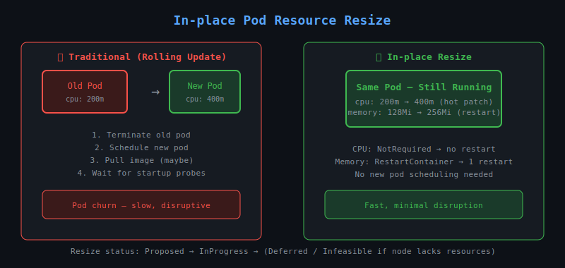

# 28 — In-place Resize of Pod Resources

## What is In-place Pod Resize?

Traditionally, changing a pod's CPU or memory **requires deleting and recreating the pod** (a rolling update). **In-place Pod Vertical Scaling** (KEP-1287, stable in Kubernetes 1.33) allows you to **change CPU/memory requests and limits on a running pod without restarting it**.



---

## Feature Gate

| Kubernetes Version | Status |
|-------------------|--------|
| 1.27 | Alpha |
| 1.32 | Beta (enabled by default) |
| 1.33+ | Stable |

For versions < 1.32, enable manually:
```
--feature-gates=InPlacePodVerticalScaling=true
```

---

## How it Works

Each container in a pod spec now has two resource fields:

```yaml
resources:
  requests:
    cpu: 500m
    memory: 128Mi
  limits:
    cpu: 1
    memory: 256Mi
```

Plus a new field `resizePolicy` to control **restart behaviour per resource**:

```yaml
resizePolicy:
- resourceName: cpu
  restartPolicy: NotRequired   # CPU can resize without restart
- resourceName: memory
  restartPolicy: RestartContainer  # Memory resize needs container restart
```

---

## Resize Policies

| Policy | Behaviour |
|--------|-----------|
| `NotRequired` | Resource is updated live, no restart needed |
| `RestartContainer` | Container is restarted to apply the new resource value |

**Default behaviour:**
- CPU: `NotRequired` (can be hot-patched)
- Memory: `RestartContainer` (requires container restart)

---

## Performing an In-place Resize

Use `kubectl patch` to update resources on a running pod:

```bash
# Increase CPU limit
kubectl patch pod mypod --subresource='resize' \
  --type='merge' \
  -p '{"spec":{"containers":[{"name":"app","resources":{"limits":{"cpu":"2"}}}]}}'
```

Or edit directly:
```bash
kubectl edit pod mypod
# Change resources.requests/limits under the container
```

---

## Checking Resize Status

After patching, check the pod's status:

```bash
kubectl get pod mypod -o jsonpath='{.status.resize}'
```

| Value | Meaning |
|-------|---------|
| `Proposed` | Request accepted, not yet applied |
| `InProgress` | Being applied by kubelet |
| `Deferred` | Node lacks resources, will retry |
| `Infeasible` | Cannot be done (exceeds node capacity) |

---

## Checking Allocated Resources

```bash
kubectl get pod mypod -o jsonpath='{.status.containerStatuses[0].allocatedResources}'
```

This shows what the kubelet has **actually allocated**, as opposed to what is **requested** in spec.

---

## Limitations

- Only **CPU and memory** are supported (not other extended resources)
- Cannot resize **init containers** in-place
- Pod must have `requests` set to resize
- If `resizePolicy` is `RestartContainer`, the container will briefly restart
- Does not work on static pods or pods managed by certain admission controllers that reject changes

---

## In-place Resize vs VPA

| Feature | In-place Resize | VPA |
|---------|----------------|-----|
| Manual trigger | Yes (you patch it) | Automatic |
| Restarts pod | Depends on policy | Usually yes |
| Works on live pod | Yes | Recreates pod |
| Good for | One-off adjustments | Automated right-sizing |
