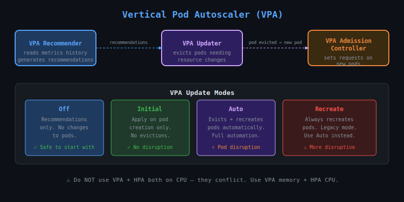

# 29 — Vertical Pod Autoscaler (VPA)

## What is VPA?

The **Vertical Pod Autoscaler** automatically adjusts the **CPU and memory requests/limits** for containers based on historical usage. Unlike HPA (which adds more pods), VPA makes each pod bigger or smaller.



---

## VPA vs HPA

| Feature | HPA | VPA |
|---------|-----|-----|
| Scales | Number of pods | Pod resource size |
| Trigger | Current metrics | Historical usage |
| Good for | Stateless apps | Stateful apps, single-pod workloads |
| Use together? | With care (not both on CPU) | Yes, but avoid CPU conflicts |

---

## VPA Components

VPA is a separate installation (not built-in like HPA):

| Component | Role |
|-----------|------|
| **VPA Recommender** | Watches metrics history, generates recommendations |
| **VPA Updater** | Evicts pods that need resizing |
| **VPA Admission Controller** | Sets correct requests on new/recreated pods |

---

## Installing VPA

```bash
git clone https://github.com/kubernetes/autoscaler.git
cd autoscaler/vertical-pod-autoscaler
./hack/vpa-up.sh

# Verify
kubectl get pods -n kube-system | grep vpa
```

---

## VPA Modes

| Mode | Behaviour |
|------|-----------|
| `Off` | Recommendations only — no action taken |
| `Initial` | Apply recommendations only at pod creation |
| `Auto` | Apply recommendations and evict/recreate pods as needed |
| `Recreate` | Like Auto but always recreates (legacy) |

---

## Basic VPA YAML

```yaml
apiVersion: autoscaling.k8s.io/v1
kind: VerticalPodAutoscaler
metadata:
  name: myapp-vpa
spec:
  targetRef:
    apiVersion: apps/v1
    kind: Deployment
    name: myapp
  updatePolicy:
    updateMode: "Auto"
  resourcePolicy:
    containerPolicies:
    - containerName: app
      minAllowed:
        cpu: 100m
        memory: 50Mi
      maxAllowed:
        cpu: 2
        memory: 2Gi
      controlledResources: ["cpu", "memory"]
```

---

## Checking VPA Recommendations

```bash
kubectl describe vpa myapp-vpa
```

Look for the `Recommendation` section:

```
Recommendation:
  Container Recommendations:
    Container Name:  app
    Lower Bound:
      Cpu:     100m
      Memory:  150Mi
    Target:
      Cpu:     350m
      Memory:  380Mi
    Uncapped Target:
      Cpu:     350m
      Memory:  380Mi
    Upper Bound:
      Cpu:     2
      Memory:  2Gi
```

- **Target**: Recommended value — what VPA will set
- **Lower Bound**: Minimum safe value
- **Upper Bound**: Maximum VPA will set
- **Uncapped Target**: What VPA would set ignoring minAllowed/maxAllowed

---

## resourcePolicy — Fine-grained Control

```yaml
resourcePolicy:
  containerPolicies:
  - containerName: sidecar
    mode: "Off"           # don't touch this container
  - containerName: app
    mode: "Auto"
    minAllowed:
      cpu: 50m
    maxAllowed:
      cpu: 4
```

---

## VPA and HPA Together

**Do NOT** use both VPA and HPA on CPU simultaneously — they conflict. Safe combinations:
- VPA on CPU + HPA on custom/external metrics
- VPA on memory only + HPA on CPU

---

## Limitations

- VPA requires pod **eviction** to apply new resource values (except with in-place resize integration in newer versions)
- Not suitable for workloads that cannot tolerate restarts
- Requires at least a few hours of metric history for accurate recommendations
- Does not work well with very bursty workloads
