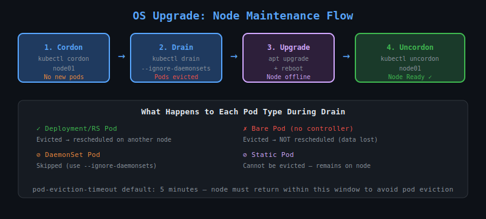

# 30 — Cluster Maintenance: OS Upgrade

## Why OS Upgrades Matter

Nodes run a host OS (Ubuntu, RHEL, etc.) that needs security patches and kernel updates. During an OS upgrade, the node must be **rebooted**, which means all pods on it are temporarily unavailable.



---

## Pod Eviction Timeout

Kubernetes waits `pod-eviction-timeout` (default **5 minutes**) before declaring a node dead after it goes offline. If the node comes back within this window, pods are NOT rescheduled. If it exceeds the window, pods are evicted and rescheduled elsewhere.

```bash
# Default on kube-controller-manager
--pod-eviction-timeout=5m0s
```

---

## Safe OS Upgrade Procedure

### Step 1 — Cordon the node
Marks the node as **unschedulable** — no new pods will be placed on it:

```bash
kubectl cordon node01
```

The node shows `SchedulingDisabled`:
```
NAME     STATUS                     ROLES   AGE
node01   Ready,SchedulingDisabled   worker  10d
```

### Step 2 — Drain the node
Evicts all pods from the node gracefully:

```bash
kubectl drain node01 --ignore-daemonsets --delete-emptydir-data
```

Flags explained:
- `--ignore-daemonsets`: DaemonSet pods cannot be evicted (they're managed by DaemonSet controller), so we skip them
- `--delete-emptydir-data`: Allows eviction of pods using emptyDir volumes (data will be lost)
- `--force`: Evict pods not managed by a controller (use with care — they won't be rescheduled)

### Step 3 — Perform OS upgrade / reboot
```bash
# SSH into the node and upgrade
sudo apt-get update && sudo apt-get upgrade -y
sudo reboot
```

### Step 4 — Uncordon the node
After reboot, mark the node schedulable again:

```bash
kubectl uncordon node01
```

---

## What Happens to Pods During Drain?

| Pod Type | Behaviour |
|----------|-----------|
| ReplicaSet/Deployment pod | Evicted and rescheduled on another node |
| DaemonSet pod | Skipped (ignored with flag) |
| Static pod | Cannot be evicted — remains on node |
| Bare pod (no controller) | Evicted and **lost** unless `--force` is used |

---

## Cordon vs Drain

| Command | What it does |
|---------|-------------|
| `kubectl cordon` | Prevents NEW pods from being scheduled. Existing pods stay. |
| `kubectl drain` | Evicts ALL existing pods AND cordons the node |
| `kubectl uncordon` | Makes node schedulable again |

---

## PodDisruptionBudgets (PDB)

Drain respects PodDisruptionBudgets. If draining would violate a PDB (e.g. bring available replicas below minimum), drain will wait or fail.

```bash
# Force drain even if PDB is violated
kubectl drain node01 --ignore-daemonsets --disable-eviction
```

---

## Checking Node Status

```bash
kubectl get nodes
kubectl describe node node01
kubectl get pods -o wide | grep node01
```
