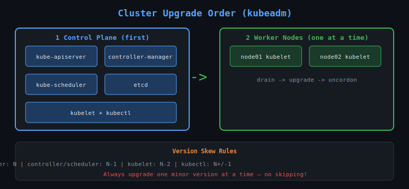

# 31 — Cluster Upgrade (kubeadm)

## Kubernetes Version Policy

- Kubernetes releases a new minor version every ~4 months
- Only the **3 most recent minor versions** are supported
- The API server must be **at or above** the version of other components
- You can only upgrade **one minor version at a time** (e.g. 1.28 → 1.29, not 1.28 → 1.30)



---

## Component Version Skew Policy

| Component | Allowed skew from API server |
|-----------|------------------------------|
| kube-apiserver | N (reference) |
| kube-controller-manager | N-1 |
| kube-scheduler | N-1 |
| kubelet | N-2 |
| kubectl | N+1 to N-1 |

---

## Upgrade Order

Always upgrade in this order:
1. **Control plane** (API server, controller manager, scheduler, etcd)
2. **Worker nodes** (one at a time or in rolling fashion)

---

## Step-by-Step: Upgrade Control Plane (kubeadm)

### 1. Check available versions
```bash
apt-cache madison kubeadm | head -5
```

### 2. Upgrade kubeadm on control plane
```bash
apt-mark unhold kubeadm
apt-get update
apt-get install -y kubeadm=1.29.0-00
apt-mark hold kubeadm
kubeadm version
```

### 3. Plan and apply the upgrade
```bash
kubeadm upgrade plan
kubeadm upgrade apply v1.29.0
```

### 4. Upgrade kubelet and kubectl on control plane
```bash
kubectl drain controlplane --ignore-daemonsets
apt-mark unhold kubelet kubectl
apt-get install -y kubelet=1.29.0-00 kubectl=1.29.0-00
apt-mark hold kubelet kubectl
systemctl daemon-reload
systemctl restart kubelet
kubectl uncordon controlplane
```

---

## Step-by-Step: Upgrade Worker Node

### 1. Upgrade kubeadm on worker node
```bash
# SSH into worker node
apt-mark unhold kubeadm
apt-get install -y kubeadm=1.29.0-00
apt-mark hold kubeadm
```

### 2. Upgrade kubelet config
```bash
kubeadm upgrade node
```

### 3. Drain worker node (from control plane)
```bash
kubectl drain node01 --ignore-daemonsets --delete-emptydir-data
```

### 4. Upgrade kubelet on worker node
```bash
# On worker node
apt-mark unhold kubelet
apt-get install -y kubelet=1.29.0-00
apt-mark hold kubelet
systemctl daemon-reload
systemctl restart kubelet
```

### 5. Uncordon (from control plane)
```bash
kubectl uncordon node01
```

Repeat for each worker node.

---

## Verify Upgrade

```bash
kubectl get nodes
# All nodes should show new version

kubectl version
kubeadm version
```

---

## GKE Cluster Upgrade

On GKE (managed), the control plane is upgraded by Google. You upgrade node pools:

```bash
# Upgrade control plane
gcloud container clusters upgrade CLUSTER_NAME --master --cluster-version=1.29

# Upgrade node pool
gcloud container clusters upgrade CLUSTER_NAME \
  --node-pool=default-pool \
  --cluster-version=1.29
```

GKE also supports **surge upgrades** to minimise disruption.

---

## Key Points

- Always backup etcd before upgrading
- Test in non-production first
- Read release notes for breaking changes
- `apt-mark hold` prevents accidental upgrades
- Upgrade one minor version at a time — no skipping
