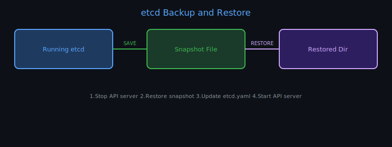

# 32 — Backup and Restore Methods

## What Needs to be Backed Up?

In a Kubernetes cluster, the critical state lives in **etcd**. Everything else (pods, deployments, services) can be recreated from YAML manifests. A complete backup strategy includes:

1. **etcd snapshot** — the source of truth for all cluster state
2. **Resource manifests** — YAML definitions (can be exported from cluster or stored in Git)
3. **Persistent Volume data** — application data (separate, handled by storage solutions)



---

## Method 1: Export Resource Manifests

Back up all Kubernetes object definitions:

```bash
# All resources in all namespaces
kubectl get all --all-namespaces -o yaml > all-resources.yaml

# Specific resources
kubectl get deployments,services,configmaps,secrets \
  --all-namespaces -o yaml > k8s-backup.yaml
```

> Best practice: store manifests in **Git** (GitOps). The cluster state should always be reproducible from code.

---

## Method 2: etcd Snapshot (recommended for full backup)

etcd stores ALL cluster state — nodes, pods, configs, secrets, RBAC, everything.

### Taking a snapshot

```bash
ETCDCTL_API=3 etcdctl snapshot save /backup/etcd-snapshot.db \
  --endpoints=https://127.0.0.1:2379 \
  --cacert=/etc/kubernetes/pki/etcd/ca.crt \
  --cert=/etc/kubernetes/pki/etcd/server.crt \
  --key=/etc/kubernetes/pki/etcd/server.key
```

### Verify snapshot

```bash
ETCDCTL_API=3 etcdctl snapshot status /backup/etcd-snapshot.db \
  --write-out=table
```

Output:
```
+----------+----------+------------+------------+
|   HASH   | REVISION | TOTAL KEYS | TOTAL SIZE |
+----------+----------+------------+------------+
| abc12345 |    12345 |       1024 |     3.2 MB |
+----------+----------+------------+------------+
```

---

## Method 3: Restore from etcd Snapshot

### Step 1: Stop the API server (on kubeadm clusters)

```bash
# Move the API server manifest out of the static pod directory
mv /etc/kubernetes/manifests/kube-apiserver.yaml /tmp/
```

### Step 2: Restore the snapshot

```bash
ETCDCTL_API=3 etcdctl snapshot restore /backup/etcd-snapshot.db \
  --data-dir=/var/lib/etcd-restored \
  --initial-cluster=controlplane=https://127.0.0.1:2380 \
  --initial-advertise-peer-urls=https://127.0.0.1:2380 \
  --name=controlplane
```

### Step 3: Update etcd to use the new data directory

Edit the etcd static pod manifest:
```bash
vi /etc/kubernetes/manifests/etcd.yaml
```

Change `--data-dir` from `/var/lib/etcd` to `/var/lib/etcd-restored`.
Also update the `hostPath` volume to match.

### Step 4: Restore API server manifest

```bash
mv /tmp/kube-apiserver.yaml /etc/kubernetes/manifests/
```

### Step 5: Verify cluster

```bash
kubectl get nodes
kubectl get pods --all-namespaces
```

---

## etcd Certificates Location (kubeadm)

| Certificate | Path |
|-------------|------|
| CA cert | `/etc/kubernetes/pki/etcd/ca.crt` |
| Server cert | `/etc/kubernetes/pki/etcd/server.crt` |
| Server key | `/etc/kubernetes/pki/etcd/server.key` |
| Peer cert | `/etc/kubernetes/pki/etcd/peer.crt` |

---

## etcdctl vs etcdutl

| Tool | Use |
|------|-----|
| `etcdctl` | Interact with a running etcd cluster (snapshot, get, put) |
| `etcdutl` | Offline operations on etcd data files (defrag, restore) |

In newer versions (etcd 3.5+), `etcdutl snapshot restore` is preferred over `etcdctl snapshot restore` for offline restores.

---

## Velero (Production Backup Solution)

For production clusters, use **Velero** — a full backup and restore tool:

```bash
# Install Velero
velero install --provider aws --bucket my-bucket ...

# Backup
velero backup create my-backup --include-namespaces production

# Restore
velero restore create --from-backup my-backup
```

Velero backs up both Kubernetes objects and persistent volumes.
